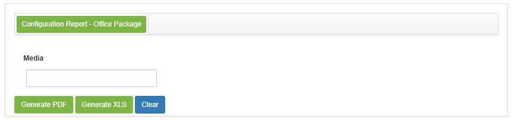
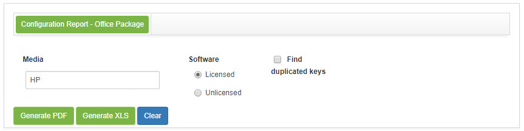
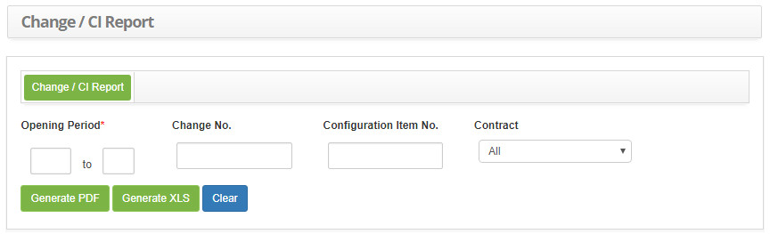

title:  Report generation - Configuration Management
Description: This report aims to present valid, invalid, and duplicate media (license) keys. 
# Report generation - Configuration Management

Generating configuration item report - office package
-----------------------------------------------------------

*This report aims to present valid, invalid, and duplicate media (license) keys*.

 *How to access* 

1. Access the Office Package Configuration Report Report functionality by navigating the main menu 
**Reports > Assets and Configuration Management > CI Report Office Suit**.

 *Filters*

1. The following filter enable the user to restrict the participation of items in the standard feature listing, making it easier to 
locate the desired items as shown in the figure below:

    - Name;
    - Software;
    - Find duplicated keys
    
2. The **Office Package Configuration Report Generation** screen will be displayed, as shown in the following figure:
    
    
    
    **Figure 1 - Item report generation screen configuration - Office Package**

3. Inform the media you want to generate the report. After that, the fields to filter valid, invalid and duplicate keys (licenses) 
will be displayed;

    
    
    **Figure 2 - Filters for generating the configuration item report - Office Package**
    
    - **Software**: Select the option you want to check;
    - **Look for duplicate keys**: Check this option if you want to check the duplicate keys related to the media;
    
    !!! note "NOTE"
    
        Licensed (valid) keys will be considered those that are registered in the media file.
        
Generating change report/configuration item
----------------------------------------------------

*This report is intended to provide information on the different change Requests related to the same configuration item*.

*How to access*

1. Access the Change Report / Configuration Item feature by navigating the main menu 
**Reports > Assets and Configuration Management > Change/CI report**.

*Filters*

1. The following filters enable the user to restrict the participation of items in the standard feature listing, making it easier 
to locate the desired items as shown in the figure below:

    - **Opening Period**: Enter the period you want to generate the report;
    - **Change No.**: Enter the change identification number;
    - **Configuration Item No**.: Enter the configuration item identification number;
    - **Contract**: select the desired contract.
    
2. The **Change Report Generation/Configuration Item** screen will be displayed, as shown in the following figure:

    
    
    **Figure 3 - Change report generation screen / item configuration**
    
3. Set the filters as needed.

!!! tip "About"

    <b>Product/Version:</b> CITSmart | 7.00 &nbsp;&nbsp;
    <b>Updated:</b>08/26/2019 - Larissa Lourenço

