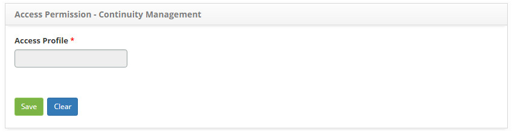
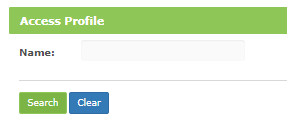
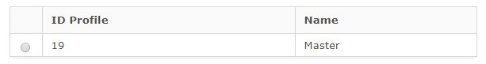

title:  Continuity management access permission
Description: This functionality aims to define who will have access to the functionality of continuity management. 
# Continuity management access permission

This functionality aims to define who will have access to the functionality of continuity management and what type of access is 
allowed (reading, writing and/or deletion).

How to access
---------------

1. Access the Continuity Management Access Permission feature by navigating the main menu 
**Access and Permission > Continuity Management**.

Preconditions
---------------

1. Register access profile (see knowledge [Access profile registration and search][1]);

Filters
---------

1. The following filter enable the user to restrict the participation of items in the standard feature listing, making it easier to 
locate the desired items as shown in the figure below:

    - Name.
    
2. The screen for **Defining the Access Permission** will be displayed, as shown in the figure below:

    
    
    **Figure 1 - Continuity management access permission screen**
    
    - Clicking on the Access Profile will open a search tab for it, as shown below:
    
    
    
    **Figure 2 - Continuity management access lookup screen**
    
    - Enter the access profile to apply the type of access it will have;
    
3. For each continuity management functionality, define the actions (search, save, and/or delete) that the profile can perform;

4. Click the *Save* button to register, where the date, time and user will be saved automatically for a future audit.

Items list
--------------------

1. The following cadastral fields are available to the user to make it easier to identify the desired items in the standard feature 
listing: **ID Profile** and **Name**.

    
    
    **Figure 3 - Continuity management access listing screen**
    
Filling in the registration fields
------------------------------------

1. Not applicable.

!!! tip "About"

    <b>Product/Version:</b> CITSmart | 7.00 &nbsp;&nbsp;
    <b>Updated:</b>08/27/2019 - Larissa Lourenço

[1]:/en-us/citsmart-platform-7/initial-settings/access-settings/profile/user-profile.html
