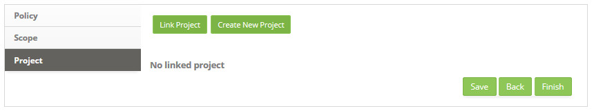
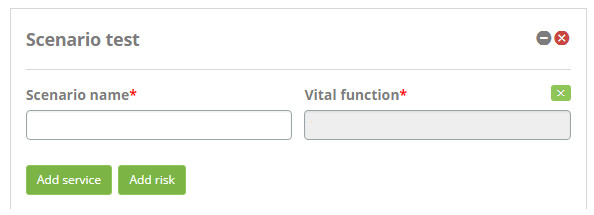

title: Continuity Management
Description: Continuity Management focuses on recovering IT services and their components in the face of a disaster event.
# Continuity Management

Continuity Management focuses on recovering IT services and their components in the face of a disaster event.

Preconditions
--------------

1. Register category of threat (see knowledge [Threat category registration and search][1]);

2. Register threat (see knowledge [Threat registration and search][2]);

3. Link the threat category to the registered threat;

4. Register the risk category (see knowledge [Risk category registration and search][3]);

5. Register risk (see knowledge [Continuity risk registration and search][4]);

6. Register Customer (see knowledge [Customer registration and search][5]);

7. Register employee (see knowledge [Staff registration and search][6]);

8. Record Incident, Request and Procedures automatic actions related to Event Management (see knowledge [Automatic actions registration and search][7]);

9. Register on the knowledge base a document of type Recovery Measure (see knowledge [Knowledge management][8]).

How to access
---------------

1. Access the functionality through navigation in the main menu 
**Process Management > Continuity Management > Continuity Management**.

Registering continuity of service
------------------------------------

1. On the **Continuity Management** screen, click the *Register Continuity* button, as shown in the figure below:

    
    
    **Figure 1 - Continuity registration button**
    
2. The **Continuity Registration** screen will be displayed, as shown in the figure below:

    
    
    **Figure 2 - Continuity master data screen**
    
    - **Name**: define the name of the service continuity;
    - **Client**: inform the customer of the continuity of the service;
    - After entering the service continuity data, click the *Save* button to register. The figure below shows the Service 
    Continuity after being registered:
    
    
    
    **Figure 3 - Service continuity record**
    
     : extends the Continuity Management screen;
    
     **Navigation Bar**: allows the navigation between the continuity data;
    
     **Continuity Register button**: allows the registration of a new continuity of services;
    
     **Edit Continuity**: allows the edit the data of the continuity record;
    
     **Next Continuity**: allows the access to the continuity of services.
    
    - To change the service continuity record data, click the *Edit* button service continuity record data, change the data, and 
    click *Save* to make the change, where the date, time, and user are automatically saved for a future audit.

    - To delete the service continuity log, click the *Edit button* service continuity log, and then click the *Delete Data* button 
    to perform the operation.

    - After registering for Continuity of Service, click the *Next* button to access it. The Service Continuity Management screen 
    will be displayed.

Initiation
-----------

1. After registering for IT Service Continuity, click the *Next* button IT Service Continuity to access it;

2. The **IT Service Continuity** information screen will be displayed, click on the **Initiation** phase, at this stage the policy, 
scope and project will be defined. Once this is done, you will be presented with the screen where you can register the necessary 
information for this phase, as shown in the figure below:

**Figure 4 - IT service continuity initiation phase**

Defining policy
--------------------

The policy should be defined and communicated as early as possible so that all members of the organization involved or affected by 
business continuity are made aware of their responsibilities to support IT Service Continuity Management (ITSCM) in accordance with 
policy objectives.

1. On the **Continuity Management** screen, in the **Initiation** phase, click the **Policy** tab. Once this is done, the 
respective policy registration screen will be displayed, as shown in the figure below:

    
    
    **Figure 5 - Policy registration screen**
    
2. Fill in the fields as directed below:

    - **Title**: report the title of the policy;
    - **Version**: report the version of the policy;
    - **Expiration Date**: enter the expiration date of the policy;
    - **Description**: describe the details of the policy;
    - **Responsible**: inform the responsible for the policy;
    - After entering the data and if you want to attach a file, click the **Attachment** tab. The file attachment screen will be 
    displayed as shown in the figure below:
    
    
    
    **Figure 6 - File attachment screen**
    
    - Enter the description for the file that will be attached, click the *Add File* button and select the file you want. After 
    that, the file will be appended and displayed in the policy attachment screen.
    
    
    
    **Figure 7 - Attached policy file**
    
3. After setting the policy, click the *Save* button to register, where the date, time and user will be saved automatically for a 
future audit.

4. The *Next* button, when triggered, advances to the next step of the initiation phase.

Registering scope
---------------------

Definition of the scope and responsibilities of the teams covering the activities of the process such as risk assessment, Business 
Impact Analysis (BAI), determination of controls according to customer and regulatory requirements, considering audit points and 
compliance with ISO 27001 .

1. On the **Continuity Management**screen, in the **Initiation** phase, click the **Scope** tab. Once this is done, the respective 
scope register screen will be displayed, as shown in the figure below:

    
    
    **Figure 8 - Scope registraton screen**
    
2. Fill in the fields as directed below:

    - **Executive Summary**: describe a summary of the organization's business plan;
    - **Description**: describe the details of the scope of service continuity;
    - **Validity date**: enter the expiration date of the scope of service continuity;
    - After entering the data and if you want to attach a file, click the **Attachment** tab. The file attachment screen will be 
    displayed as shown in the figure below:
    
    
    
    **Figure 9 - File attachment screen**
    
    - Enter the description for the file that will be attached, click the *Add File* button and select the file you want. After 
    that, the file will be appended and displayed in the scope attachment screen, as shown in the figure below:

    
    
    **Figura 10 - Attached scope file**
    
3. After recording the scope information, click the *Save* button to register, where the date, time and user will be automatically 
saved for a future audit.

4. The *Back* button, when triggered, returns to the previous step of the initiation phase.

5. The *Next* button, when triggered, advances to the next step of the initiation phase.

Defining project
-------------------

1. On the **Continuity Management** screen, in the **Initiation** phase, click the **Project** tab. Once this is done, the project 
definition screen will be displayed, as shown in the figure below:

    
    
    **Figure 11 - Project link screen**
    
2. Click the *Link Project* button to link an existing project to the continuity of the service. Once this is done, the project 
search screen will be displayed. Perform the search and select the desired project to perform the operation. After this, the 
project record will be presented as shown in the figure below:

    
    
    **Figure 12 - Project registration**
    
    - If you need to create a new project, you can register it from this screen, just click the *Create New Project* button.
    - To change the project data, just click on the project's icon  in the upper left 
    corner.
    
3. After the project has been defined, click the *Save* button to register, where the date, time and user will be saved 
automatically for a future audit.

4. The *Back* button, when triggered, returns to the previous step of the initiation phase.

5. The *Finish* button, when triggered, closes the initiation phase records and advances to the next stage of the process.

Requirements and strategy
----------------------------

1. The **IT Service Continuity** information screen will be displayed, click on the **Requirements and Strategy** phase, this phase 
defines the vital functions, business impact analysis, risk assessment and continuity strategy. Once this is done, you will be 
presented with the screen where you can register the necessary information for this phase, as shown in the figure below:

**Figure 13 - Requirements phase and IT service continuity strategy**

Recording vital functions
----------------------------

1. On the **Continuity Management** screen, in the **Requirements and Strategy** phase, click the **Vital Functions** tab. Once 
this is done, the vital functions registration screen will be displayed, as shown in the figure below:

    
    
    **Figure 14 - Vital function addition screen**
    
2. Click the *Add Vital Function* button to add the business process (s). Once this is done, the business process search screen 
will be displayed. Perform the search, select the desired process (s) and click the *Submit* button to perform the operation. After 
this, the business process registration (s) will be added on the screen, as shown in the figure below:

    
    
    **Figure 15 - Vital function record**
    
3. After defining the vital functions, click the *Save* button to register, where the date, time and user will be saved 
automatically for a future audit. After recording the record, the file attachment Attach button for the vital function will be 
displayed, as shown in the figure below:

    
    
    **Figure 16 - Vital function record**
    
4. The **Next** button, when triggered, advances to the next step in the requirements and strategy phase.

Registering business impact analysis
--------------------------------------------

1. On the **Continuity Management** screen, in the **Requirements and Strategy** phase, click the **Business Impact Analysis** tab. 
Once this is done, the screen will be presented to add the vital function in order to record the characteristics of the impact on 
the business, as shown in the figure below:

    
    
    **Figure 17 - Vital function addition screen**
    
2. Click the Select Vital Function button to add the vital function to the business impact analysis. Once this is done, the vital 
functions search screen will be displayed. Perform the search and select the vital function you want. After that, the vital 
function will be added to the screen, click on the icon  of it to register the information of 
the business impact analysis, as shown in the figure below:

    
    
    **Figure 18 - Business impact log screen**
    
    - **Possible Impacts**: inform the possible impacts to the business;
    - **Severity**: select gravity to the business;
    - **Recovery Point Goal**: enter the time that the recovery of the service will begin;
    - **Recovery time objective**: enter the expected time for service recovery;
    - **Cost per hour of inactivity**: set the cost per hour when this vital function is unavailable;
    - **Maximum tolerable downtime**: enter the maximum time the service can be idle;
    - **Cost of impact**: define the cost of impact when this vital function is unavailable;
    - **Strategy 1**: describe the first strategy for service continuity;
    - **Strategy 2**: describe the second strategy for service continuity;
    - **Strategy 3**: describe the third strategy for service continuity.
    
3. After informing the characteristics of the impact on the business, click the *Save* button to register, where the date, time and 
user will be saved automatically for a future audit.

4. The *Back* button, when triggered, returns to the previous step of the requirements and strategy phase.

5. The *Next* button, when triggered, advances to the next step in the requirements and strategy phase.

Registering risk assessment
---------------------------------

1. On the **Continuity Management** screen, in the **Requirements and Strategy** phase, click the **Risk Assessment** tab. Once 
this is done, the scenario addition screen will be displayed to record the risk assessment, as shown in the figure below:

    
    
    **Figure 19 - Scenario addition screen**
    
2. Click the Add Scenario button. Once this is done, the scenario will be displayed on the screen, click on the icon
 to record the characteristics, as shown in the figure below:

    
    
    **Figure 20 - Scenario record screen**
    
    - **Scenario name**: report scenario description
    - **Vital function**: select the vital function. If you want to clear the data entered in the field, click the
    ;
    
3. Add services to risk assessment:

    - Click the *Add service* button, the service search screen will be displayed, as shown in the figure below:
    
    
    
    **Figure 21 - Service search screen**
    
    - Perform the search and select the desired service. After this, the service will be added on the screen,as shown in the figure 
    below:
    
    
    
    **Figure 22 - Scenario-related service**
    
4. Add risk to evaluation:

    - Click the *Add Risk* button, the risk search screen will be displayed, as shown in the figure below:
    
    
    
    **Figure 23 - Risk search screen**
    
    - Perform the search and select the desired risk. After that, the risk will be added to the screen, as shown in the figure 
    below:
    
    
    
    **Figure 24 - Threats guide**
    
    - Click the *Select Threat* button to add the threat of risk or the *Add Threat* button to create a new threat. The field to 
    report the threat will be displayed. After selecting the threat click on the icon to expand the screen and inform the 
    probability and the impact of the threat on the risk;
    
    
    
    **Figure 25 - Threat register**
    
    - After reporting the threats, click the *Treatment Plans* tab. It will be presented the treatment plan screen as shown in the 
    figure below:
    
    
    
    **Figure 26 - Treatment plans guide**
    
    - Click the *Add treatment* button to record the threat handling. The field will be displayed to inform the description of the 
    treatment plan. After entering the name of the plan click the icon  to expand the screen 
    and inform the probability and the impact of the treaty on the threat;
    
    
    
    **Figure 27 - Treatment plan registration**
    
    - **Treatment plan name**: report in the name of the plan to treat the threats;
    - **Threats related**: Report risk-related threats;
    - **Probability**: report the probability of threat handling;
    - **Impact**: report the impact of trafficking on threats;
    - **Recovery measure proposal**: describe the proposal for the recovery measure;
    - **Mitigation plan proposal**: describe the proposed mitigation plan.
    
    - After recording the treatment plan data, click on the icon  to check the risk assessment 
    chart. The figure below illustrates the example of the risk assessment chart:
    
    
    
    **Figure 28 - Risk assessment chart**
    
5. After the definition of threats and treatment plans, the risk assessment will be complete, then click the *Save* button to 
register, where the date, time and user will be automatically saved for a future audit.

6. The *Back* button, when triggered, returns to the previous step of the requirements and strategy phase.

7. The *Next* button, when triggered, advances to the next step in the requirements and strategy phase.

Registering IT services continuity strategy
----------------------------------------------------------

1. On the **Continuity Management** screen, in the **Requirements and Strategy** phase, click the **IT Services Continuity 
Strategy** tab. Once this is done, the screen for recording the IT service continuity strategy will be displayed, as shown in the 
figure below::

    
    
    **Figure 29 - IT Service Continuity strategy logging screen**
    
2. In this screen, a *green* stripe is displayed informing the percentage of vital functions contemplated for the executive summary 
and a *red* stripe informing the percentage of vital functions not contemplated for the objective;

    - **Executive Summary**: describe the executive summary of the IT service continuity strategy;
    - **Objective**: describe the purpose of the IT service continuity strategy
    
3. Add vital functions:

    - Click the *Select Vital Function* button. The screen for searching for vital functions will be displayed. Perform the search 
    and select the desired vital function. Once this is done, the vital function will be added to the screen, as shown in the 
    figure below:
    
    
    
    **Figure 30 - Select vital function**
    
    - Click the *Services* button to view the services linked to it;
    - Click the Scenarios button to see the scenarios linked to it. After this, the scenarios will be presented, click on the icon 
     of the scenario to display the information of the same, as shown in the figure below:
    
    
    
    **Figure 31 - Scenario preview**
    
    - Click on the **Risk Treatment plans** tab, two buttons will appear that allow you to use the proposed recovery measure as a 
    recovery measure and use the proposed mitigation plan as a response measure;
    
    
    
    **Figure 32 - Visualization of treated plans**
    
    - After clicking the buttons, the recovery measure and response measure for definition will be added in the IT Service 
    Continuity Strategy screen, as shown in the figure below:
    
    
    
    **Figure 33 - Recovery measures and Risk response measures**
    
4. After defining the IT service continuity strategy, click the *Save* button to register, where the date, time, and user are 
automatically saved for a future audit.

5. The *Back* button, when triggered, returns to the previous step of the requirements and strategy phase.

6. The *Finish* button, when triggered, closes the requirements and strategy phase records and advances to the next stage of the 
process.

Implementation
----------------

1. After registering for IT Service Continuity, click the *Next* button IT Service Continuity to access it;

    
    
    **Figure 34 - Access to IT service continuity**
    
2. The **IT Service Continuity** information screen will be displayed, click on the **Implementation** phase, at this stage the 
continuity plan, organizational planning and testing strategy will be defined. Once this is done, you will be presented with the 
screen where you can register the necessary information for this phase, as shown in the figure below:

**Figure 35 - Implementation phase of IT service continuity**

Registering the continuity plan
-------------------------------------

1. On the **Continuity Management** screen, in the **Implementation** phase, click the **Continuity Plan** tab. Once this is done, 
the respective continuity plan register screen will be displayed, as shown in the figure below:

    
    
    **Figure 36 - Continuity plan record screen**
    
2. Fill in the fields as directed below:

    - **Title**: report the title of the continuity plan;
    - **Version**: this field is for simple conference, will be presented the version of the continuity plan;
    - **Status**: report the status of the continuity plan;
    - **Description**: describe the details of the continuity plan;
    - **Procedure for Continuity**: report the continuity procedure (automatic incident / Request / procedure action);
    - **Responsible**: inform the person responsible for the continuity plan;
    - **Validity**: Enter the expiration date for the continuity plan;
    - **Authorization**: state whether the continuity plan will be authorized;
    - **Related Change**: report change regarding continuity plan;
    - Click the *Save* button, and the options for relating knowledge, relating recovery measure, and add attachment will be 
    displayed.
    
3. Relate a knowledge to the continuity plan:

    - Click the *Relate Knowledge* button, the knowledge search screen will be displayed. Perform the survey and select the 
    knowledge. Once this is done, knowledge will be linked to the continuity plan, as shown in the figure below:
    
    
    
    **Figure 37 - Relate knowledge**
    
    - To view the knowledge content, just click on the *Details* button.
    - To delete the knowledge link with the continuity plan, simply click on the *Delete* button.
    
4. Relate recovery measures to the continuity plan:

    - Click the *Relate Recovery Measures* button, the recovery measures search screen appears. Perform the search and select the 
    recovery measure. Once this has been done, the recovery measure will be linked to the continuity plan, as shown in the figure 
    below:
    
    
    
    **Figure 38 - Relate recovery measures**
    
5. If you want to attach a file, click the *Attachments* button. The file attachment screen appears. Enter the description for the 
file that will be attached, click the *Add File* button and select the file you want. After that, the file will be attached and 
displayed on the continuity plan attachment screen.

6. After information of the continuity plan data, click the *Save* button to register, where the date, time and user will be saved 
automatically for a future audit.

7. The *Next* button, when triggered, advances to the next stage of the deployment phase.

Registering organizational planning
-----------------------------------------

1. On the **Continuity Management** screen, in the **Implementation** phase, click the **Organizational Planning** tab. Once this 
is done, the organizational planning register screen will be displayed, as shown in the figure below:

    
    
    **Figure 39 - Organizational planning record screen**
    
2. Fill in the fields as directed below:

    - **Executive Summary**: Describe a summary of organizational planning;
    - Inform the executive committee of organizational planning:
        - **Group**: report the planning group;
        - **Responsibility**: Inform group responsibility.
        
3. Add the organizational planning coordination group:

    - Click the *Add Group* button, the fields: Group and Responsibility will be displayed;
    - **Group**: report the organizational planning coordination group;
    - **Responsibility**: report group responsibility..
    
4. Add recovery team:

    - Click the *Add Group* button, the fields: Group and Responsibility will be displayed;
    - **Group**: report the organizational planning recovery group;
    - **Responsibility**: report group responsibility.
    
5. After the organizational plan is defined, click the *Save* button to register, where the date, time and user are automatically 
saved for a future audit.

6. The *Back* button, when triggered, returns to the previous step of the deployment phase.

7. The *Next* button, when triggered, advances to the next stage of the deployment pha

Registering test strategy
----------------------------------

1. On the **Continuity Management** screen, in the **Implementation** phase, click the **Test Strategy** tab. Once this is done, 
the test strategy registration screen will be displayed, as shown in the figure below:

    
    
    **Figure 40 - Test strategy registration screen**
    
2. Fill in the fields as directed below:

    - **Name**: describe the description of the strategic test;
    - **Executive Summary**: describe the summary of the test plan, test levels, test scenarios, test acceptance criteria and etc;
    - Add recovery measures. These (negotiation) recovery measures are traced within the scenarios of the Service Continuity 
    Strategy stage of the Requirements and Strategy phase:
    
3. Click the *Select Recovery Measure* button, the Recovery Measurements Search screen appears. Perform the search and select the 
recovery measure. Once this is done, a screen will be displayed to define the test plan for the recovery measure, as shown in the 
figure below:

    
    
    **Figure 41 - Recording recovery measures**
    
    - **Test plan name**: Enter the name of the test plan;
    - **Test plan**: Describe the test plan that will be followed. At this point you can write the types of test that will be 
    carried out, risks and contingency and the exit criteria;
    - **Start Date/Time**: enter the start date and time of the tests;
    - **End Date/Time**: Enter the date and time of the test closure.
    - Please inform the participant of the tests:
    
4. Click the *Select participant group* button, the Group Search screen appears. Perform the search and select the group. Once this 
is done, the participant group will be added to the screen.

    - Inform the test facilitator group:
    - Click the *Select facilitator group* button, the Group Search screen appears. Perform the search and select the group. Once 
    this is done, the facilitator group will be added to the screen.
    - To delete the facilitator group, simply click the *Delete* button.
    - **Test type**: Select the type of test that will be performed during the testing step;
    - **Checklist**: Select the checklist that will be checked in the tests;
    - If you want to attach a file to the test plan, just click the icon ;
    
5. After entering the test strategy data and if you want to attach a file, click the **Attachment** tab. The file attachment screen 
will be displayed as shown in the figure below:

    
    
    **Figure 42 - File attachment screen**
    
    - Enter the description for the file that will be attached, click the *Add File* button and select the file you want. After 
    that, the file will be appended and displayed on the test strategy attachment screen.
    
6. After defining the test strategy, click the *Save* button to register, where the date, time and user will be saved automatically 
for a future audit.

7. The *Back* button, when triggered, returns to the previous step of the deployment phase.

8. The *Finish* button, when triggered, closes the records of the implementation phase and advances to the next stage of the 
process.

Continuous operation
----------------------

1. After registering for IT Service Continuity, click the *Next* button IT Service Continuity to access it;

    
    
    **Figure 43 -Access to IT service continuity**
    
2. The **IT Service Continuity information** screen will be displayed, click on the **Continuous Operation** phase, at this stage 
the awareness, auditing, testing and invocation will be defined. Once this is done, you will be presented with the screen where you 
can register the necessary information for this phase, as shown in the figure below:

**Figure 44 - Continuous operation phase of IT service continuity**

Awareness (education and training)
------------------------------------------

1. On the **Continuity Management** screen, in the **Continuous Operation** phase, click the **Awareness (Education and Training)** 
tab. Once this is done, the registration screen will be displayed, as shown in the figure below:

    
    
    **Figure 45 - Awareness recording screen**
    
2. Fill in the fields as directed below:

    - **Executive Summary**: describe the executive summary;
    - Inform the training records:
    - Click the *Add Record* button, the Training Data Log screen will be displayed, as shown in the figure below:
    
    
    
    **Figure 46 - Training registration**
    
    - **Critical analysis of the action**: report the critical analysis of the training;
    - **Activity type**: select the type of training activity;
    - **Status**: select the status of the training;
    - If you want to attach a file to the training log, simply click the icon .
    
3. After the data is entered, click the *Save* button to register, where the date, time and user will be saved automatically for a 
future audit.

4. The *Next* button, when triggered, advances to the next step of the continuous operation phase.

Realizando revisão e auditoria
--------------------------------

1. On the **Continuity Management** screen, in the **Continuous Operation** phase, click the **Review and Audit** tab. Once this is 
done, the service continuity review and audit screen will be displayed. In this screen, you can check the history of changes to the 
IT service continuity record to audit the IT service and record the required information from the audit performed. The figure below 
illustrates this screen:

    
    
    **Figure 47 - Registered audits screen**
    
2. To perform a specific search of the change made to the IT service continuity record, enter the desired date range, select the 
category and click the *Search* button. After that, the data for review and auditing will be presented;

3. To check more details about the modification made, just click on the *Expand* button of the desired item.

4. If you need to record the details of the audit performed, click on the tab *Register Audit*. Once this is done, the registration 
screen will be displayed as shown in the figure below:

    
    
    **Figure 48 - Audit register screen**
    
    - **Category**: select the category of continuity of service, in which the audit was performed;
    - **Description**: Enter the details of the audit performed
    
5. After entering all the required data, click the *Save* button to register.

6. The *Back* button, when triggered, returns to the previous step of the continuous operation phase.

7. The *Next* button, when triggered, advances to the next step in the continuous phase.

Tests
---------

1. On the **Continuity Management** screen, in the **Continuous Operation** phase, click the **Tests** tab. Once this is done, the 
test calendar will be displayed, as shown in the figure below:

    
    
    **Figure 49 - Test schedule**
    
2. In this calendar, we present the test events traced during the implementation, which we call test strategy. These test events 
can be viewed by month, week, or day. To set the display type, click one of the buttons located above the calendar: **Month, 
Week**, or **Day**;

3. Click the test event to record the remaining test information. After that, the test event screen displays the main event 
information, as shown in the figure below:

    
    
    **Figure 50 - Main information tab**
    
4. Add the test groups. Click on the **Group** tab, the screen will be displayed as shown in the figure below:

    
    
    **Figure 51 - Group tab**
    
5. Click the *Add Group* button, the Group Search screen will appear. Perform the desired group search and select the group to 
perform the operation.

6. After adding the groups, they will be displayed on the test event screen, as shown in the figure below:

    
    
    **Figure 52 - Related group**
    
7. Add the employees involved in the test. Click the **Staff** tab, the screen will be displayed as shown in the figure below:

    
    
    **Figure 53 - Staff tab**
    
8. Click the *Add Staff* button, the Staff Search screen will be displayed. Perform the poll of the desired collaborator and select 
the same one to carry out the operation.

9. After adding employees, they will be displayed on the test event screen, as shown in the figure below:

    
    
    **Figure 54 - Related contributor**
    
10. Inform the test evidence. Click the **Test Evidence** tab, the screen will be displayed as shown in the figure below:

    
    
    **Figure 55 - Test evidence tab**
    
11. Click the *Add Test Evidence* button, the Test Evidence Search screen appears. Perform the desired test evidence search and 
select it to perform the operation. If you do not find the record of the test evidence and need to record evidence to add to the 
test event, you can register it from this screen by simply clicking the *Create Test Evidence* button;

12. After adding the test evidence, they will be displayed on the test event screen, as shown in the figure below:

    
    
    **Figure 56 - Evidence of related test**
    
    - To view the contents of the test evidence, simply click the *Details* button.
    
13. Please inform the test plans. Click on the **Test Plans** tab, the screen will be displayed as shown in the figure below:

    
    
    **Figure 57 - Test plans tab**
    
    - Click the *Add Test Plans* button, the Test Plan Search screen appears. Perform the desired test plan search and select the 
    test plan to perform the operation;
    - After adding the test plans, they will be displayed on the test event screen.
    
    
    
    **Figure 58 - Related test plans tab**
    
14. After entering all the necessary data for the test event, click the *Add* button to perform the operation.

15. The *Delete* button, when triggered, deletes the test event from the calendar.

16. Click the *Save* button in the test calendar to apply the changes you made.

17. The *Back* button of the test calendar, when triggered, returns to the previous step of the continuous operation phase.

18. The *Next* button on the test calendar, when triggered, advances to the next stage of the continuous operation phase.

Invocation
--------------

The trigger for an invocation is the opening of an incident of the critical type. The incident must be approved for display on the 
Summon screen.

1. On the **Continuity Management** screen, in the **Continuous Operation** phase, click the **Invocation** tab. Once this is done, 
the invocation screen will be displayed, as shown in the figure below:

    
    
    **Figure 59 - Invocation screen**
    
    !!! warning "WARNING"
    
        To begin the continuity procedure, the basic procedures data should already be registered in the Incidents / 
        Requests/Procedures Automatic Actions screen.
        
2. Click on the *Start Main Continuity Plan* button to start the main continuity procedure, which must already be registered in the 
continuity plan of the implementation phase;

3. Click the *Start Auxiliary Continuity Plan* button to start the continuity auxiliary procedures;

4. The example shown in the figure below shows the continuity procedures that were started:

    
    
    **Figure 60 - Initiated continuity procedures**
    
5. To verify the description of the continuity procedure request, simply click the *Description* button;

6. To view the continuity procedure request, simply click the *Visualize* button;

7. To capture the request for continuity procedure to execute it, just click on the *Capture Task* button;

8. To execute the continuity procedure request, click the *Execute* button, the request fulfillment screen will be displayed.

Critical incident flow
-----------------------------

The "critical incident" service request follows the flow defined in the service portfolio, at the time of the contract incident 
service link. The figure below illustrates the flow pattern:

**Figure 61 - Critical incident flow**

Flow of continuity procedure
---------------------------------------

The service request of the continuity procedure type follows the flow defined in the service portfolio, at the moment of the 
service of the contract procedure service. The figure below illustrates the flow pattern:

**Figure 62 - Continuity procedure flow**

!!! tip "About"

    <b>Product/Version:</b> CITSmart | 7.00 &nbsp;&nbsp;
    <b>Updated:</b>08/27/2019 – Larissa Lourenço
    
[1]:/en-us/citsmart-platform-7/processes/continuity/threat-category.html

[2]:/en-us/citsmart-platform-7/processes/continuity/threat-registration.html

[3]:/en-us/citsmart-platform-7/processes/continuity/risk-category.html

[4]:/en-us/citsmart-platform-7/processes/continuity/continuity-risk.html

[5]:/en-us/citsmart-platform-7/processes/portfolio-and-catalog/client.html

[6]:/en-us/citsmart-platform-7/initial-settings/access-settings/user/employee.html

[7]:/en-us/citsmart-platform-7/plataform-administration/configuring-automatic-actions/automatic-actions.html

[8]:/en-us/citsmart-platform-7/processes/knowledge/management.html
