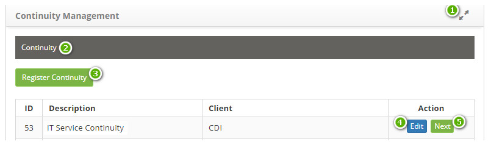
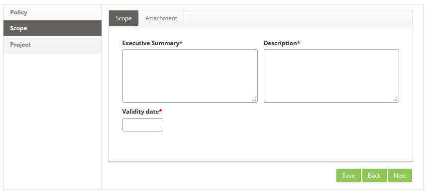
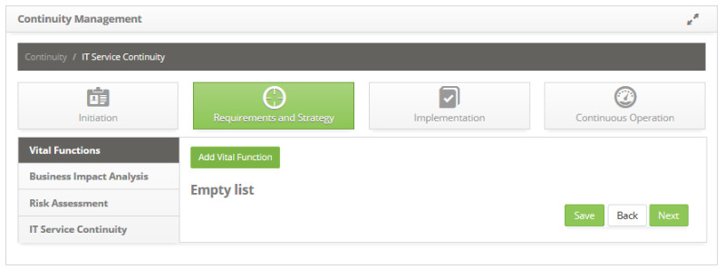

title: Continuity Management
Description: Continuity Management focuses on recovering IT services and their components in the face of a disaster event.
# Continuity Management

Continuity Management focuses on recovering IT services and their components in the face of a disaster event.

Preconditions
--------------

1. Register category of threat (see knowledge [Threat category registration and search][1]);

2. Register threat (see knowledge [Threat registration and search][2]);

3. Link the threat category to the registered threat;

4. Register the risk category (see knowledge [Risk category registration and search][3]);

5. Register risk (see knowledge [Continuity risk registration and search][4]);

6. Register Customer (see knowledge [Customer registration and search][5]);

7. Register employee (see knowledge [Staff registration and search][6]);

8. Record Incident, Request and Procedures automatic actions related to Event Management (see knowledge [Automatic actions registration and search][7]);

9. Register on the knowledge base a document of type Recovery Measure (see knowledge [Knowledge management][8]).

How to access
---------------

1. Access the functionality through navigation in the main menu 
**Process Management > Continuity Management > Continuity Management**.

Registering continuity of service
------------------------------------

1. On the **Continuity Management** screen, click the *Register Continuity* button, as shown in the figure below:

    
    
    **Figure 1 - Continuity registration button**
    
2. The **Continuity Registration** screen will be displayed, as shown in the figure below:

    
    
    **Figure 2 - Continuity master data screen**
    
    - **Name**: define the name of the service continuity;
    - **Client**: inform the customer of the continuity of the service;
    - After entering the service continuity data, click the *Save* button to register. The figure below shows the Service 
    Continuity after being registered:
    
    
    
    **Figure 3 - Service continuity record**
    
     : extends the Continuity Management screen;
    
     **Navigation Bar**: allows the navigation between the continuity data;
    
     **Continuity Register button**: allows the registration of a new continuity of services;
    
     **Edit Continuity**: allows the edit the data of the continuity record;
    
     **Next Continuity**: allows the access to the continuity of services.
    
    - To change the service continuity record data, click the *Edit* button service continuity record data, change the data, and 
    click *Save* to make the change, where the date, time, and user are automatically saved for a future audit.

    - To delete the service continuity log, click the *Edit button* service continuity log, and then click the *Delete Data* button 
    to perform the operation.

    - After registering for Continuity of Service, click the *Next* button to access it. The Service Continuity Management screen 
    will be displayed.

Initiation
-----------

1. After registering for IT Service Continuity, click the *Next* button IT Service Continuity to access it;

2. The **IT Service Continuity** information screen will be displayed, click on the **Initiation** phase, at this stage the policy, 
scope and project will be defined. Once this is done, you will be presented with the screen where you can register the necessary 
information for this phase, as shown in the figure below:

**Figure 4 - IT service continuity initiation phase**

Defining policy
--------------------

The policy should be defined and communicated as early as possible so that all members of the organization involved or affected by 
business continuity are made aware of their responsibilities to support IT Service Continuity Management (ITSCM) in accordance with 
policy objectives.

1. On the **Continuity Management** screen, in the **Initiation** phase, click the **Policy** tab. Once this is done, the 
respective policy registration screen will be displayed, as shown in the figure below:

    
    
    **Figure 5 - Policy registration screen**
    
2. Fill in the fields as directed below:

    - **Title**: report the title of the policy;
    - **Version**: report the version of the policy;
    - **Expiration Date**: enter the expiration date of the policy;
    - **Description**: describe the details of the policy;
    - **Responsible**: inform the responsible for the policy;
    - After entering the data and if you want to attach a file, click the **Attachment** tab. The file attachment screen will be 
    displayed as shown in the figure below:
    
    
    
    **Figure 6 - File attachment screen**
    
    - Enter the description for the file that will be attached, click the *Add File* button and select the file you want. After 
    that, the file will be appended and displayed in the policy attachment screen.
    
    
    
    **Figure 7 - Attached policy file**
    
3. After setting the policy, click the *Save* button to register, where the date, time and user will be saved automatically for a 
future audit.

4. The *Next* button, when triggered, advances to the next step of the initiation phase.

Registering scope
---------------------

Definition of the scope and responsibilities of the teams covering the activities of the process such as risk assessment, Business 
Impact Analysis (BAI), determination of controls according to customer and regulatory requirements, considering audit points and 
compliance with ISO 27001 .

1. On the **Continuity Management**screen, in the **Initiation** phase, click the **Scope** tab. Once this is done, the respective 
scope register screen will be displayed, as shown in the figure below:

    
    
    **Figure 8 - Scope registraton screen**
    
2. Fill in the fields as directed below:

    - **Executive Summary**: describe a summary of the organization's business plan;
    - **Description**: describe the details of the scope of service continuity;
    - **Validity date**: enter the expiration date of the scope of service continuity;
    - After entering the data and if you want to attach a file, click the **Attachment** tab. The file attachment screen will be 
    displayed as shown in the figure below:
    
    
    
    **Figure 9 - File attachment screen**
    
    - Enter the description for the file that will be attached, click the *Add File* button and select the file you want. After 
    that, the file will be appended and displayed in the scope attachment screen, as shown in the figure below:

    
    
    **Figura 10 - Attached scope file**
    
3. After recording the scope information, click the *Save* button to register, where the date, time and user will be automatically 
saved for a future audit.

4. The *Back* button, when triggered, returns to the previous step of the initiation phase.

5. The *Next* button, when triggered, advances to the next step of the initiation phase.

Defining project
-------------------

1. On the **Continuity Management** screen, in the **Initiation** phase, click the **Project** tab. Once this is done, the project 
definition screen will be displayed, as shown in the figure below:

    
    
    **Figure 11 - Project link screen**
    
2. Click the *Link Project* button to link an existing project to the continuity of the service. Once this is done, the project 
search screen will be displayed. Perform the search and select the desired project to perform the operation. After this, the 
project record will be presented as shown in the figure below:

    
    
    **Figure 12 - Project registration**
    
    - If you need to create a new project, you can register it from this screen, just click the *Create New Project* button.
    - To change the project data, just click on the project's icon  in the upper left 
    corner.
    
3. After the project has been defined, click the *Save* button to register, where the date, time and user will be saved 
automatically for a future audit.

4. The *Back* button, when triggered, returns to the previous step of the initiation phase.

5. The *Finish* button, when triggered, closes the initiation phase records and advances to the next stage of the process.

Requirements and strategy
----------------------------

1. The **IT Service Continuity** information screen will be displayed, click on the **Requirements and Strategy** phase, this phase 
defines the vital functions, business impact analysis, risk assessment and continuity strategy. Once this is done, you will be 
presented with the screen where you can register the necessary information for this phase, as shown in the figure below:

**Figure 13 - Requirements phase and IT service continuity strategy**

Recording vital functions
----------------------------

1. On the **Continuity Management** screen, in the **Requirements and Strategy** phase, click the **Vital Functions** tab. Once 
this is done, the vital functions registration screen will be displayed, as shown in the figure below:

    
    
    **Figure 14 - Vital function addition screen**
    
2. Click the *Add Vital Function* button to add the business process (s). Once this is done, the business process search screen 
will be displayed. Perform the search, select the desired process (s) and click the *Submit* button to perform the operation. After 
this, the business process registration (s) will be added on the screen, as shown in the figure below:

    
    
    **Figure 15 - Vital function record**
    
3. After defining the vital functions, click the *Save* button to register, where the date, time and user will be saved 
automatically for a future audit. After recording the record, the file attachment Attach button for the vital function will be 
displayed, as shown in the figure below:

    
    
    **Figure 16 - Vital function record**
    
4. The **Next** button, when triggered, advances to the next step in the requirements and strategy phase.

Registering business impact analysis
--------------------------------------------

1. On the **Continuity Management** screen, in the **Requirements and Strategy** phase, click the **Business Impact Analysis** tab. 
Once this is done, the screen will be presented to add the vital function in order to record the characteristics of the impact on 
the business, as shown in the figure below:

    
    
    **Figura 17 - Tela de adição de função vital**
    
2. Clique no botão "Selecionar Função Vital" para adicionar a função vital à análise de impacto do negócio. Feito isso, será 
exibida a tela de pesquisa de funções vitais. Realize a pesquisa e selecione a função vital que desejar. Após isso, será 
adicionada na tela a função vital, clique no ícone  da mesma para registro das informações 
da análise de impacto no negócio, conforme exemplo ilustrado na figura abaixo:

    
    
    **Figura 18 - Tela de registro de impacto no negócio**
    
    - **Possíveis Impactos**: informe os possíveis impactos ao negócio;
    - **Gravidade**: selecione a gravidade ao negócio;
    - **Objetivo para ponto de recuperação**: informe o tempo que começará a recuperação do serviço;
    - **Objetivo do tempo de recuperação**: informe o tempo esperado para recuperação do serviço;
    - **Custo por hora de inatividade**: defina o custo por hora quando houver indisponibilidade dessa função vital;
    - **Máximo tolerável de inatividade**: informe o tempo máximo que o serviço poderá ficar inativo;
    - **Custo do impacto**: defina o custo do impacto quando houver indisponibilidade dessa função vital;
    - **Estratégia 1**: descreva a primeira estratégia para continuidade do serviço;
    - **Estratégia 2**: descreva a segunda estratégia para continuidade do serviço;
    - **Estratégia 3**: descreva a terceira estratégia para continuidade do serviço.
    
3. Após informar as características do impacto no negócio, clique no botão "Gravar" para efetuar o registro, onde a data, hora e 
usuário serão gravados automaticamente para uma futura auditoria;

4. O botão "Voltar", ao ser acionado, retorna para a etapa anterior da fase de requisitos e estratégia;

5. O botão "Avançar", ao ser acionado, avança para a próxima etapa da fase de requisitos e estratégia.

Registrando avaliação de riscos
---------------------------------

1. Na tela de **Gerenciamento de Continuidade**, na fase de **Requisitos e Estratégia**, clique na guia **Avaliação de Riscos**. 
Feito isso, será apresentada a tela de adição de cenários para registro da avaliação dos riscos, conforme ilustrada na figura 
abaixo:

    
    
    **Figura 19 - Tela de adição de cenário**
    
2. Clique no botão "Adicionar Cenário". Feito isso, será apresentado o cenário na tela, clique no 
ícone  do mesmo para registro das características, conforme ilustrado na figura abaixo:

    
    
    **Figura 20 - Tela de registro de cenário**
    
    - **Nome cenário**: informe descrição do cenário;
    - **Função vital**: selecione a função vital. Caso queira limpar o dado informado no campo, clique no 
    ícone  ;
    
3. Adicione os serviços à avaliação de risco:

    - Clique no botão "Adicionar serviço", será apresentada a tela de pesquisa de serviços, conforme ilustrada na figura abaixo:
    
    
    
    **Figura 21 - Tela de pesquisa de serviço**
    
    - Realize a pesquisa e selecione o serviço desejado. Após isso, será adicionado o serviço na tela, conforme exemplo ilustrado 
    na figura abaixo:
    
    
    
    **Figura 22 - Serviço relacionado à cenário**
    
4. Adicione os riscos à avaliação:

    - Clique no botão "Adicionar risco", será apresentada a tela de pesquisa de riscos, conforme ilustrada na figura abaixo:
    
    
    
    **Figura 23 - Tela de pesquisa de riscos**
    
    - Realize a pesquisa e selecione o risco desejado. Após isso, será adicionado o risco na tela, conforme exemplo ilustrado na 
    figura abaixo:
    
    
    
    **Figura 24 - Guia de ameaças**
    
    - Clique no botão "Selecionar ameaça" para adicionar a ameaça do risco ou no botão "Adicionar ameaça" para criar um nova ameaça. Será apresentado o campo para informar a ameaça. Após selecionar a ameaça clique no ícone para expandir a tela e informar a probabilidade e o impacto da ameaça sobre o risco;
    
    
    
    **Figura 25 - Registro de ameaças**
    
    - Após informar as ameaças, clique na guia **Planos de Tratativa**. Será apresenta a tela de plano de tratativa conforme 
    ilustrada na figura abaixo:
    
    
    
    **Figura 26 - Guia de Planos de Tratativa**
    
    - Clique no botão "Adicionar tratativa", para registrar a tratativa da ameaça. Será apresentado o campo para informar a 
    descrição do plano de tratativa. Após informar o nome do plano clique no ícone  para 
    expandir a tela e informar a probabilidade e o impacto da tratativa sobre a ameaça;
    
    
    
    **Figura 27 - Registro de plano de tratativa**
    
    - **Nome do plano de tratativa**: informe no nome do plano de tratativa das ameaças;
    - **Ameaças relacionadas**: informe as ameaças relacionadas ao risco;
    - **Probabilidade**: informe a probabilidade de tratativa das ameaças;
    - **Impacto**: informe o impacto da tratativa sobre as ameaças;
    - **Proposta de medida de recuperação**: descreva a proposta da medida de recuperação;
    - **Proposta de plano de mitigação**: descreva a proposta do plano de mitigação.
    
    - Após registro dos dados do plano de tratativa, clique no ícone  para verificar o gráfico 
    de avaliação de riscos. A figura abaixo ilustra o exemplo do gráfico de avaliação de riscos:
    
    
    
    **Figura 28 - Gráfico de avaliação de riscos**
    
5. Após a definição de ameaças e planos de tratativa, a avaliação de risco estará completa, diante disso, clique no botão 
"Gravar" para efetuar o registro, onde a data, hora e usuário serão gravados automaticamente para uma futura auditoria.

6. O botão "Voltar", ao ser acionado, retorna para a etapa anterior da fase de requisitos e estratégia.

7. O botão "Avançar", ao ser acionado, avança para a próxima etapa da fase de requisitos e estratégia.

Registrando estratégia de continuidade de serviços de TI
----------------------------------------------------------

1. Na tela de **Gerenciamento de Continuidade**, na fase de **Requisitos e Estratégia**, clique na guia **Estratégia de 
Continuidade de Serviços de TI**. Feito isso, será apresentada a tela para registro da estratégia de continuidade de serviço de 
TI, conforme ilustrada na figura abaixo:

    
    
    **Figura 29 - Tela de registro de estratégia de continuidade de serviço de TI**
    
2. Nesta tela, é apresentado uma tarja *verde* informando a porcentagem de funções vitais contempladas para o sumário executivo e 
uma tarja *vermelha* informando a porcentagem de funções vitais não contempladas para o objetivo;

    - **Sumário Executivo**: descreva o sumário executivo da estratégia de continuidade de serviço de TI;
    - **Objetivo**: descreva o objetivo da estratégia de continuidade de serviço de TI.
    
3. Adicione as funções vitais:

    - Clique no botão "Selecionar Função Vital". Será apresentada a tela para pesquisa de funções vitais. Realize a pesquisa e 
    selecione a função vital desejada. Feito isso, será adicionado na tela a função vital, conforme exemplo ilustrado na figura 
    abaixo:
    
    
    
    **Figura 30- Selecionar função vital**
    
    - Clique no botão "Serviços" da função vital para visualizar os serviços vinculados à mesma;
    - Clique no botão "Cenários" para visualizar os cenários vinculados à mesma. Após isso, serão apresentados os cenários, 
    clique no ícone  do cenário para exibição das informações do mesmo, conforme exemplo 
    ilustrado na figura abaixo:
    
    
    
    **Figura 31 - Visualização de cenário**
    
    - Clique na guia de **Planos de Tratativa** do risco, serão apresentados dois botões que permite utilizar a proposta de 
    medida de recuperação como medida de recuperação e utilizar a proposta de plano de mitigação como medida de resposta;
    
    
    
    **Figura 32 - Visualização de planos de tratativa**
    
    - Após clicar nos botões, será adicionado na tela de Estratégia da Continuidade de Serviço de TI a medida de recuperação e 
    medida de resposta para definição, conforme exemplo ilustrado na figura abaixo:
    
    
    
    **Figura 33 - Medidas de recuperação e medidas de respostas aos riscos**
    
4. Após a definição da estratégia da continuidade de serviço de TI, clique no botão "Gravar" para efetuar o registro, onde a 
data, hora e usuário serão gravados automaticamente para uma futura auditoria;

5. O botão "Voltar", ao ser acionado, retorna para a etapa anterior da fase de requisitos e estratégia;

6. O botão "Finalizar", ao ser acionado, encerra os registros da fase de requisitos e estratégia e avança para a próxima fase do 
processo.

Implementação
--------------

1. Após o registo da Continuidade de Serviço de TI, clique no botão "Avançar" da mesma para acessá-la, conforme indicado na 
figura abaixo:

    
    
    **Figura 34 - Acesso a continuidade de serviço de TI**
    
2. Será apresentada a tela de informações de **Continuidade do Serviço de TI**, clique na fase de **Implementação**, nesta fase é 
definido o plano de continuidade, planejamento organizacional e estratégia de testes. Feito isso, será apresentada a tela onde 
poderá registrar as informações necessárias dessa fase, conforme ilustrada na figura abaixo:

**Figura 35 - Fase de implementação da continuidade do serviço de TI**

Registrando o plano de continuidade
-------------------------------------

1. Na tela de **Gerenciamento de Continuidade**, na fase de **Implementação**, clique na guia **Plano de Continuidade**. Feito 
isso, será apresentada a respectiva tela de cadastro de plano de continuidade, conforme ilustrada na figura abaixo:

    
    
    **Figura 36 - Tela de registro de plano de continuidade**
    
2. Preencha os campos conforme orientações abaixo:

    - **Título**: informe o título do plano de continuidade;
    - **Versão**: este campo é para simples conferência, será apresentado a versão do plano de continuidade;
    - **Status**: informe o status do plano de continuidade;
    - **Descrição**: descreva os detalhes do plano de continuidade;
    - **Procedimentos de Continuidade**: informe o procedimento de continuidade (ação automática de 
    incidente/requisição/procedimento);
    - **Responsável**: informe o responsável pelo plano de continuidade;
    - **Validade**: informe a data de validade para o plano de continuidade;
    - **Autorização**: informe se o plano de continuidade será autorizado;
    - **Mudança Relacionada**: informe a mudança referente ao plano de continuidade;
    - Clique no botão "Gravar", e serão apresentadas as opções para relacionar conhecimento(s), relacionar medida(s) de 
    recuperação e adicionar anexo(s).
    
3. Relacione um conhecimento ao plano de continuidade:

    - Clique no botão "Relacionar Conhecimentos", será apresentada a tela de pesquisa de conhecimentos. Realize a pesquisa e 
    selecione o conhecimento. Feito isso, será vinculado o conhecimento ao plano de continuidade, conforme exemplo ilustrado na 
    figura abaixo:
    
    
    
    **Figura 37 - Relacionar conhecimentos**
    
    - Para visualizar o conteúdo do conhecimento, basta clicar no ícone  do mesmo;
    - Para excluir o vínculo do conhecimento com o plano de continuidade, basta clicar no
    ícone  do mesmo.
    
4. Relacione medidas de recuperação ao plano de continuidade:

    - Clique no botão "Relacionar Medidas de Recuperação", será apresentada a tela de pesquisa de medidas de recuperação. Realize 
    a pesquisa e selecione a medida de recuperação. Feito isso, será vinculado a medida de recuperação ao plano de continuidade, 
    conforme exemplo ilustrado na figura abaixo:
    
    
    
    **Figura 38 - Relacionar medidas de recuperação**
    
5. Caso queira anexar um arquivo, clique no botão "Anexos". Será exibida a tela para anexo de arquivos. Informe a descrição para 
o arquivo que será anexado, clique no botão "Adicionar Arquivo" e selecione o arquivo desejado. Após isso, o arquivo será anexado 
e apresentado na tela de anexo do plano de continuidade;

6. Após informação dos dados do plano de continuidade, clique no botão "Gravar" para efetuar o registro, onde a data, hora e 
usuário serão gravados automaticamente para uma futura auditoria;

7. O botão "Avançar", ao ser acionado, avança para a próxima etapa da fase de implementação.

Registrando planejamento organizacional
-----------------------------------------

1. Na tela de **Gerenciamento de Continuidade**, na fase de **Implementação**, clique na guia **Planejamento Organizacional**. 
Feito isso, será apresentada a tela de cadastro de planejamento organizacional, conforme ilustrada na figura abaixo:

    
    
    **Figura 39 - Tela de registro de planejamento organizacional**
    
2. Preencha os campos conforme orientações abaixo:

    - **Sumário Executivo**: descreva um resumo sobre o planejamento organizacional;
    - Informe a comissão executiva do planejamento organizacional:
        - **Grupo**: informe o grupo do planejamento;
        - **Responsabilidade**: informe a responsabilidade do grupo.
        
3. Adicione o grupo de coordenação do planejamento organizacional:

    - Clique no botão "Adicionar Grupo", serão exibidos os campos: Grupo e Responsabilidade;
    - **Grupo**: informe o grupo de coordenação do planejamento organizacional;
    - **Responsável**: informe responsabilidade do grupo.
    
4. Adicione a equipe de recuperação:

    - Clique no botão "Adicionar Grupo", serão exibidos os campos: Grupo e Responsabilidade;
    - **Grupo**: informe o grupo de recuperação do planejamento organizacional;
    - **Responsável**: informe responsabilidade do grupo.
    
5. Após definição do planejamento organizacional, clique no botão "Gravar" para efetuar o registro, onde a data, hora e usuário 
serão gravados automaticamente para uma futura auditoria;

6. O botão "Voltar", ao ser acionado, retorna para a etapa anterior da fase de implementação;

7. O botão "Avançar", ao ser acionado, avança para a próxima etapa da fase de implementação.

Registrando estratégia de testes
----------------------------------

1. Na tela de **Gerenciamento de Continuidade**, na fase de **Implementação**, clique na guia **Estratégia de Testes**. Feito 
isso, será apresentada a tela de cadastro de estratégia de testes, conforme ilustrada na figura abaixo:

    
    
    **Figura 40 - Tela de registro estratégia de testes**
    
2. Preencha os campos conforme orientações abaixo:

    - **Nome**: informe a descrição da estratégica de testes;
    - **Sumário Executivo**: descreva o resumo do plano de teste, níveis de teste, cenários de teste, critérios de aceite do 
    teste e etc.;
    - Adicione as medidas de recuperação. Essas medidas de recuperação (tratativas) são traçadas dentro dos cenários da etapa de 
    Estratégia de Continuidade do Serviço da fase de Requisitos e Estratégia.
    
3. Clique no botão "Selecionar medida de recuperação", será apresentada a tela de pesquisa de medidas de recuperação. Realize a 
pesquisa e selecione a medida de recuperação. Feito isso, será exibida uma tela para definir o plano de teste da medida de 
recuperação, conforme ilustrada na figura abaixo:

    
    
    **Figura 41 - Registro medidas de recuperação**
    
    - **Nome do plano de teste**: informe o nome do plano de testes;
    - **Plano de teste**: descreva o plano de teste que será seguido. Nesse momento pode-se escrever os tipos de teste que será 
    realizado, riscos e contingência e os critérios de saída;
    - **Data/Hora Início**: informe a data e hora de início dos testes;
    - **Data/Hora Fim**: informe a data e hora de encerramento dos testes.
    - Informe o grupo participante dos testes.
    
4. Clique no botão "Selecionar grupo participante", será apresentada a tela de pesquisa de grupos. Realize a pesquisa e selecione 
o grupo. Feito isso, será adicionado o grupo participante na tela.

    - Informe o grupo facilitador dos testes;
    - Clique no botão "Selecionar grupo facilitador", será apresentada a tela de pesquisa de grupos. Realize a pesquisa e 
    selecione o grupo. Feito isso, será adicionado o grupo facilitador na tela;
    - **Tipo de teste**: selecione o tipo de teste que será realizado durante a etapa de testes;
    - **Checklist**: selecione o checklist que será verificado nos testes;
    - Caso queira anexar um arquivo ao plano de teste, basta clicar no ícone ;
    
5. Após informar os dados da estratégia de testes e caso queira anexar um arquivo, clique na aba **Anexos**. Será exibida a tela 
para anexo de arquivos conforme ilustrada na figura abaixo:

    
    
    **Figura 42 - Tela de anexo de arquivos**
    
    - Informe a descrição para o arquivo que será anexado, clique no botão "Adicionar Arquivo" e selecione o arquivo desejado. 
    Após isso, o arquivo será anexado e apresentado na tela de anexo da estratégia de testes.
    
6. Após a definição da estratégia de testes, clique no botão "Gravar" para efetuar o registro, onde a data, hora e usuário serão 
gravados automaticamente para uma futura auditoria;

7. O botão "Voltar", ao ser acionado, retorna para a etapa anterior da fase de implementação;

8. O botão "Finalizar", ao ser acionado, encerra os registros da fase de implementação e avança para a próxima fase do processo.

Operação contínua
-------------------

1. Após o registro da Continuidade de Serviço de TI, clique no botão "Avançar" da mesma para acessá-la, conforme indicado na 
figura abaixo:

    
    
    **Figura 43 - Acesso a continuidade de serviço de TI**
    
2. Será apresentada a tela de informações de **Continuidade do Serviço de TI**, clique na fase de **Operação Contínua**, nesta 
fase é definido a conscientização, auditoria, testes e invocação. Feito isso, será apresentada a tela onde poderá registrar as 
informações necessárias dessa fase, conforme ilustrada na figura abaixo:

**Figura 44 - Fase de operação contínua da continuidade do serviço de TI**

Conscientização (educação e treinamento)
------------------------------------------

1. Na tela de **Gerenciamento de Continuidade**, na fase de **Operação Contínua**, clique na guia **Conscientização (Educação e 
Treinamento)**. Feito isso, será apresentada a tela de cadastro, conforme ilustrada na figura abaixo:

    
    
    **Figura 45 - Tela de registro de conscientização**
    
2. Preencha os campos conforme orientações abaixo:

    - **Sumário Executivo**: descreva o sumário executivo;
    - Informe os registros de treinamento;
    - Clique no botão "Adicionar Registro", será apresentada a tela registro dos dados de treinamento, conforme ilustrada na 
    figura abaixo:
    
    
    
    **Figura 46 - Registro de treinamento**
    
    - **Análise Crítica da Ação**: informe a análise crítica sobre o treinamento;
    - **Tipo de Atividade**: selecione o tipo de atividade do treinamento;
    - **Status**: selecione o status do treinamento;
    - Caso queira anexar um arquivo ao registro de treinamento, basta clicar no ícone .
    
3. Após a informação dos dados, clique no botão "Gravar" para efetuar o registro, onde a data, hora e usuário serão gravados 
automaticamente para uma futura auditoria;

4. O botão "Avançar", ao ser acionado, avança para a próxima etapa da fase de operação contínua.

Realizando revisão e auditoria
--------------------------------

1. Na tela de **Gerenciamento de Continuidade**, na fase de **Operação Contínua**, clique na guia **Revisão e Auditoria**. Feito 
isso, será apresentada a tela de revisão e auditoria da continuidade do serviço. Nesta tela permite verificar o histórico de 
alterações do registro de continuidade de serviço de TI para auditoria do mesmo e registrar as informações necessárias da 
auditoria realizada. A figura abaixo ilustra essa tela:

    
    
    **Figura 47 - Tela auditorias registradas**
    
2. Para realizar uma busca específica da alteração feita no registro de continuidade do serviço de TI, informe o período 
desejado, selecione a categoria e clique no botão "Buscar". Após isso, serão apresentados os dados para revisão e auditoria;

3. Para verificar mais detalhes sobre a modificação realizada, basta clicar no botão "Expandir" do item desejado;

4. Caso tenha a necessidade de registrar os detalhes da auditoria realizada, clique na aba **Cadastrar Auditoria**. Feito isso, 
será apresentada a tela de cadastro conforme ilustrada na figura abaixo:

    
    
    **Figura 48 - Tela cadastrar auditoria**
    
    - **Categoria**: selecione a categoria de continuidade de serviço, na qual foi feita a auditoria;
    - **Descrição**: informe os detalhes da auditoria realizada.
    
5. Após informar todos os dados necessários, clique no botão "Gravar" para efetuar o registro;

6. O botão "Voltar", ao ser acionado, retorna para a etapa anterior da fase de operação contínua;

7. O botão "Avançar", ao ser acionado, avança para a próxima etapa da fase de contínua.

Testes
---------

1. Na tela de **Gerenciamento de Continuidade**, na fase de **Operação Contínua**, clique na guia **Testes**. Feito isso, será 
apresentado o calendário de testes, conforme ilustrado na figura abaixo:

    
    
    **Figura 49 - Calendário de testes**
    
2. Neste calendário, são apresentados os eventos de testes traçados durante a implementação, o que chamamos de estratégia de 
testes. Estes eventos de testes podem ser visualizados por mês, semana ou dia. Para definir o tipo de visualização, clique em um 
dos botões localizados acima do calendário: **Mês, Semana** ou **Dia**;

3. Clique no evento de teste para registrar as demais informações sobre o teste. Após isso, será apresentada a tela de evento de 
teste exibindo as informações principais do mesmo, conforme ilustrada na figura abaixo:

    
    
    **Figura 50 - Guia informações principais**
    
4. Adicione os grupos de teste. Clique na aba **Grupo**, será apresentada a tela conforme ilustrada na figura abaixo:

    
    
    **Figura 51 - Guia grupo**
    
5. Clique no botão "Adicionar Grupo", será apresentada a tela de pesquisa de grupo. Realize a pesquisa do grupo desejado e 
selecione o mesmo para efetuar a operação;

6. Após a adição dos grupos, os mesmos serão exibidos na tela de evento de teste, conforme exemplo ilustrado na figura abaixo:

    
    
    **Figura 52 - Grupo relacionado**
    
7. Adicione os colaboradores envolvidos no teste. Clique na aba **Colaborador**, será apresentada a tela conforme ilustrada na 
figura abaixo:

    
    
    **Figura 53 - Guia colaborador**
    
8. Clique no botão "Adicionar Colaborador", será apresentada a tela de pesquisa de colaborador. Realize a pesquisa do colaborador 
desejado e selecione o mesmo para efetuar a operação;

9. Após a adição dos colaboradores, os mesmos serão exibidos na tela de evento de teste, conforme exemplo ilustrado na figura 
abaixo:

    
    
    **Figura 54 - Colaborador relacionado**
    
10. Informe a evidência de teste. Clique na guia **Evidências de teste**, será apresentada a tela conforme ilustrada na figura 
abaixo:

    
    
    **Figura 55 - Guia evidência de teste**
    
11. Clique no botão "Adicionar Evidência de teste", será apresentada a tela de pesquisa de evidências de teste. Realize a 
pesquisa da evidência de teste desejada e selecione a mesma para efetuar a operação. Caso não encontre o registro da evidência de 
teste e haja a necessidade de registrar uma evidência para adicionar ao evento de teste, poderá registrá-la a partir dessa tela, 
basta clicar no botão "Criar Evidência de teste";

12. Após a adição das evidências de teste, as mesmas serão exibidas na tela de evento de teste, conforme exemplo ilustrado na 
figura abaixo:

    
    
    **Figura 56 - Evidência de teste relacionado**
    
    - Para visualizar o conteúdo da evidência de teste, basta clicar no botão "Detalhe" da mesma.
    
13. Informe os planos de teste. Clique na aba **Planos de teste**, será apresentada a tela conforme ilustrada na figura abaixo:

    
    
    **Figura 57 - Guia planos de teste**
    
    - Clique no botão "Planos de teste", será apresentada a tela de pesquisa de planos de teste. Realize a pesquisa do plano de 
    teste desejado e selecione o mesmo para efetuar a operação;
    - Após a adição dos planos de teste, os mesmos serão exibidos na tela de evento de teste, conforme exemplo ilustrado na 
    figura abaixo:
    
    
    
    **Figura 58 - Planos de teste relacionado**
    
14. Após informar todos os dados necessários do evento de teste, clique no botão "Adicionar" para efetuar a operação;

15. O botão "Excluir", ao ser acionado, exclui o evento de teste do calendário;

16. Clique no botão "Gravar" do calendário de testes para aplicar as alterações realizadas;

17. O botão "Voltar" do calendário de teste, ao ser acionado, retorna para a etapa anterior da fase de operação contínua;

18. O botão "Avançar" do calendário de teste, ao ser acionado, avança para a próxima etapa da fase de operação contínua.

Invocação
----------

O gatilho para haver uma invocação é a abertura de um incidente do tipo crítico. O incidente tem que estar aprovado para exibição 
na tela de Invocação.

1. Na tela de **Gerenciamento de Continuidade**, na fase de **Operação Contínua**, clique na guia **Invocação**. Feito isso, será 
apresentado a tela de invocação, conforme ilustrado na figura abaixo:

    
    
    **Figura 59 - Tela invocação**
    
    !!! warning "ATENÇÃO"
    
        Para iniciar o procedimento de continuidade, os dados básicos dos procedimentos já devem estar registrados nas 
        Iniciativas/Solicitações/Procedimentos Ação Automática.
        
2. Clique no botão "Iniciar Plano de Continuidade Principal", para iniciar o procedimento principal de continuidade, o qual já 
deve estar cadastrado no plano de continuidade da fase de implementação;

3. Clique no botão "Iniciar Plano de Continuidade Auxiliar", para iniciar os procedimentos auxiliares de continuidade;

4. O exemplo ilustrado na figura abaixo apresenta os procedimentos de continuidade que foram iniciados:

    
    
    **Figura 60 - Procedimentos de continuidade iniciados**
    
5. Para verificar a descrição da solicitação de procedimento de continuidade, basta clicar no botão "Descrição";

6. Para visualizar a solicitação de procedimento de continuidade, basta clicar no botão "Visualizar";

7. Para capturar a solicitação de procedimento de continuidade para execução da mesma, basta clicar no botão "Capturar tarefa";

8. Para executar a solicitação de procedimento de continuidade, clique no botão "Executar", será apresentada a tela para 
atendimento da solicitação.

Fluxo de incidente crítico
-----------------------------

A solicitação de serviço do tipo "incidente crítico" segue o fluxo definido no portfólio de serviços, no momento do vínculo do 
serviço de incidente com contrato. A figura abaixo ilustra o desenho do fluxo:

**Figura 61 - Fluxo de incidente crítico**

Fluxo de procedimento de continuidade
---------------------------------------

A solicitação de serviço do tipo procedimento de continuidade segue o fluxo definido no portfólio de serviços, no momento do 
vínculo do serviço de procedimento com contrato. A figura abaixo ilustra o desenho do fluxo:

**Figura 62 - Fluxo de procedimento de continuidade**

!!! tip "About"

    <b>Product/Version:</b> CITSmart | 7.00 &nbsp;&nbsp;
    <b>Updated:</b>07/17/2019 – Larissa Lourenço
    
[1]:/pt-br/citsmart-platform-7/processes/continuity/threat-category.html

[2]:/pt-br/citsmart-platform-7/processes/continuity/threat-registration.html

[3]:/pt-br/citsmart-platform-7/processes/continuity/risk-category.html

[4]:/pt-br/citsmart-platform-7/processes/continuity/continuity-risk.html

[5]:/pt-br/citsmart-platform-7/processes/portfolio-and-catalog/client.html

[6]:/pt-br/citsmart-platform-7/initial-settings/access-settings/user/employee.html

[7]:/pt-br/citsmart-platform-7/plataform-administration/configuring-automatic-actions/automatic-actions.html

[8]:/pt-br/citsmart-platform-7/processes/knowledge/management.html
