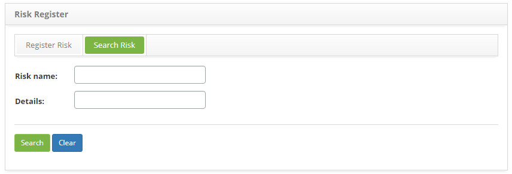
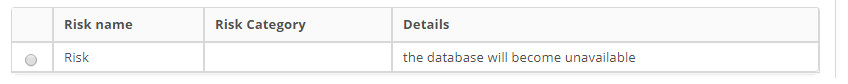
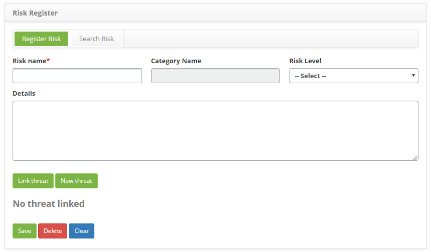
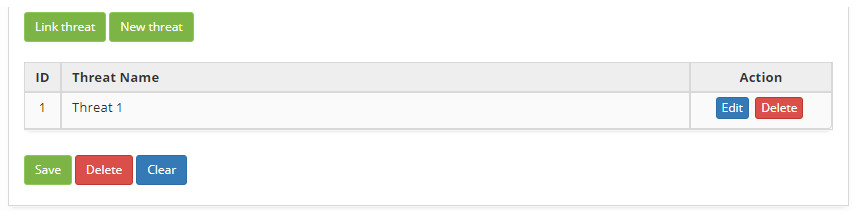

title: Continuity risk registration and search
Description: The goal of this feature is to register the risks which will be used during the continuity registry.
# Continuity risk registration and search

The goal of this feature is to register the risks which will be used during the continuity registry.

How to access
--------------

1. Access the Risk Register feature navigating through the main menu 
**Process Management > Continuity Management > Risk Register**.

Preconditions
----------------

1. Register a risk category (see knowledge [Risk category registration and search](/en-us/citsmart-platform-7/processes/continuity/risk-category.html));

2. Register a threat (see knowledge [Threat registration and search](/en-us/citsmart-platform-7/processes/continuity/threat-registration.html)).

Filters
---------

1. The following filter enables the user to restrict the participation of items in the standard feature listing, making it easier 
to find the desired items:

    - Risk name;
    - Details.
    
    
    
    **Figure 1 - Risk search screen**
    
2. Perform a risk search:

    - Insert the name of the intended risk and click on the *Search* button. Afterwards, the risk entry will be displayed according 
    to the description provided.

    - To list all risks categories, just click directly on the *Search* button, if needed.

Items list
-------------------

1. The following cadastral fields are available to the user to facilitate the identification of the desired items in the standard 
feature listing: **Risk name, Risk Category** and **Details**.

    
    
    **Figure 2 - Risk listing screen**
    
2. After searching, select the intended entry. Afterwards, they will be redirected to the registry screen displaying the content 
belonging to the selected entry.

3. To edit a risk entry, just modify the information on the intended fields and click on the *Save* button to confirm the changes 
to the database, at which date, time and user will be stored automatically for a future audit.

Filling in the registration fields
------------------------------------

1. The **Risk Registration** screen will be displayed, as illustrated on the image below:

    
    
    **Figure 3 - Risk entry screen**
    
2. Fill out the fields as instructed below:

    - **Risk Name**: describe the risk;
    - **Category Name**: insert the risk category;
    - **Risk Level**: select the level of risk
    - Link a threat to a risk:
        - Click on the *Link Threat* button. Afterwards, the threat search screen will be displayed. Perform the search, select the 
        intended threats and click on the *Add* button to confirm. If the intended threat entry can't be found and they need to 
        register a threat to link to the risk, it can be registered on this screen, just click on the *New Threat* button
        - After linking the threat to a risk, they will be displayed on the risk entry screen, as illustrated on the image below.
        
    
    
    **Figure 4 - Threats linked to a risk**
    
3. Click on the *Save* the button to confirm the entry, at which date, time and user will automatically be stored for a future 
audit.

!!! tip "About"

    <b>Product/Version:</b> CITSmart | 7.00 &nbsp;&nbsp;
    <b>Updated:</b>08/27/2019 – Larissa Lourenço
