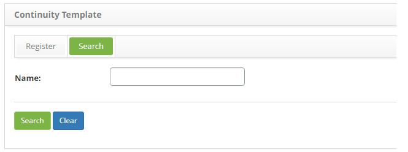
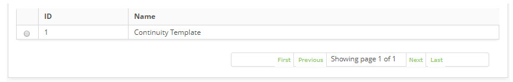
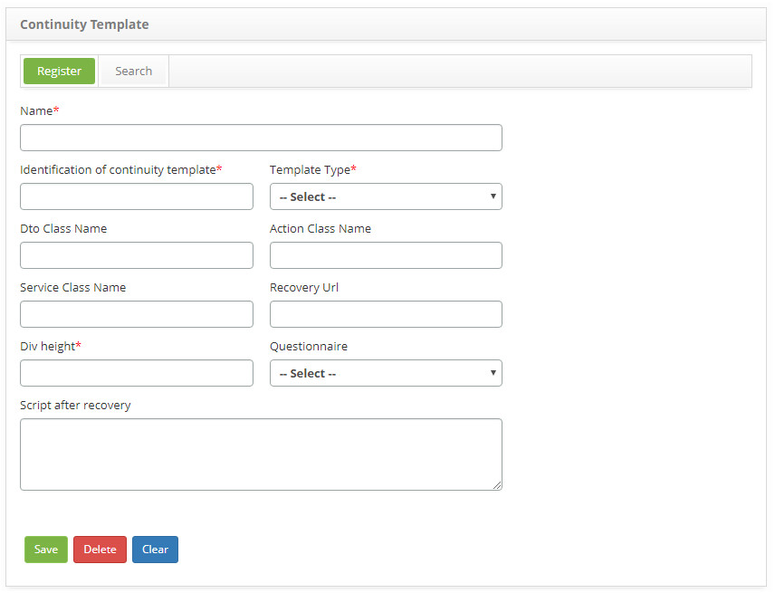

title: Continuity template registration and search
Description: The goal of this feature is to register a continuity template, which will be used to customize the test entry screen.
# Continuity template registration and search

The goal of this feature is to register a continuity template, which will be used to customize the test entry screen.

How to access
-----------------

1. Access the Continuity Template feature navigating through the main menu 
**Process Management > Continuity Management > Continuity Template**.

Preconditions
-----------------

1. Register a questionnaire (see knowledge [Questionnaire Category registration and search](/en-us/citsmart-platform-7/plataform-administration/questionnaires/questionnaires-management/questionnaire-category.html)).

Filters
---------

1. The following filter enables the user to restrict the participation of items in the standard feature listing, making it easier 
to find the desired items:

    - Name.
    
    
    
    **Figure 1 - Continuity template search screen**
    
2. Perform a continuity template search:

    - Insert the name of the intended template and click on the *Search* button. Afterwards, the template entry will be displayed 
    according to the description provided.

    - To list all continuity templates, just click directly on the *Search* button, if needed.

Items list
------------------

1. The following cadastral fields are available to the user to facilitate the identification of the desired items in the standard 
feature listing: **ID** and **Name**.

    
    
    **Figure 2 - Continuity template listing screen**
    
2. After searching, select the intended entry. Afterwards, they will be redirected to the registry screen displaying the content 
belonging to the selected entry.

3. To edit a template entry, just modify the information on the intended fields and click on the *Save* button to confirm the 
changes to the database, at which date, time and user will be stored automatically for a future audit.

Filling in the registration fields
--------------------------------------

1. The **Continuity Template Registration** screen will be displayed, as illustrated on the image below:

    
    
    **Figure 3 - Continuity template registration screen**
    
2. Fill out the fields as instructed below:

    - **Name**: name the continuity template;
    - **Identification of continuity template**: insert the continuity template identification;
    - **Template Type**: select the template type;
    - **DTO Class Name**: insert the continuity template dto class' name;
    - **Action Class Name**: insert the continuity template action class' name ;
    - **Service Class Name**: insert the continuity template service class' name;
    - **Recovery URL**: inser the recovery URL address;
    - **DIV height**: insert the DIV height value;
    - **Questionnaire**: insert the continuity questionnaire. It is determined on the Questionnaire screen;
    - **Script after recovery**: insert the script after recovery;
    
3. After the entry, click on the *Save* the button to confirm the entry, at which date, time and user will automatically be stored 
for a future audit.

!!! tip "About"

    <b>Product/Version:</b> CITSmart | 7.00 &nbsp;&nbsp;
    <b>Updated:</b>08/27/2019 – Larissa Lourenço

