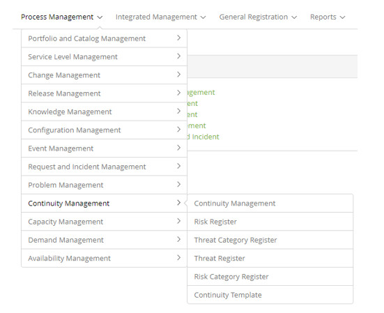

title: Continuity Management module
Description: Continuity Management focuses on recovering IT services and their components in the face of a disaster event.
# Continuity Management module

Module objective
--------------------

Continuity Management focuses on recovering IT services and their components in the face of a disaster event.

What can be a disaster event?

1. Fires;
2. Flooding;
3. Terrorism;
4. Blackouts;
5. Fall of systems;
6. Vandalism;
7. Storms.

The definition of what could be a disaster varies in organizations according to business impact.

The purpose of Continuity Management is to support the business continuity process, manage the risks that can seriously affect IT 
services, and ensure the provision of these services in the minimum service level agreement.

Where are the features
--------------------------------

To access the functionality click on the main menu **Process Management > Continuity Management**.

**Figure 1 - Continuity Management module menu**

Main feature (in highlight)
----------------------------------------

In the *See also* section you can access the main functionality(ies) of this module, in order to obtain a more detailed knowledge.

!!! abstract "KNOW MORE"

    This functionality is responsible for initiating Business Continuity Management that will provide Continuity 
    Management capability to act in a time of disaster. In turn, IT Service Continuity Management connects to the Service Level 
    Management, Availability Management, Configuration Management, Capacity Management, and Change Management processes to ensure 
    that recovery implementations occur satisfactorily Need to use.
    
See also
-------------

- [Continuity Management](/en-us/citsmart-platform-7/processes/continuity/continuity-management.html)

!!! tip "About"

    <b>Product/Version:</b> CITSmart | 7.00 &nbsp;&nbsp;
    <b>Updated:</b>08/28/2019 – Larissa Lourenço

