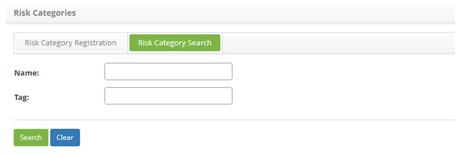
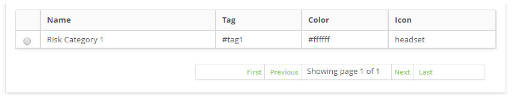
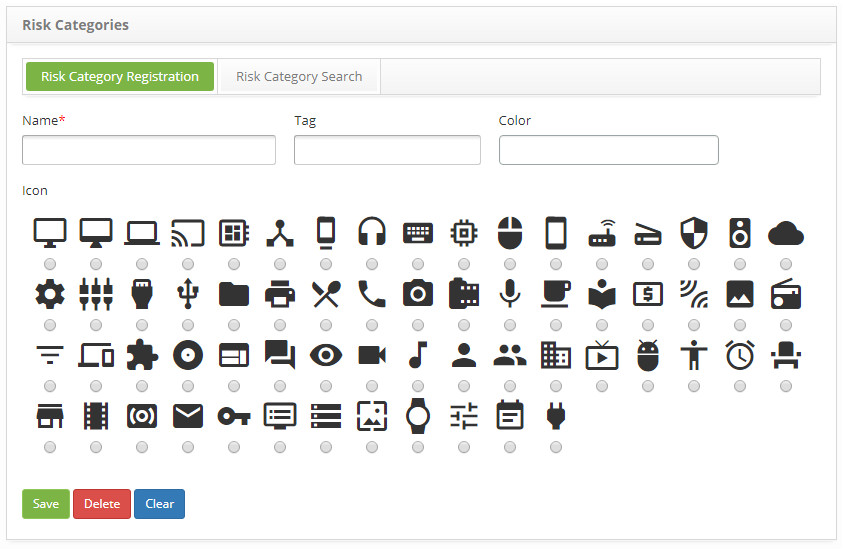
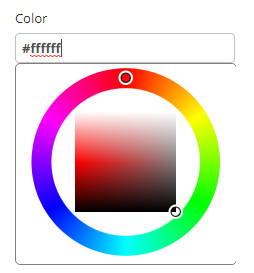

title: Risk category registration and search
Description: The goal of this feature is to register the risk categories which will be used during the risk entry.
# Risk category registration and search

The goal of this feature is to register the risk categories which will be used during the risk entry.

How to access
----------------

1. Access the **Threat Category** feature navigating through the main menu 
**Process Management > Continuity Management > Risk Category Register**.

Preconditions
---------------

1. Not applicable.

Filters
-----------

1. The following filter enables the user to restrict the participation of items in the standard feature listing, making it easier 
to find the desired items:

    - Name;
    - Tag.
    
2. On the **Risk Category** screen, click on the **Risk Category Search** tab. The search screen will be displayed as illustrated 
on the image below:

    
    
    **Figure 1 - Risk category search screen**
    
3. Perform a risk category search;

    - Insert the name and/or Tag of the intended risk category and click on the *Search* button. Afterwards, the threat category 
    entry will be displayed according to the description provided.

    - To list all risk categories, just click directly on the *Search* button, if needed.

Items list
-------------------

1. The following cadastral fields are available to the user to make it easier to identify the desired items in the standard feature 
listing: **Name, Tag, Color** and **Icon**.

    
    
    **Figure 2 - Risk category listing screen**
    
2. After searching, select the intended entry. Afterwards, they will be redirected to the registry screen displaying the content 
belonging to the selected entry.

3. To edit a risk category entry, just modify the information on the intended fields and click on the *Save* button to confirm the 
changes to the database, at which date, time and user will be stored automatically for a future audit.

Filling in the registration fields
-------------------------------------

1. The risk category entry screen will be displayed, as illustrated on the image below:

    
    
    **Figure 3 - Risk category entry screen**
    
2. Fill out the fields as instructed below:

    - **Name**: name the risk category;
    - **Tag**:  insert the Tag which will identify the risk category;
    - **Color**: assign a color to the risk category. Clicking on this field, a color palette screen will be displayed in order to 
    select the intended color, as illustrated on the image below:
    
    
    
    **Figure 4 - Palette**
    
    - To select a color, just place the mouse on over the intended color and click on it.
    - **Icon**: select an icon which will represent the risk category;
    
3. Click on the *Save* the button to confirm the entry, at which date, time and user will automatically be stored for a future 
audit.

!!! tip "About"

    <b>Product/Version:</b> CITSmart | 7.00 &nbsp;&nbsp;
    <b>Updated:</b>08/27/2019 – Larissa Lourenço
