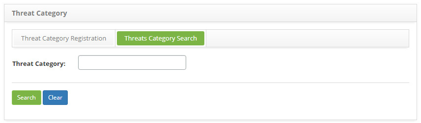
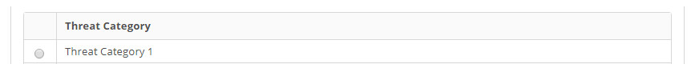
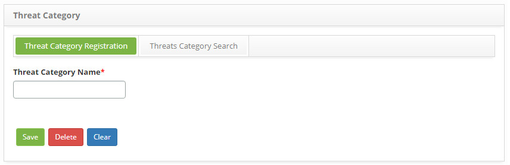

title: Threat category registration and search
Description: The goal of this feature is to register the threat categories which will be used during the threat entry 
# Threat category registration and search

The goal of this feature is to register the threat categories which will be used during the threat entry.

How to access
----------------

1. Access the **Threat Category** feature navigating through the main menu 
**Process Management > Continuity Management > Threat Category Register**.

Preconditions
--------------

1. No applicable.

Filters
-----------

1. The following filter enables the user to restrict the participation of items in the standard feature listing, making it easier 
to find the desired items:

    - Threat Category.
    
    
    
    **Figure 1 - Threat category search screen**
    
2. Perform a threat category search:

    - Insert the name of the intended threat category and click on the *Search* button. Afterwards, the threat category entry will 
    be displayed according to the description provided.

    - To list all threat categories, just click directly on the **Search** button, if needed.

Items list
-------------------

1. The following cadastral field is available to the user to facilitate the identification of the desired items in the standard 
feature listing: **Threat Category**.

    
    
    **Figure 2 - Threat category listing screen**
    
2. After searching, select the intended entry. Afterwards, they will be redirected to the registry screen displaying the content 
belonging to the selected entry.

3. To edit a threat category entry, just modify the information on the intended fields and click on the *Save* button to confirm 
the changes to the database, at which date, time and user will be stored automatically for a future audit.

Filling in the registration fields
-------------------------------------

1. The threat category entry screen will be displayed, as illustrated on the image below:

    
    
    **Figure 3 - Threat category entry screen**
    
2. Fill out the fields as instructed below:

    - **Threat Category Name**: insert the threat category description;
    
3. Click on the *Save* the button to confirm the entry, at which date, time and user will automatically be stored for a future 
audit.

!!! tip "About"

    <b>Product/Version:</b> CITSmart | 7.00 &nbsp;&nbsp;
    <b>Updated:</b>08/27/2019 – Larissa Lourenço
