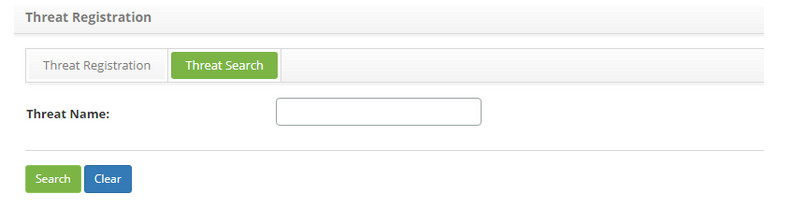
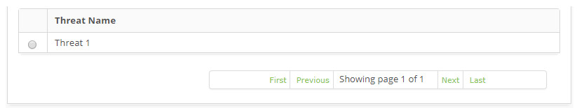
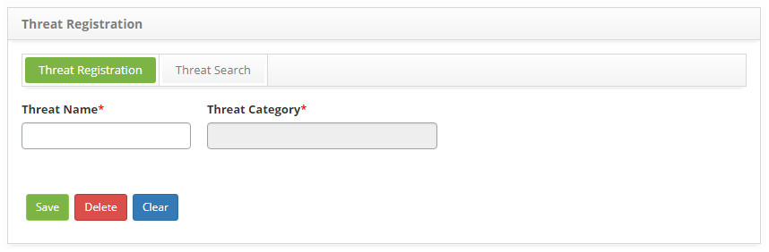

title: Threat registration and search
Description: The goal of this feature is to register threats which will be used during the continuity entry 
# Threat registration and search

The goal of this feature is to register threats which will be used during the continuity entry.

How to access
-----------------

1. Access the **Threat Register** feature navigating through the main menu 
**Process Management > Continuity Management > Threat Register**.

Preconditions
-----------------

1. Register a Threat Category (see knowledge [Threat category registration and search](/en-us/citsmart-platform-7/processes/continuity/threat-category.html)).

Filters
------------

1. The following filter enables the user to restrict the participation of items in the standard feature listing, making it easier 
to find the desired items:

    - Threat Name.
    
2. On the **Threat Registration** screen, click on the **Threat Search** tab. The search screen will be displayed as illustrated on 
the image below:

    
    
    **Figure 1 - Threat search screen**
    
3. Perform a threat category search;

    - Insert the name of the intended threat and click on the *Search* button;

    - Afterwards, the threat entry will be displayed according to the description provided;

    - To list all threats, just click directly on the *Search* button, if needed.

Items list
-------------------

1. The following cadastral field is available to the user to make it easier to identify the desired items in the default listing of 
the feature: **Threat Name**.

    
    
    **Figure 2 - Threat listing screen**
    
2. After searching, select the intended entry. Afterwards, they will be redirected to the registry screen displaying the content 
belonging to the selected entry.

3. To edit a threat category entry, just modify the information on the intended fields and click on the *Save* button to confirm 
the changes to the database, at which date, time and user will be stored automatically for a future audit.

Filling in the registration fields
-------------------------------------

1. The threat entry screen will be displayed, as illustrated on the image below:

    
    
    **Figure 3 - Threat entry screen**
    
2. Fill out the fields as instructed below:

    - **Threat Name**: describe the threat;
    - **Threat Category**: insert the threat category.
    
3. Click on the *Save* the button to confirm the entry, at which date, time and user will automatically be stored for a future 
audit.

!!! tip "About"

    <b>Product/Version:</b> CITSmart | 7.00 &nbsp;&nbsp;
    <b>Updated:</b>08/27/2019 – Larissa Lourenço
