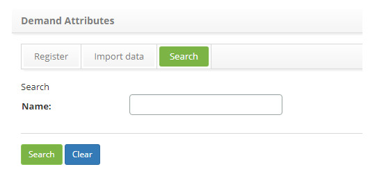
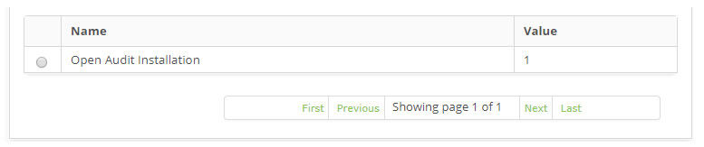
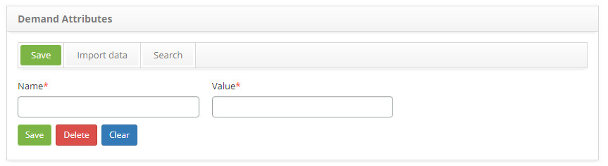

title: Demand Attribute registration and search
Description: The goal of this feature is to register the demand attributes which will be linked to the services and the 
# Demand Attribute registration and search

The goal of this feature is to register the demand attributes which will be linked to the services and the Configuration Items 
(IC).

How to access
-----------------

1. Access the **Demand Attribute** feature navigating through the main menu 
**Process Management > Demand Management > Demand Attributes**.

Preconditions
---------------

1. Not applicable.

Filters
---------

1. The following filter enables the user to restrict the participation of items in the standard feature listing, making it easier 
to find the desired items:

    - Name.
    
    
    
    **Figure 1 - Demand attribute search screen**
    
2. Perform a demand attribute search;

    - Insert the name of the intended attribute and click on the *Search* button. Afterwards, the attribute entry will be displayed 
    according to the description provided.
    
    - To list all demand attributes, just click directly on the *Search* button, if needed.
    
Items list
-------------------

1. The following cadastral fields are available to the user to facilitate the identification of the desired items in the standard 
feature listing: **Name** and **Value**.
  
    
    
    **Figure 2 - Demand attribute listing screen**
    
2. After searching, select the intended entry. Afterwards, they will be redirected to the registry screen displaying the content belonging to the selected entry.
    
3. To edit a demand attribute entry, just modify the information on the intended fields and click on the *Save* button;

Filling in the registration fields
------------------------------------

1. The **Demand Attributes Screen** will be displayed, as illustrated on the image below:

    
    
    **Figure 3 - Demand attribute entry screen**
    
2. Fill out the fields as instructed below:

    - **Name**: name the demand attribute;
    - **Value**: insert the demand attribute's value.
    
3. After inserting the data, click on the *Save* the button to confirm the entry, at which date, time and user will automatically 
be stored for a future audit.

!!! tip "About"

    <b>Product/Version:</b> CITSmart | 7.00 &nbsp;&nbsp;
    <b>Updated:</b>08/28/2019 – Larissa Lourenço
