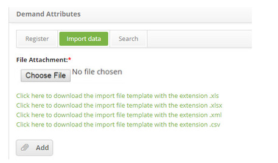

title: Demand attribute data import
Description: Importing demand attribute data.
# Demand attribute data import

How to access
----------------

1. Access the **Demand Attribute** feature navigating through the main menu **Process Management > Demand Management > Attributes**.

Implementing demand attributed data
-------------------------------------------------------

1. The **Demand Attribute** entry screen will be displayed, as illustrated on the image below. Click on the **Importa Data** tab. The 
data import screen will be displayed, as illustrated on the image below::

    
    
    **Figure 1 - Data import screen**
    
2. Add the file for data import:

    - Note there are file templates displayed on screen to instruct the format and order the data must be arranged in the file. 
    Therefore, before selecting the file, make sure it is in consonance with the template, taking into account the format (.xls, 
    .xlsx, .xml or .csv), After checking, click on the Choose File button, select the file and click on the Add button to confirm 
    the import.
    
    - Afterwards, the data will be successfully imported.
    
See also
-------------

- [Demand Management module](/en-us/citsmart-platform-7/processes/demand/overview.html)

!!! tip "About"

    <b>Product/Version:</b> CITSmart | 7.00 &nbsp;&nbsp;
    <b>Updated:</b>08/28/2019 – Larissa Lourenço
