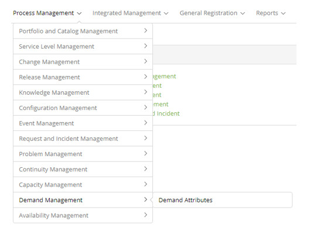

title: Demand Management module
Description: Demand Management is the process that seeks to understand, anticipate and influence customer demand 
# Demand Management module

Module objective
--------------------

Demand Management is the process that seeks to understand, anticipate and influence customer demand for services and provide the 
capacity needed to meet this demand. The same is closely linked to the guarantee of service delivery, so it is a critical process 
to be managed, because, to ensure that the services will be delivered, within the capacity and availability required infere in 
cost, service level agreement and quality .

This process works closely with Capacity Management to ensure that the provider has the capacity to meet the demand. It is in this 
module that it records the attributes of the demand.

This functionality is intended to record the demand attributes that will be linked to the Services and Configuration Items.

Where are the features
---------------------------------

To access the functionality click on the main menu **Process Management > Demand Management**.

**Figure 1 - Demand Management module menu**

Main feature (in highlight)
-----------------------------------------

In the *See also* section you can access the main functionality(ies) of this module, in order to obtain a more detailed knowledge.

See also
-------------

- [Demand Attribute registration and search](/en-us/citsmart-platform-7/processes/demand/demand-attribute.html)

- [Demand attribute data import](/en-us/citsmart-platform-7/processes/demand/demand-import.html)

!!! tip "About"

    <b>Product/Version:</b> CITSmart | 7.00 &nbsp;&nbsp;
    <b>Updated:</b>08/28/2019 – Larissa Lourenço
