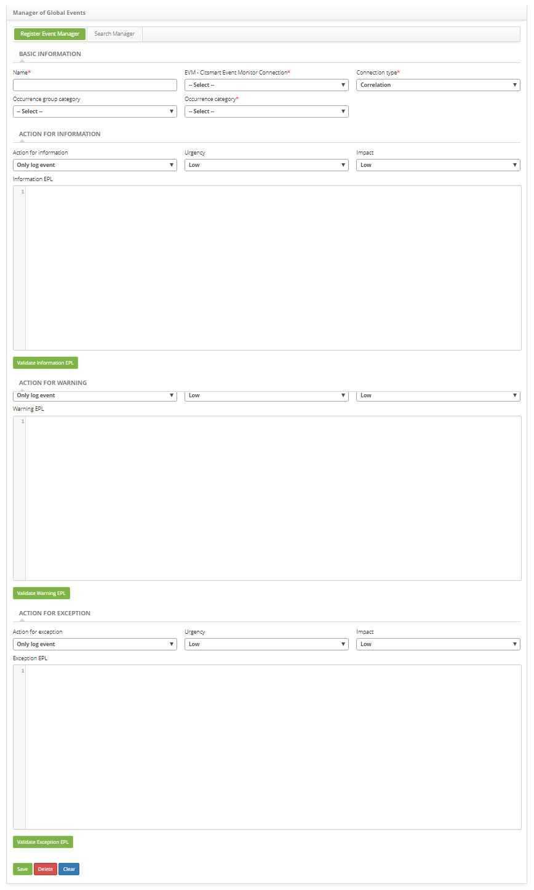
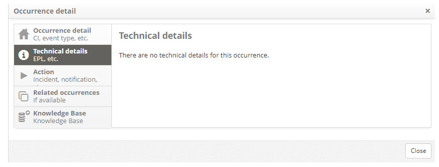

title: Capturing events from other fonts/tools
Description: Allows you to capture events from other sources or tools (WebService).
# Capturing events from other fonts/tools

Allows you to capture events from other sources or tools (WebService).

Preconditions
----------------

1. No applicable.

Capturing events
-----------------------

## How to access ##

1. Access the event capture functionality from other sources/tools by navigating the main menu 
**ITIL Processes > Event Management > Global Event Manager**.

## Filters ##

1. No applicable.

## Items list ##

1. No applicable.

## Filling in the registration fields ##

1. In the **Register Event Manager** tab, register an EPL to identify the relevant events:

    - Make a record of an EPL that will define which events will be relevant and should be recorded.
    - Here's an example of EPL for HR:
        - @Description ('EPL for HR Event') select * from pattern [every (ev = EventCorrelation (properties ('type') = 'HR'))]
        
    
    
    **Figure 1 - Global events manager screen**
    
2. This EPL will capture and record any event that is sent using our WS containing the 'RH' type.

3. Sending Events via WebService:

    - Use the URL http: // <IP_EVM>: <PORT> / citsmartevm / ws / processEvent to send the events that are to be processed by Esper. 
    This WebService uses POST method and receives a JSON as data for the processing of events. Below is an example of JSON to be 
    submitted in the WebService that will fit the example of the EPL registered above:
    
    **{"properties" : {"uuid" : "5e5517507c66", "name" : "Barry Allen", "type" : "HR", "status" : "Hiring"}}**
   
        - The "**properties**" element is required, and if it was not sent, it will not be possible to identify the event;
        - The "**uuid**" element is required for the identification of related events;
        - The WS will not return any information, only the 200 OK response stating that the request was successful.
        
Viewing captured events
-----------------------------------

## How to access ##

1. After registering the event occurrence, it can be viewed in the Event Management screen 
**ITIL Processes > Event Management > Event Management**.

2. In this screen it allows to perform the search of the occurrence and allows to verify the technical details of the event, as 
shown in the figure below:

**Figure 2 - Occurrence details screen - technical details**

## Filters ##

1. No applicable.

## Items list ##

1. No applicable.

## Filling in the registration fields ##

1. No applicable.

!!! tip "About"

    <b>Product/Version:</b> CITSmart | 7.00 &nbsp;&nbsp;
    <b>Updated:</b>08/28/2019 – Larissa Lourenço
