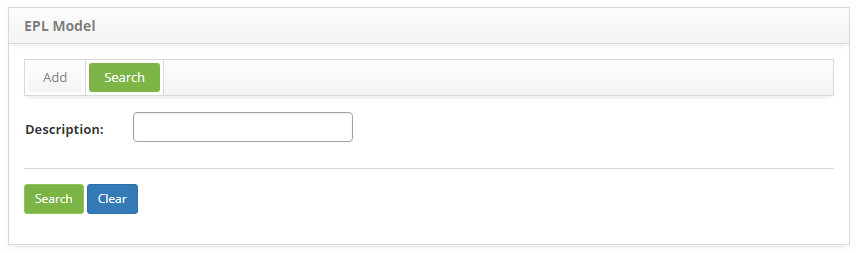
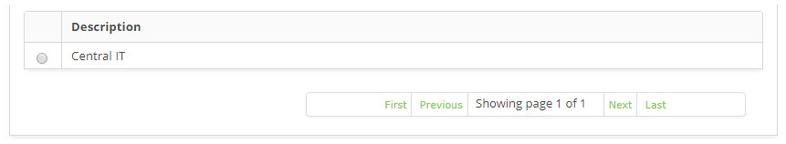
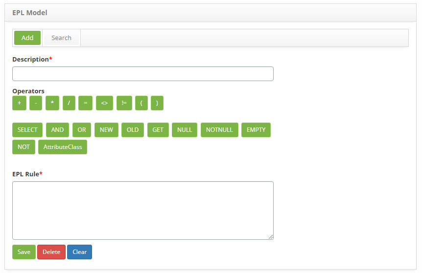

title: EPL model registration and search
Description: This feature allows creating and keeping EPL models which will be used on an EPL creation.
# EPL model registration and search

This feature allows creating and keeping EPL models which will be used on an EPL creation.

!!! warning "WARNING"

    It is necessary to have knowledge on the event processing language. For more information refer to the website:  
    http://www.espertech.com/esper/esper-documentation/
    
How to access
----------------

1. Access the **EPL Model** feature navigating through the main menu **Process Management > Event Management > EPL Model**.

Preconditions
----------------

1. No applicable.

Filters
----------

1. The following filter enables the user to restrict the participation of items in the standard feature listing, making it easier 
to find the desired items:

    - Description.
    
    
    
    **Figure 1 - EPL model search screen**
    
2. Perform an EPL model search:

    - Insert the name of the intended EPL model and click on the *Search* button. Afterwards, the EPL model entry will be displayed 
    according to the description provided;
    
    - To list all EPL models, just click directly on the *Search* button, if needed.
    
Items list
-------------------

1. The following cadastral field is available to the user to facilitate the identification of the desired items in the standard 
feature listing: **Description**.

    
    
    **Figure 2 - EPL model listing screen**
    
2. After searching, select the intended entry. Afterwards, they will be redirected to the registry screen displaying the content 
belonging to the selected entry.

Filling in the ragistration fields
-------------------------------------

1. The EPL Model entry screen will be displayed, as illustrated on the image below:

    
    
    **Figure 3 - EPL model entry screen**
    
2. Fill out the fields as instructed below to register an EPL Model:

    - **Description**: describe the EPL Model;
    - **Operators**: itens which can be used in the creation of the EPL Model;
    - **EPL Rule**: describe the EPL script which will serve as a model to the EPL creation. e.g.: select*from Event where classBusiness = 'BusinessClass' and (old is null).
    
3. Click on the *Save* the button to confirm the entry, at which date, time and user will automatically be stored for a future 
audit.

!!! tip "About"

    <b>Product/Version:</b> CITSmart | 7.00 &nbsp;&nbsp;
    <b>Updated:</b>08/28/2019 – Larissa Lourenço
