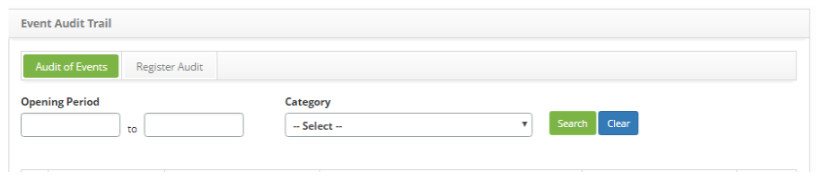
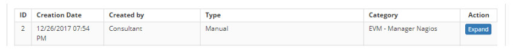
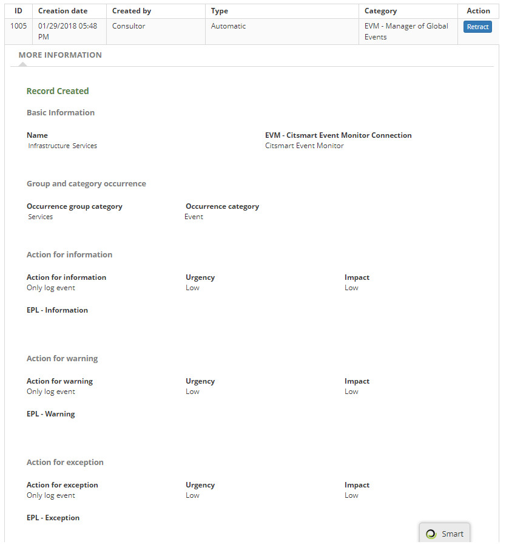
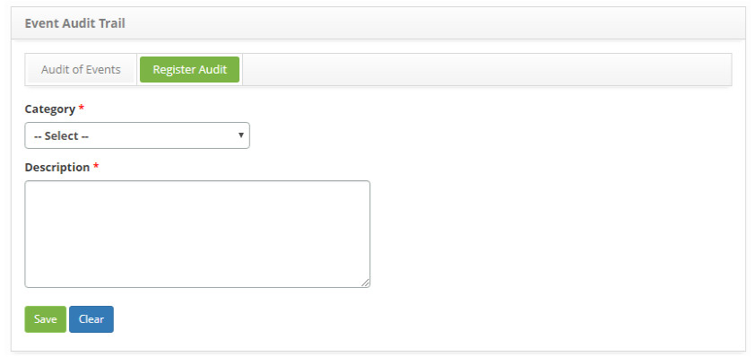

title: Event audit registration and search
Description: This functionality is intended to provide a historical basis for all event changes and manual auditing.
# Event audit registration and search

This functionality is intended to provide a historical basis for all event changes and manual auditing.

How to access
-------------

1. Access the **Event Audit Trail** feature by navigating through the main menu. Place the mouse in the option 
**ITIL Processes > Event Management > Audit Trail**.

Preconditions
-----------------

1. No applicable.

Filters
-----------

1. The following filter enables the user to restrict the participation of items in the standard feature listing, making it easier 
to find the desired items:

    - Opening Period;
    - Category.
    
2. In the **Event Audit Trail** screen, under the **Register Audit** tab, all the audits of events performed will be presented, as 
shown below:

    
    
    **Figure 1 - Event audit screen**
    
3. To perform a specific audit search, proceed as described below:

    - **Period**: enter the desired audit period;
    - **Category**: select the audit category.
    
4. Click on the *Search* button and the audit data will be displayed;

Items list
------------------

1. The following cadastral fields are available to the user to facilitate the identification of the desired items in the standard 
feature listing: **ID, Creation Date, Created by, Type** and **Category**.

2. There is one action button available to the user for each item in the listing, it is: *Expand*.

    
    
    **Figure 2 - Items list screen**
    
3. Click on the button *Expand* to view audit details;

4. The figure below illustrates an example:

**Figure 3 - Event audit screen**

Filling in the registration fields
-------------------------------------

1. On the **Event Audit Trail** screen, in the **Register Audit** tab, the respective audit record screen is displayed manually, as 
shown below:

    
    
    **Figure 4 - Audit master register screen**
    
2. Fill in the fields as directed below:

    - **Category**: select an audit category;
    - **Description**: please provide a description for the audit performed.
    
3. Click on the *Save* button to register, where the date, time and user will be automatically saved for a future audit.

!!! tip "About"

    <b>Product/Version:</b> CITSmart | 7.00 &nbsp;&nbsp;
    <b>Updated:</b>08/28/2019 – Larissa Lourenço
