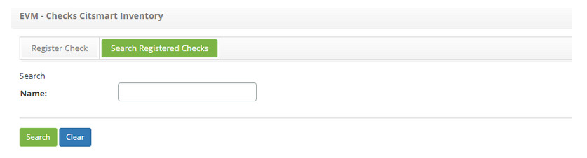
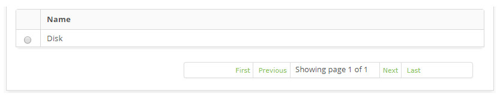
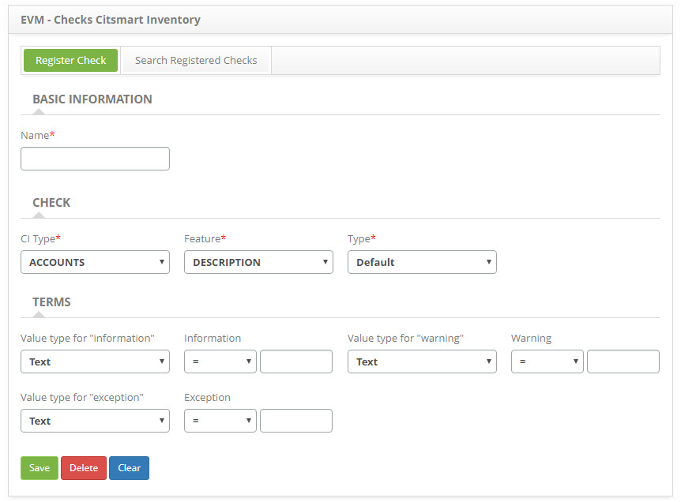

title: Event checks registration and search
Description: The goal of this feature is to register the event checks .
# Event checks registration and search

The goal of this feature is to register the event checks which will be used to monitor the configuration items, through the 
CITSmart Inventory.

How to access
-----------------

1. Access the **Check** feature navigating through the main menu **Process Management > Event Management > Check**.

Preconditions
---------------

1. Register a Configuration Item type (see knowledge [Configuration item type registration and search][1]).

Filters
-----------

1. The following filter enable the user to restrict the participation of items in the standard feature listing, making it easier to 
locate the desired items as shown in the figure below:

    - Name.
    
    
    
    **Figure 1 - Event checks search screen**
    
2. Perform a check search:

    - Insert the name of the intended check and click on the *Search* button. Afterwards, the check entry will be displayed 
    according to the description provided;
    
    - To list all checks, just click directly on the *Search* button, if needed.
    
Items list
------------------

1. The following cadastral field is available to the user to facilitate the identification of the desired items in the standard 
listing of the functionality: **Name**.

    
    
    **Figure 2 - Events checks items list screen**
    
2. After searching, select the intended entry. Afterwards, they will be redirected to the registry screen displaying the content 
belonging to the selected entry;

3. To edit a check entry, just modify the information on the intended fields and click on the *Save* button to confirm the changes 
to the database, at which date, time and user will be stored automatically for a future audit.

Filling in the registration fields
------------------------------------

1. Access the feature, afterwards, the **Check Entry** screen will be displayed, as illustrated on the image below:

    
    
    **Figure 3 - Check entry screen**
    
2. On the screen, the field are self explanatory. Just place the cursor on the intended field and a brief description will be 
displayed. Therefore, only the main information to perform a connection entry will be displayed:

    - Insert the **Basic Information**;
    - Insert the **Check** data. If the "Percentage" option is chosen on the Type field, the Complementary Feature field will be 
    displayed so it can be filled out;
    - Insert the **Terms** information. Associate a term to an information and/or warning and/or exception and they will be 
    evaluated during the configuration item event monitoring determined on the check:
        - **Information**: indicates a normal procedure, that is, does not require any actions and does not represent an exception, 
        it is working as it should. Provides data for decision making. It is generally used for statistics and investigation 
        purposes;
        - **Warning**: Indicates an abnormal procedure, but not exceptional. It is an indicator the situation may require close 
        monitoring, it needes to be verified and appropriate measures must be taken to prevent an exception;
        - **Exception**: Exceptions that indicate an abnormal situation requires an action, a procedure out of the acceptable 
        limits, that it, it can indicate a total failure, an impaired feature or degraded performance.
        
3. Click on the **Save** the button to confirm the entry, at which date, time and user will automatically be stored for a future 
audit.

[1]:/en-us/citsmart-platform-7/processes/configuration/IC-type.html

!!! tip "About"

    <b>Product/Version:</b> CITSmart | 7.00 &nbsp;&nbsp;
    <b>Updated:</b>08/28/2019 – Larissa Lourenço
