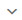

title: Event management
Description: This functionality aims to present some functionality for managing events.
# Event management

This functionality aims to present some functionality for managing events, allowing you to view graphs, monitor monitoring and 
search for event occurrence.

- Graphics;
- Management;
- Search.

How to access
----------------

1. Access the **Event Management** feature by navigating through the main menu. Position the mouse in the option 
**ITIL Processes > Event Management > Event Management**.

**Figure 1 - Event management menu screen**

Preconditions
---------------

1. Register Connection of the CITSmart Event Monitor (see knowledge [CITSmart event monitor connection][1]);

2. Register Monitoring Tool;

3. Have at least one Request/Incident registered and linked to the IC (Configuration Item) that generated the event, if you want to 
"Run" the service using the Events screen (see knowledge [Ticket management (services)][2]).

Filters
---------

1. The following filters enable the user to restrict the participation of items in the standard feature listing, making it easier 
to locate the desired items as shown in the figure below:

    - Occurrence ID;
    - Tool;
    - Classification;
    - Status;
    - Host;
    - Managed;
    - Start date;
    - Final date.
    
   
    
   **Figure 2 - Event occurrence search screen**
    
Items list of events occurrences
----------------------------------------------

1. The following cadastral fields are available to the user to facilitate the identification of the desired items in the standard 
listing of the functionality: **Classification, Tool, Date/Time, Category, Host, Managed, Priority** and **Status**;

2. After accessing the **Event Management** feature, all the events recorded in MongoDB are viewed through the CITSmart Event 
Monitor application, as shown below:

   
    
   **Figure 3 - Listing of events screen**
    
3. The guide , presents the following features for the event listing:

    - **Automat refresh**  : enables the refresh list option to be run from time to time;
    - **Update list** : clicking, the events list is updated;
    - **Options** : enables the change of the columns in the event list.
    
4. By clicking on any event in the listing, the  will be shown:

    - **Open** : you can access the details of each occurrence of events;
    - **Close occurrence** : closes the open event;
    - **Close occurrence and all actions** : closes the occurrence and actions related to it;
    - **More options** : you can perform three actions by clicking this icon (create service 
    request/create change request/create problem request).
    
Filling in the registration fields
-------------------------------------

1. No applicable.

Option - event management
----------------------------------

This feature allows real-time tracking of occurrences of all tools and is automatically updated according to time. This screen will 
only display occurrences that are started and awaiting treatment.

Search
-----------

1. All events in the Nagios, Zabbix, and CITSmart Inventory monitoring tools can be filtered through this functionality;

2. Click on the icon  of the **Search** section , then the 
respective event search screen will be displayed, as shown below:

   
    
   **Figure 4 - Event occurrence search screen**
    
3. Enter the filters according to your need to search for event occurrence;

4. Click on the button  and the listing of occurrences with the application of the filter is shown 
as in **Figure 3**;

5. It will now be possible to access the details of each occurrence of events, as shown in the figure below, through the button
 (which appears when clicking on the occurrence):

**Figure 5 - Event informations**

Detail screen menu
------------------------------

1. By clicking on the   located in the upper left corner, the following listing will be displayed:

**Figure 6 - Detailing screen**

Actions
-----------

1. By clicking the *Actions* option in the menu in **Figure 6**, a screen will be displayed with the list of all incidents/requests 
linked to the selected occurrence:

   
    
   **Figure 7 - Action**
    
2. When you click the *Execute* button, a new screen is displayed showing and making available the request/incident to execute it 
normally (Shut down, Caput, etc.) as shown below:

   
    
   **Figure 8 - Request/Incident screen**
    
Related occurrences
--------------------------

1. To view related occurrences, tap the **Related Occurrences** tab, as shown in the example below:

**Figure 9 - Related occurrences**

Related knowledge
---------------------------

1. To see the detail of the occurrence, click on the instance that will display the details screen:

    - To view the knowledge already recorded and to register new knowledge in the Knowledge Base, click the **Knowledge Base** tab, 
    the related knowledge will be presented and to create a new knowledge, just click the *Create Knowledge* button. The figure 
    below shows this screen:
    
    
    
    **Figure 10 - Related knowledges**
    
Option - graphics
-----------------

This feature lets you view comparison charts by event types, number of occurrences by event types, number of instances per tool, 
and number of occurrences per configuration item, as selected filters.

Checking graphics
----------------------

1. After accessing the Event Management functionality, in the Graphs menu, the event occurrence information screen will be 
displayed, which will be shown in graphs, as exemplified in the images below. From this screen it is possible to filter the 
occurrences by date/period (search conducted by field  in the upper right-hand corner):

   
    
   **Figure 11 - Number of occurences by type of event**
    
   
    
   **Figure 12 - Number of occurrences by tools**
    
   
    
   **Figure 13- Number of occurrences by configuration item**
    
[1]:/en-us/citsmart-platform-7/additional-features/add-ons/event-monitor-connection.html
[2]:/en-us/citsmart-platform-7/processes/tickets/ticket-management.html
    
!!! tip "About"

    <b>Product/Version:</b> CITSmart | 7.00 &nbsp;&nbsp;
    <b>Updated:</b>08/28/2019 – Larissa Lourenço
