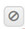

title: CITSmart event monitor managers registration and search
Description: It is the functionality responsible for managing the application that performs the analysis, monitoring 
# CITSmart event monitor managers registration and search

It is the functionality responsible for managing the application that performs the analysis, monitoring and signaling of Events, 
which can be:

- Manager Nagios;
- Manager Zabbix;
- Inventory Manager;
- Global Events Manager;
- Generic Manager Nagios;
- Generic Manager Zabbix.
    
Preconditions
---------------

1. Register connection of CITSmart Event Monitor (see knowledge [CITSmart event monitor connection](/en-us/citsmart-platform-7/additional-features/add-ons/event-monitor-connection.html));

2. Schedule time (see knowledge [Schedule registration and search](/en-us/citsmart-platform-7/processes/event/time-registration.html));

3. Enter category of occurrence (see knowledge [Occurrence category registration and search](/en-us/citsmart-platform-7/processes/event/occurrence-category.html));

4. Enroll automatic action (see knowledge [Automatic actions registration and search](/en-us/citsmart-platform-7/plataform-administration/configuring-automatic-actions/automatic-actions.html));

5. Register CITSmart Inventory connection (see knowledge [CITSmart Inventory connection setup](/en-us/citsmart-platform-7/processes/event/inventory-connection-setup.html));

6. Register check (see knowledge [Event checks registration and search](/en-us/citsmart-platform-7/processes/event/event-checks.html)).

Nagios manager
-----------------

Nagios is a network monitoring tool. It can monitor both hosts and services, alerting when problems occur and also when problems 
are solved. Hosts are the equipment and the Services are the resources offered by the equipment.

The purpose of this feature is to register and maintain the managers who will be responsible for monitoring the configuration and 
occurrence items of events captured from Nagios. It allows the user to indicate how much time the Manager will be processed, what 
configuration items he will manage and what actions to take automatically.

## How to access ##

1. Access the Nagios manager functionality through navigation in the main menu 
**ITIL Processes > Event Management > Nagios Manager**.

## Filters ##

1. The following filter enables the user to restrict the participation of items in the standard feature listing, making it easier 
to find the desired items:

    - Name
    
    
    
    **Figure 1 - Nagios manager search screen**
    
2. Perform the search for manager Nagios:

    - Enter the name of the Nagios manager you want to search and click the *Search* button. After this, the record will be 
    displayed according to the name entered;
    
    - If you want to list all the Nagios manager records, simply click the *Search* button directly.
    
## Items list ##

1. The following cadastral field is available to the user to make it easier to identify the desired items in the default listing of 
the functionality: **Name**.

    
    
    **Figure 2 - Items list screen**
    
2. After searching, select the desired record. Once this is done, it will be directed to the registration screen displaying the 
contents of the selected registry;

3. To change the Nagios manager log data, simply modify the information of the desired fields and click on the *Record* button to 
save the change made to the registry, where the date, time and user will be saved automatically for a future audit.

## Filling in the registration fields ##

1. Access functionality, after that, the **Nagios Manager Registration** screen will be displayed, as shown in the figure below:

    
    
    **Figure 3 - Nagios manager registry screen**
    
2. In this screen, the fields are self-explanatory. Simply place your mouse over the chosen field and a short description will be 
displayed. Therefore only the main information will be addressed to register the connection:

    - Enter the **Basic Data**:
        - When you select the monitoring tool, the hosts that are monitored by the tool will be listed.
    - Enter the **Scheduler Data**:
        - **Enable/Disable self-connection**: determines whether an event occurrence should be automatically terminated if the 
        condition that generated the event initially does not happen again. If this option is enabled, the "Event closure time" 
        field will be enabled for completion;
        - **Time for event closure**: in this field you must enter the time in minutes for autocorrection, which determines the 
        time for closing an occurrence that no longer occurs.
    - Enter the **Parent Configuration Item Data**:
        - Clicking on the parent configuration item field will display the parent IC lookup screen as the filters are populated. 
        The figure below illustrates this screen:
        
    
    
    **Figure 4 - Search screen configuration Item**
    
    - Perform the search and click on the icon  to select the desired parent IC and record on 
    the manager screen;
    - Clicking on the Host field will list the hosts being monitored by Nagios for selection. Once this is done, the Host services 
    will be displayed, as shown in the example below:
    
    
    
    **Figure 5 - Nagios manager registry screen**
    
    - After presenting the Host services, if you wanted to register the IC in CITSmart with the Host data selected, just click the 
    *Create IC* button;
    - Remember that this registration can only be done if there is no IC with the same Host ID;
    - Inform the other fields that will be used to generate the events of this manager;
    - Enter the data for the child configuration item.

    
    
    **Figure 6 - Nagios manager registry screen**
    
    - Perform a gap between the Host service and the child configuration item. Each Host service must be related to its respective 
    child configuration item;
    - Enter the other fields that will be used to generate service events;
    - Inform the actions that will be triggered when there is an event of a certain type (*information, warning* and *exception*).
    
3. Click the *Record* button to register, where the date, time and user will be saved automatically for a future audit.

Zabbix manager
-------------------

Zabbix is a monitoring tool for networks, servers and services, designed to monitor availability, user experience and quality of 
services.

The purpose of this feature is to register and maintain the managers who are responsible for monitoring the configuration items 
whose statuses will be queried in Zabbix. It allows the user to associate the configuration items with their respective triggers 
and with the actions that must be taken in the event occurrence.

## How to access ##

1. Access the Zabbix manager functionality by navigating the main menu **ITIL Processes > Event Management > Zabbix Manager**.

## Filters ##

1. The following filter enables the user to restrict the participation of items in the standard feature listing, making it easier 
to find the desired items:

    - Name.
    
    
    
    **Figure 7 - Zabbix manager search screen**
    
2. Perform Zabbix manager search:

    - Enter the name of the Zabbix manager you want to search and click the *Search* button. After this, the record will be 
    displayed according to the name entered;
    
    - If you want to list all Zabbix manager records, simply click the *Search* button directly.
    
## Items list ##

1. The following cadastral field is available to the user to make it easier to identify the desired items in the default listing of 
the functionality: **Name**.

    
    
    **Figure 8 - Items list screen**
    
2. After searching, select the desired record. Once this is done, it will be directed to the registration screen displaying the 
contents of the selected registry;

3. To change Zabbix manager registry data, simply change the information of the desired fields and click the *Record* button to 
save the change made to the registry, where the date, time and user will be saved automatically for a future audit.

## Filling in the registration fields ##

1. Access functionality, after that, the **Zabbix Manager Registration** screen will be displayed, as shown in the figure below:

    
    
    **Figure 9 - Zabbix manager registration screen**
    
2. In this screen, the fields are self-explanatory. Simply place your mouse over the chosen field and a short description will be 
displayed. Therefore, only the main information will be addressed to register the connection:

    - Enter the **Basic Data**:
        - When you select the monitoring tool, the hosts that are monitored by the tool will be listed.
    - Enter the **Scheduler Data**:
        - **Enable/Disable AutoCorrect**: Determines whether an event occurrence should be automatically terminated if the 
        condition that generated the event initially does not happen again;
        - **Time for event closure**: In this field you must enter the time in minutes for autocorrection, which determines the 
        time for closing an occurrence that no longer occurs.
    - Enter the **Parent Configuration Item Data**:
        - Clicking on the parent configuration item field will display the parent IC lookup screen as the filters are populated.
    - The figure below illustrates this screen:
    
    
    
    **Figure 10 - Search screen configuration item**
    
    - Perform the search and click on the icon  to select the desired parent IC and record on 
    the manager screen;
    - Clicking on the Host field will list the hosts being monitored by Zabbix for selection;
    - Once this is done, the Host services will be displayed, as shown in the example below:
    
    
    
    **Figure 11 - Zabbix manager registration screen**
    
    - After presenting the Host services, if you wanted to register the IC in CITSmart with the Host data selected, just click the 
    *Create IC* button;
    - Remember that this registration can only be done if there is no IC with the same Host ID;
    - Inform the other fields that will be used to generate the events of this manager;
    - Enter the data for the child configuration item.
    
    
    
    **Figure 12 - Nagios manager registry screen**
    
    - Perform a gap between the Host service and the child configuration item. Each Host service must be related to its respective 
    child configuration item;
    - Enter the other fields that will be used to generate service events;
    - Inform the actions that will be triggered when there is an event of a certain type (information, warning and exception).
    
3. Click the *Record* button to register, where the date, time and user will be saved automatically for a future audit.

Inventory manager
--------------------

The purpose of this feature is to register and maintain the managers who will be responsible for the occurrences of events captured 
from the CITSmart Inventory. It allows the user to indicate how much time the Manager will be processed, what configuration items 
he will manage, the checks that will be applied and the actions to be taken automatically.

## How to access ##

1. Access inventory manager functionality through navigation in the main menu 
**ITIL Processes > Event Manager > Inventory Manager**.

## Filters ##

1. The following filter enables the user to restrict the participation of items in the standard feature listing, making it easier 
to locate the desired items, as illustrated below:

    - Name.
    
    
    
    **Figure 13 - Inventory manager search screen**
    
2. Perform search for inventory manager:

    - Enter the name of the inventory manager you want to search for and click the *Search* button. After this, the record will be 
    displayed according to the name entered;
    
    - If you want to list all inventory manager records, simply click the *Search* button directly.
    
## Items list ##

1. The following cadastral field is available to the user to make it easier to identify the desired items in the default listing of 
the functionality: **Name**.

    
    
    **Figure 14 - Items list screen**
    
2. After searching, select the desired record. Once this is done, it will be directed to the registration screen displaying the 
contents of the selected registry;

3. To change the data of the inventory manager record, simply modify the information of the desired fields and click the *Record* 
button to save the change made to the record, where the date, time and user will be saved automatically for a future audit.

## Filling in the registration fields ##

1. Access functionality, after that, the **Inventory Manager Registration** screen will be displayed, as shown in the figure below:

    
    
    **Figure 15 - Inventory manager master screen**
    
2. In this screen, the fields are self-explanatory. Simply place your mouse over the chosen field and a short description will be 
displayed. Therefore, only the main information will be addressed to register the connection;

    - Enter the **Basic Data**;
    - Enter the **Scheduler Data**;
        - **Enable/Disable AutoCorrect**: determines whether an event occurrence should be automatically terminated if the 
        condition that generated the event initially does not happen again;
        - **Time for event closure**: in this field you must enter the time in minutes for autocorrection, which determines the 
        time for closing an occurrence that no longer occurs.
    - Enter the **Configuration Type data for the Configuration Items**. Select one of the options, "Specific Configuration" or 
    "General Configuration":
    - **Specific Configuration** allows you to create specific rules for a single configuration item. These rules will be applied 
    at the time the configuration item is being inventoried.
    
    
    
    **Figure 16 - Inventory manager master screen**
    
    - Enter the data of the parent configuration item;
    - Clicking on the parent configuration item field will display the screen for searching and selecting the same as the filters 
    are populated.
    
    
    
    **Figure 17 - Search screen configuration item**
    
    - Select the child configuration item or configuration item type to apply a specific rule;
    - Selecting the child configuration item or configuration item type will be listed in the Check the child records to be 
    selected field;
    - After selecting the check, the default conditions will be displayed, which have been configured in the check register. It is 
    allowed to change the values of these conditions;
    - Report an action for each condition. These actions will be triggered when there was an event occurrence;
    - After entering the required data, click the Add button. The rules defined for the configuration item will be listed, as shown 
    below:
    
    
    
    **Figure 18 - Inventory manager master screen**
    
    - If you want to edit the rules for Information, Warning and Exception, just click the icon
    ;
    - If you want to edit the actions click the icon  and to delete a configuration item from the 
    list, click the icon .
    
3. **General Configuration** allows you to create rules for all configuration items. These rules will be applied the moment the 
configuration items are being inventoried.

    
    
    **Figure 19 - Inventory manager master screen**
    
    - Select the child configuration item or configuration item type to apply a specific rule;
    - When selecting the type of configuration item will be listed in the field Check the records of the same to be selected;
    - After selecting the check, the default conditions will be displayed, which have been configured in the check register. It is 
    allowed to change the values of these conditions;
    - Report an action for each condition. These actions will be triggered when there was an event occurrence;
    - After entering the required data, click the *Add* button. The rules defined for the configuration items will be listed, as 
    shown below:
    
    
    
    **Figure 20 - Inventory manager master screen**
    
    - If you want to edit the rules for Information, Warning and Exception, just click the icon 
    ;
    - If you want to edit the actions click the icon  and to delete a configuration item from the 
    list, click the icon .
    
4. Click the *Record* button to register, where the date, time and user will be saved automatically for a future audit.

Global events manager
--------------------------

This functionality is intended to create rules for monitoring various types of events.

## How to access ##

1. Access global event manager functionality by navigating the main menu 
**ITIL Processes > Event Management > Manager of Global Events**.

## Filters ##

1. The following filter enables the user to restrict the participation of items in the standard feature listing, making it easier 
to find the desired items:

    - Name.
    
    
    
    **Figure 21 - Global event manager search screen**
    
2. Perform global event manager search:

    - Enter the name of the global event manager you want to search and click the *Search* button. After this, the record will be 
    displayed according to the name entered;
    
    - If you want to list all global event manager records, simply click the *Search* button directly.
    
## Items list ##

1. The following cadastral field is available to the user to make it easier to identify the desired items in the default listing of 
the functionality: **Name**.

    
    
    **Figure 22 - Items list screen**
    
2. After searching, select the desired record. Once this is done, it will be directed to the registration screen displaying the 
contents of the selected registry;

3. To change global event manager log data, simply change the information for the desired fields and click the *Record* button to 
save the change made to the record, where the date, time and user will be saved automatically for a future audit.

## Filling in the registration ##

1. Access the feature, after this, the **Global Event Manager registration** screen will be displayed, as shown in the figure 
below:

    
    
    **Figure 23 - Global event record screen**
    
2. In this screen, the fields are self-explanatory. Simply place your mouse over the chosen field and a short description will be 
displayed. Therefore, only the main information will be addressed to register the connection:

    - Enter the **Basic Data**;
    - Enter the **connection type**:
        - **Correlation**: this type of connection is used to manage correlation events between the types of events in CITSmart 
        (Nagios Event Manager, Zabbix Event Manager and Inventory Event Manager);
        - **External**: this type of connection is used to manage external events, sent through a WS. The same is passive, that is, 
        it waits for the receipt of any event that is sent through the WS and compares with the events managed in the global 
        manager registry;
        - **File**: This type of connection is used to manage events as read from log files. When selecting this type of 
        connection, inform the "Scheduler" and describe the "ScriptRhino".
    - Enter **Action data for Information**:
        - Select the action that will be triggered when there is an event of type information, the degree of urgency and impact. 
        The rules for this action are defined using the Event Processing Language (EPL). Click the *Validate EPL Information* 
        button to validate the informed EPL.
    - Enter **Action data for Warning**:
        - Select the action that will be triggered when there is an event of type warning, the degree of urgency and impact. The 
        rules for this action are defined using the Event Processing Language (EPL). Click the *Validate EPL from Warning* button 
        to  validate the informed EPL.
    - Enter **Action data for Exception**:
        - Select the action that will be triggered when there is an event occurrence of type exception, the degree of urgency and 
        impact. The rules for this action are defined using the Event Processing Language (EPL). Click the *Validate Exit EPL* 
        button to validate the EPL entered.
        
    !!! warning "WARNING"
        
        Each global manager contains an EPL for Information, Warning and/or Exception. EPL is an event correlation language used by 
        Esper (Espertech). Upon initialization of the CITSmart Event Monitor (EVM), these EPLs are imported into the Esper engine 
        so that a new correlated event will be created each time the condition defined in the EPL is satisfied. Example of an EPL 
        that makes a correction between the CITSmart Inventory and Nagios events: @Description ("For any Nagios event that occurs 
        after any Inventory event in the last 10 minutes") select * from pattern [every a = EventCheckInventory-> b = 
        EventServiceNegios where timer: within (10 minutes)]
        
3. Click the *Record* button to register, where the date, time and user will be saved automatically for a future audit.

Generic manager Nagios
-------------------------

The purpose of this feature is to register and maintain the generic managers who will be responsible for monitoring the hosts 
and/or services of the Nagios monitoring tool.

Managers allow the monitoring of all hosts or all services in a generic way, that is, without the need to choose a specific host 
for monitoring.

The purpose is to simplify the monitoring of an entire network in search of the relevant events for the business.

## How to access ##

1. Access the generic Nagios manager functionality by navigating the main menu 
**ITIL Processes > Event Management > Generic Nagios Manager**.

## Filters ##

1. The following filter enables the user to restrict the participation of items in the standard feature listing, making it easier 
to find the desired items:

    - Name.
    
    
    
    **Figure 24 - Nagios generic manager search screen**
    
2. Perform generic Nagios manager search:

    - Enter the name of the generic Nagios manager you want to search and click the *Search* button. After this, the record will be 
    displayed according to the name entered;
    
    - If you want to list all generic Nagios manager records, simply click the *Search* button directly.
    
## Items list ##

1. The following cadastral field is available to the user to make it easier to identify the desired items in the default listing of 
the functionality: **Name**.

    
    
    **Figure 25 - Items list screen**
    
2. After searching, select the desired record. Once this is done, it will be directed to the registration screen displaying the 
contents of the selected registry;

3. To change the data of the generic Nagios manager record, simply modify the information of the desired fields and click the 
*Record* button to save the change made to the record, where the date, time and user will be saved automatically for a future 
audit.

## Filling in the registration fields ##

1. Access the feature, after that, the **Generic Manager Registration** screen will be displayed, as shown in the figure below:

    
    
    **Figure 26 - Nagios generic manager registration screen**
    
2. In this screen, the fields are self-explanatory. Simply place your mouse over the chosen field and a short description will be 
displayed;

3. Therefore, only the main information will be addressed to register the connection:

    - Enter the **Basic Data**.
    
4. When selecting the monitoring tool, the manager configuration fields will be shown, as shown below:

    
    
    **Figure 27 - Nagios generic manager registration screen**
    
    - Enter the **Host** data.;
    - Select the host and if you want to generate occurrences for Up and Down, inform their respective actions, urgencies and 
    impacts.
        - Enter the data of the **Service**.
    - Select the service and if you want to generate occurrences for Information, Warning and Exception, inform your respective 
    actions, urgencies and impacts.
        - Configure **Other Information**;
    - Select the information for occurrence, scheduler, and autocorrection.
    
5. Click the *Insert/Change* button to add the settings for the monitoring tool information to which you selected:

    
    
    **Figure 28 - Nagios manager registry screen**
    
    - To edit manager configuration information, select the icon ;
    - To enable/disable manager configuration information, click the icon ;
    - To delete information from the manager's configuration, click the icon .
    
6. Click the *Record* button to register, where the date, time and user will be saved automatically for a future audit.

Generic manager Zabbix (referring to version 7.1.0.8 or higher)
-------------------------------------------------------------------

The purpose of this feature is to register and maintain generic managers that will be responsible for monitoring the hosts and/or 
triggers of the Zabbix monitoring tool.

Managers allow the monitoring of all hosts or all triggers in a generic way, that is, without the obligation to choose a specific 
host for monitoring.

The purpose is to simplify the monitoring of an entire network in search of the relevant events for the business.

## How to access ##

1. Access the Generic Manager Zabbix functionality through navigation in the main menu
**Process Management > Event Management > Generic Zabbix Manager**.

## Filters ##

1. The following filters enable the user to restrict the participation of items in the standard feature listing, making it easier 
to find the desired items:

    - Title;
    - Status.
    
2. In the  **Generic Manager Zabbix** screen, the search screen appears as illustrated in the following figure. In this screen, the 
Generic Zabbix Manager already registered and the filter fields are displayed to search certain records;

    
    
    **Figure 29 - Zabbix generic manager search screen**
    
3. To perform the generic Zabbix manager search, inform the title and/or situation. After this, the record will be displayed 
according to the data reported.

## Items list ##

1. The following cadastral fields are available to the user to make it easier to identify the desired items in the standard feature 
listing:  **Title**  and **Status**.

2. There are action buttons available to the user for each item in the listing, they are: *Edit* and *Delete*.

**Figure 30 - Items list screen**

## Filling in the registration fields ##

1. Access the feature, after this, the **Generic Zabbix Manager** screen will be displayed;Click the *New* button. Done this, the 
Zabbix generic manager registration screen will be displayed, as illustrated in the following figure:

    
    
    **Figure 31 - Zabbix generic manager registration screen**
    
2. Fill in the fields as guidelines below:

    - **Title**: Enter the name of the manager Zabbix;
    - **Connection**: select the connection with the monitoring tool. After that, the option to add the items that will be 
    monitored by the manager will be displayed;
    - **Status**: select the status of the manager;
    - Click the *Add new item* button and the screen will appear to fill in the data of the items that will be monitored by the 
    manager;

    
    
    **Figure 32 - Monitoring registration screen**
    
    - **Title**: inform a title for the items that will be monitored;
    - **Host**: select the desired host;
    - **Trigger**: select the desired trigger;
    - **Event Type**: select which types of events will be dismissed, their respective actions, urgency, and impacts;
    - **Occurrence group category**: select the occurrence category group;
    - **Occurrency category**: select the occurrence category;
    - **Scheduler**: select a timer for the Zabbix to raise information;
    - **Automatic correction**: enable this option if you want automatic correction of events and set the time (in minutes) to 
    close the occurrence if it does not happen again;
    - Click the *Add* button to register the items that will be monitored.
        
    
    
    **Figure 33 - Zabbix generic manager registration screen**
    
    - To edit the information for a monitoring, click the *Edit* button;
    - To delete information from a monitoring, click the *Delete* button.
    
3. Click the *Save* button to register, where the date, time and user will be automatically saved for a future audit.

!!! tip "About"

    <b>Product/Version:</b> CITSmart | 7.00 &nbsp;&nbsp;
    <b>Updated:</b>08/28/2019 - Larissa Lourenço 
