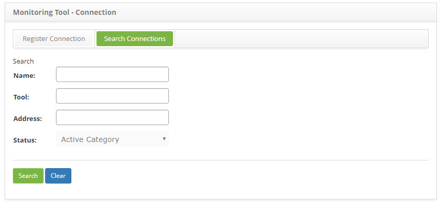
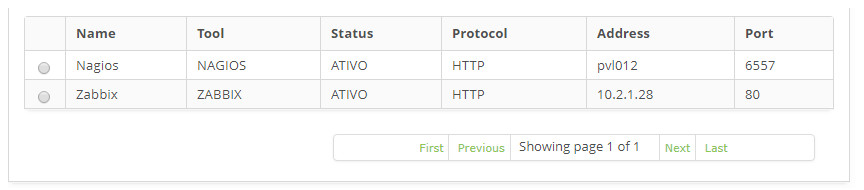
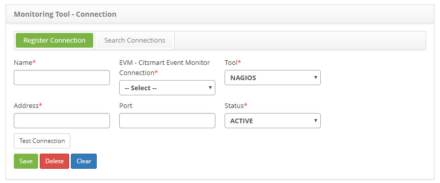

title: Event monitoring tools registration and search
Description: The goal of this feature is to register the tools which will be linked to the Event Management to monitor 
# Event monitoring tools registration and search

The goal of this feature is to register the tools which will be linked to the Event Management to monitor several configuration 
items.

Preconditions
------------------

1. Register a CITSmart Event Monitor Connection (see knowledge [CITSmart Event Monitor connection](/en-us/citsmart-platform-7/additional-features/add-ons/event-monitor-connection.html)).

How to access
-----------------

1. Access the Monitoring Tools feature navigating through the main menu **Process Management > Event Management > Check**.

Filters
-----------

1. The following filters enables the user to restrict the participation of items in the standard feature listing, making it easier 
to find the desired items:

    - Name;
    - Tool;
    - Address;
    - Status.
    
    
    
    **Figure 1 - Connection search screen**
    
2. Perform a CITSmart Event Monitor connection search:

    - Insert the name of the intended connection and click on the *Search* button. Afterwards, the connection entry will be 
    displayed according to the description provided;
    
    - To list all connections, just click directly on the *Search* button, if needed.
    
Items list
-------------------

1. The following cadastral fields are available to the user to facilitate the identification of the desired items in the standard 
feature listing: **Name, Tool, Status, Protocol, Address** and **Port**.

    
    
    **Figure 2 - Connection listing screen**
    
2. After searching, select the intended entry. Afterwards, they will be redirected to the registry screen displaying the content 
belonging to the selected entry;

3. To edit a connection entry, just modify the information on the intended fields and click on the *Save* button to confirm the 
changes to the database, at which date, time and user will be stored automatically for a future audit.

Filling in the registration fields
--------------------------------------

1. The Parent CI screen will be displayed, as illustrated on the image below:

    
    
    **Figure 3 - Monitoring tool connection entry screen**
    
2. On the screen, the fields are self explanatory. Just place the cursor on the intended field and a brief description will be 
displayed. Therefore, only the main information to perform a connection entry will be displayed:

    - Insert the connection data;
    - On the **EVM- CITSmart Event Monitor Connection** field, select the CITSmart Event Monitor connection which will be linked to 
    the tool;
    - After inserting the connection data, cick on the **Test Connection** button to test the connection to the monitoring tool.
    
!!! tip "About"

    <b>Product/Version:</b> CITSmart | 7.00 &nbsp;&nbsp;
    <b>Updated:</b>08/28/2019 – Larissa Lourenço
