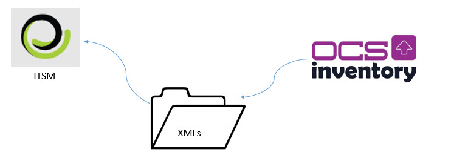

title: CITSmart Inventory Connection setup
Description: The goal of this feature is to register all properties related to the CITSmart Inventory connection.
# CITSmart Inventory Connection setup

The goal of this feature is to register all properties related to the CITSmart Inventory connection, acoording to the IP and Port 
where the CITSmart Inventory JBoss is installed.

How to access
-----------------

1. Access the **Inventory Connections** feature navigating through the main menu 
**Process Management > Event Management > Inventory Connections**.

Preconditions
---------------

1. No applicable.

Filters
----------

1. The following filters enables the user to restrict the participation of items in the standard feature listing, making it easier 
to find the desired items:

    - Name;
    - Tool;
    - Address;
    - Inventory Identifier;
    - Status.
    
    
    
    **Figure 1 - CITSmart inventory connections search screen**
    
2. Perform a connection search:

    - Insert the name of the intended connection and click on the *Search* button. Afterwards, the connection entry will be 
    displayed according to the description provided;
    
    - To list all connections, just click directly on the *Search* button, if needed.
    
Items list
--------------------

1. The following cadastral fields are available to the user to facilitate the identification of the desired items in the standard 
feature listing: **Name, Inventory Identifier,Status, Tool, Address** and **Port**.

2. On the **Inventory Connections** screen, click on the **Search Configuration** tab. The search screen will be displayed as 
illustrated on the image below:

    
    
    **Figure 2 - Connection listing screen of CITSmart Inventory**
    
3. After searching, select the intended entry. Afterwards, they will be redirected to the registry screen displaying the content 
belonging to the selected entry;

4. To edit a connection entry, just modify the information on the intended fields and click on the *Save* button to confirm the c
changes to the database, at which date, time and user will be stored automatically for a future audit.

Filling in the registration fields
-------------------------------------

1. The inventory connections entry screen will be displayed, as illustrated on the image below:

    
    
    **Figure 3 - CITSmart inventory connections entry screen**
    
2. On this screen, the fields are self explanatory. Just place the cursor on the intended field and a brief description will be 
displayed. Therefore, only the main information to perform a connection entry will be displayed;

    - Insert the **Connection Data**.
    
    !!! warning "WARNING"
    
        Selecting the "Ignore already inventoried machine" option (In the case of inventoried machines it is possible to define how 
        many days this machine will be without new inventory and therefore its Status will be set to Ignored until the total number 
        of days has been parameterized). refer to Period and Period format, select the option that best fits and save the settings.
        
OCS Inventory assumptions
-----------------------------

**Figure 4 - CITSmart Inventory Integration - OCS Inventory**

3. If the type of connection (inventory tool) chosen is the OCS Inventory the configuration field will be displayed to be informed 
of the XML repository, as shown below. In addition, there are some very relevant prerequisites that should be observed:

    - After installing OCS Inventory, it does not default to any type of integration with another system, so in the Inventory files 
    menu you need to assign GENERATE_OCS_FILES = ON, OCS_FILES_FORMAT = XML and specify the path where XML files will be stored in 
    OCS_FILES_PATH
    - The location specified for generating XML files is very strategic:
        - If the OCS server is the same as the Inventory server, this is the least risk because the folder is likely to be 
        readable;
        - If the OCS server is *NOT* the same as the Inventory server, you must choose one of two options:
            - OCS Inventory must be allowed to write to the Inventory server;
            - Inventory must have permission (share) on the OCS Inventory server.
            
    
    
    **Figure 5 - CITSmart inventory connection entry screen**
    
4. To link the CITSmart Inventory to the Citsmart Event Monitor, select the **Add connection to the CITSmart Event Monitor** 
option;

5. Afterwards, choose the CITSmart Event Monitor Connection.

    !!! note "NOTE"
    
        To link the CITSmart Inventory to the CITSmart Event Monitor it is necessary, first, to configure the CITSmart Event 
        Monitor Connection.
        
6. After inserting the connection data, click on the **Test Connection** button to test the connection to the CITSmart Inventory:

    - Insert the configuration data:
        - The **Inventort Identification** corresponds to the “**idCitsmartInventory**” property of the properties file 
        “**inventory_config.properties**”;
        - To ignore machines already inventoried, select the option and insert the period and its format.
    - Insert the .Net Capture Agent data:
        - The capture agent server IP refers to the server ip where the machine's information capture agent is installed.
    - Insert the SNMP agent data.
    
    !!! warning "WARNING"
    
       The Inventory application captures the data through the SNMP Agent (161) port and / or the Capture Agent (port 7103 eveloped 
       by CITSmart Corporation, in .Net). Initially, Inventory performs a "ping" command to verify that the machine is active. If 
       you can perform the command, try to access the SNMP port of the configuration item. If access to the port is not obtained 
       successfully, Inventory tries to access through the capture agent.
        
7. Click on the *Save and Apply Configurations* to confirm the entry, at which date, time and user will automatically be stored for a future audit.

!!! tip "About"

    <b>Product/Version:</b> CITSmart | 7.00 &nbsp;&nbsp;
    <b>Updated:</b>08/28/2019 – Larissa Lourenço
