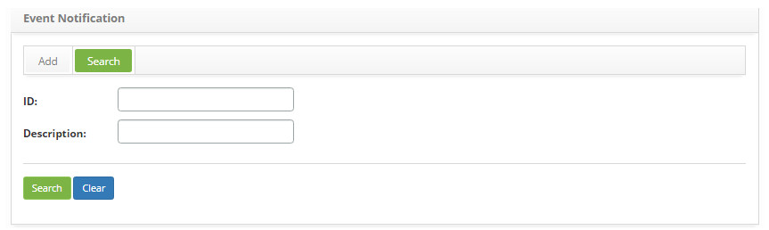
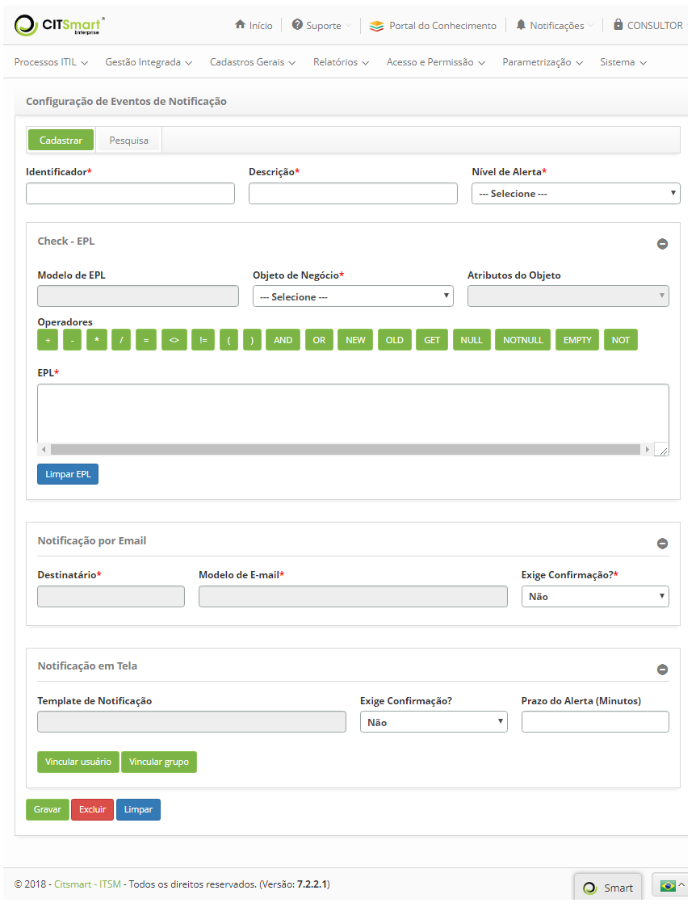

title: Event notifications registration and search
Description: The goal of this feature is to establish which rules will determine an event notification.
# Event notifications registration and search

The goal of this feature is to establish which rules will determine an event notification, that is, perform the configuration 
related to the notification which will be triggered when the EPL conditions are met.

!!! warning "WARNING"

    It is necessary to have knowledge on the event processing language. For more information check the website: 
    [espertech](http://www.espertech.com/esper)
    
Preconditions
---------------

1. Register an EPL model (see knowledge [EPL model registration and search](/en-us/citsmart-platform-7/processes/event/epl-models.html));

2. Register a recipient (see knowledge [Notification recipients setup](/en-us/citsmart-platform-7/processes/event/notifications-recipients.html));

3. Register an e-mail template (see knowledge [E-mail template configuration registration and search](/en-us/citsmart-platform-7/plataform-administration/email-settings/configure-email-template.html));

4. Register an notification template (see knowledge [Template notification registration and search](/en-us/citsmart-platform-7/additional-features/communication-and-notification/notification/configuration/notification-template.html)).

How to access
-----------------

1. Access the **Monitoring Tools** feature navigating through the main menu 
**Process Management > Event Management > Event Notification**.

Filters
-----------

1. The following filter enables the user to restrict the participation of items in the standard feature listing, making it easier 
to find the desired items:

    - ID;
    - Description.
    
2. On the **Notification Event Configuration** screen, click the **Search** tab. The search screen will be displayed as shown in 
the figure below:

    
    
    **Figure 1 - Notification event configuration search screen**
    
3. Perform a citsmart event monitor connection search:

    - Insert the id and or/description of the intended event notification configuration and click on the *Search* button. 
    Afterwards, the connection entry will be displayed according to the description provided;
    
    - To list all connections, just click directly on the *Search* button, if needed.
    
Items list
-------------------

1. The following cadastral fields are available to the user to facilitate the identification of the desired items in the standard 
feature listing: **ID** and **Description**.

    
    
    **Figura 2 - Tela de listagem de configuração de eventos de notificação**
    
2. Após a pesquisa, selecione o registro desejado. Feito isso, será direcionado para a tela de cadastro exibindo o conteúdo
referente ao registro selecionado;

3. Para alterar os dados do registro de configuração de eventos de notificação, basta modificar as informações dos campos 
desejados e clicar no botão "Gravar" para que seja gravada a alteração realizada no registro, onde a data, hora e usuário serão 
gravados automaticamente para uma futura auditoria.

Preenchimento dos campos cadastrais
-------------------------------------

1. Será apresentada a tela de cadastro de configuração de eventos de notificação, conforme ilustrada na figura abaixo:

    
    
    **Figura 3 - Tela de cadastro de configuração de eventos de notificação**
    
2. Informe os dados para cadastro de configuração de eventos de notificação:

    - **Identificador**: informe a identificação do evento de notificação. Essa identificação é uma palavra chave ou sigla para 
    diferenciar os eventos.
    - **Descrição**: informe a descrição que desejar para a configuração de eventos de notificação;
    - **Nível de Alerta**: selecione o nível de alerta;
    - **Informe os dados para Check - EPL**:
        - **Modelo de EPL**: informe o modelo de EPL que será utilizado. Ao clicar neste campo, será apresentada a tela "Modelo 
        de EPL", clique na guia "Pesquisar", realize a pesquisa e selecione o modelo de EPL. Caso queira criar um modelo de EPL, 
        clique na guia "Cadastrar";
        - **Objeto de Negócio**: selecione o objeto de negócio, o qual deverá ser analisado. No momento que é escolhido o objeto 
        de negócio, o sistema substitui a chave 'BusinessClass' para o nome completo da classe DTO, ou seja, o objeto de negócio
        selecionado;
        - **Atributos do Objeto**: selecione os atributos. Os atributos definem as características dos objetos de negócios e serão 
        apresentados conforme o objeto escolhido. No momento que é escolhido o atributo, o sistema substitui a chave 
        'AttributeClass' para o nome do atributo da classe DTO selecionado;
    - **Operadores**: são os itens que poderão ser usados para criação da EPL.
    - **EPL**: descreva o script EPL para identificação do evento.
        - Caso queira limpar os dados informados no campo, basta clicar no botão "Limpar EPL";
            - **Informe os dados para Notificação por E-mail**: quando o evento cair na regra da EPL, será enviado e-mail 
            de notificação para o destinatário escolhido;
    - **Destinatário**: informe o destinatário. Ao clicar neste campo, será apresentada a tela "Destinatário", realize a pesquisa 
    e selecione o destinatário.
    - **Modelo de E-mail**: informe o modelo de e-mail. Ao clicar neste campo, será apresentada a tela "Modelo de E-mail", 
    realize a pesquisa e selecione o modelo de e-mail.
    - **Exige Confirmação?**: selecione Sim ou Não para a necessidade de uma confirmação quando a notificação for recebida;
        - Se a opção marcada for **Não**, o sistema vai disparar um e-mail para o destinatário e registrar o evento de notificação
        como concluído.
        - Se a opção marcada for **Sim**, os campos com as informações de prazo de alerta em minutos, e prazo de confirmação em 
        minutos deverão ser preenchidos, assim como as informações para escalonamento:
            - **Destinatário de Escalonamento**: informe o destinatário de escalonamento. Ao clicar neste campo, será apresentada 
            a tela "Destinatário de Escalonamento", realize a pesquisa e selecione o destinatário de escalonamento;
            - **Modelo de E-mail Escalonamento**: informe o modelo de e-mail de escalonamento. Ao clicar neste campo, será 
            apresentada a tela "Modelo de E-mail Escalonamento", realize a pesquisa e selecione o modelo de e-mail de 
            escalonamento;
            - **Prazo de Escalonamento (Minutos)**: informe o prazo de escalonamento.
    - **Informe os dados para Notificação em Tela**: quando o evento cair na regra da EPL, será apresentada notificação na tela
    conforme configurado no template escolhido;
    - **Template de Notificação**: selecione o template de notificação desejado;
    - **Exige Confirmação?**: selecione Sim ou Não para a necessidade de uma confirmação quando a notificação for recebida;
    - **Prazo do Alerta (Minutos)**: informe o prazo de alerta da notificação em tela, em minutos;
    - **Vincular usuário**: vincule usuário(s) à notificação em tela;
        - Clique no botão "Vincular usuário". Após isso, será apresentada a tela de pesquisa de usuários;
        - Realize a pesquisa, selecione o usuário que deseja vincular à notificação em tela;
    - **Vincular grupo**: vincule grupo(s) à notificação em tela;
        - Clique no botão "Vincular grupo". Após isso, será apresentada a tela de pesquisa de grupos;
        - Realize a pesquisa, selecione o grupo que deseja vincular à notificação em tela;

3. Clique no botão "Gravar" para efetuar o registro, onde a data, hora e usuário serão gravados automaticamente para uma futura 
auditoria.

!!! note "NOTA"

    No momento da gravação, o sistema faz uma validação da sintaxe da EPL.
    
!!! tip "About"

    <b>Product/Version:</b> CITSmart | 7.00 &nbsp;&nbsp;
    <b>Updated:</b>07/18/2019 – Larissa Lourenço
