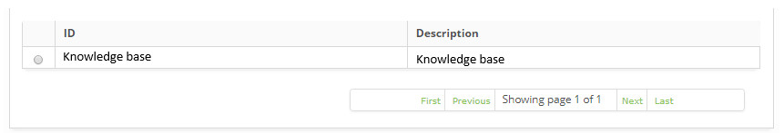
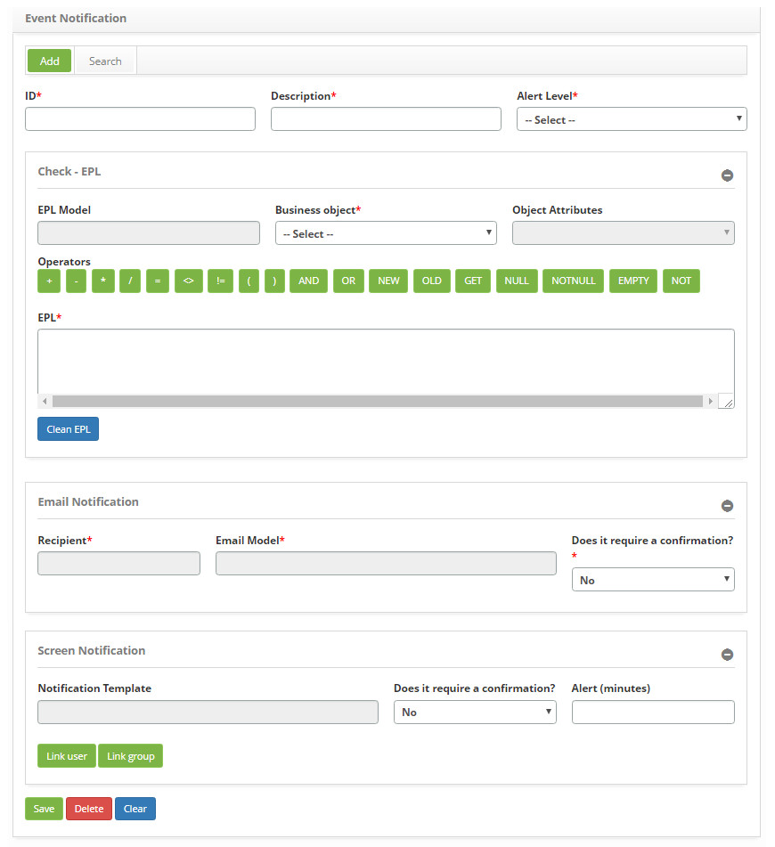

title: Event notifications registration and search
Description: The goal of this feature is to establish which rules will determine an event notification.
# Event notifications registration and search

The goal of this feature is to establish which rules will determine an event notification, that is, perform the configuration 
related to the notification which will be triggered when the EPL conditions are met.

!!! warning "WARNING"

    It is necessary to have knowledge on the event processing language. For more information check the website: 
    [espertech](http://www.espertech.com/esper)
    
Preconditions
---------------

1. Register an EPL model (see knowledge [EPL model registration and search](/en-us/citsmart-platform-7/processes/event/epl-models.html));

2. Register a recipient (see knowledge [Notification recipients setup](/en-us/citsmart-platform-7/processes/event/notifications-recipients.html));

3. Register an e-mail template (see knowledge [E-mail template configuration registration and search](/en-us/citsmart-platform-7/plataform-administration/email-settings/configure-email-template.html));

4. Register an notification template (see knowledge [Template notification registration and search](/en-us/citsmart-platform-7/additional-features/communication-and-notification/notification/configuration/notification-template.html)).

How to access
-----------------

1. Access the **Monitoring Tools** feature navigating through the main menu 
**Process Management > Event Management > Event Notification**.

Filters
-----------

1. The following filter enables the user to restrict the participation of items in the standard feature listing, making it easier 
to find the desired items:

    - ID;
    - Description.
    
2. On the **Notification Event Configuration** screen, click the **Search** tab. The search screen will be displayed as shown in 
the figure below:

    
    
    **Figure 1 - Notification event configuration search screen**
    
3. Perform a citsmart event monitor connection search:

    - Insert the id and or/description of the intended event notification configuration and click on the *Search* button. 
    Afterwards, the connection entry will be displayed according to the description provided;
    
    - To list all connections, just click directly on the *Search* button, if needed.
    
Items list
-------------------

1. The following cadastral fields are available to the user to facilitate the identification of the desired items in the standard 
feature listing: **ID** and **Description**.

    
    
    **Figure 2 - Notification event configuration listing screen**
    
2. After searching, select the intended entry. Afterwards, they will be redirected to the registry screen displaying the content 
belonging to the selected entry;

3. To edit a event notification configuration entry, just modify the information on the intended fields and click on the *Save* 
button to confirm the changes to the database, at which date, time and user will be stored automatically for a future audit.

Filling in the registration fields
-------------------------------------

1. The Event Notification screen will be displayed, as illustrated on the image below:

    
    
    **Figure 3 - Event notification entry screen**
    
2. Insert the data for registering the event notification configuration:

    - **ID**: insert the identifier of the event notification. This identification is a keyword or an acronym to distinguish the 
    events;
    - **Description**: describe the event notification configuration as intended;
    - **Alert Level**: select the alert level;
    - **Insert the data for the Check - EPL**:
        - **EPL Model**: please state the EPL model that will be used. When you click on this field, the "EPL Template" screen will 
        appear, click on the "Search" tab, perform the search and select the EPL template. If you want to create an EPL template, 
        click on the "Upload" tab;
        - **Business Object**: select the business object, which should be analyzed. When the business object is chosen, the system 
        replaces the 'BusinessClass' key for the full name of the DTO class, that is, the selected business object;
        - **Object Attributes**: select attributes. Attributes define the characteristics of business objects and are presented 
        with the chosen object. At the time the attribute is chosen, the system overrides the 'AttributeClass' key for the 
        attribute name of the selected DTO class.
    - **Operators**: these are the items that can be used to create the EPL;
    - **EPL**: describe the EPL script for event ID:
        - If you want to clear the data entered in the field, just click on the Clear EPL button;
            - **Enter the data for E-mail Notification**: when the event falls under the EPL rule, notification e-mail will be sent 
            to the chosen recipient;
    - **Recipient**: please inform the recipient. Clicking on this field will display the "Recipient" screen, perform the search 
    and select the recipient;
    - **E-mail template**: enter the e-mail template. Clicking on this field will display the "E-mail template" screen, perform the 
    search and select the e-mail template;
    - **Requires Confirmation ?**: select Yes or No for the need for a confirmation when the notification is received:
        - If the checked option is **No**, the system will trigger an e-mail to the recipient and register the notification event 
        as complete;
        - If the checked option is **Yes**, the fields with alert information in minutes, and confirmation time in minutes must be 
        filled in, as well as information for scheduling:
            - **Scheduling recipient**: inform the recipient of escalation. Clicking this field will display the "Scheduling 
            Recipient" screen, perform the search and select the scheduling recipient;
            - **E-mail Template Scheduling**: enter the escalation e-mail template. Clicking on this field will display the "E-mail 
            Scheduling Template" screen, perform the search and select the escalation e-mail template;
            - **Scheduling Time (Minutes)**: inform the scheduling period.
    - **Enter the data for Screen Notification**: when the event falls on the EPL rule, on-screen notification will be displayed as 
    configured in the chosen template;
    - **Notification Template**: select the desired notification template;
    - **Require Confirmation ?**: select Yes or No for the need for a confirmation when the notification is received;
    - **Alert Time (Minutes)**: enter the alert period of the notification on screen, in minutes;
    - **Link user**: link user (s) to notification on screen;
        - Click the *Link User* button. After that, the user search screen will be displayed;
        - Perform the search, select the user you want to link to the on-screen notification.
    - **Link group**: link group (s) to on-screen notification;
        - Click the *Link Group* button. After that, the group search screen will be displayed;
        - Perform the search, select the group you want to link to the on-screen notification.

3. Click on the *Record* button to register, where the date, time and user will be saved automatically for a future audit.

!!! note "NOTE"

    At the time of writing, the system does a validation of the EPL syntax.
    
!!! tip "About"

    <b>Product/Version:</b> CITSmart | 7.00 &nbsp;&nbsp;
    <b>Updated:</b>08/29/2019 – Larissa Lourenço
