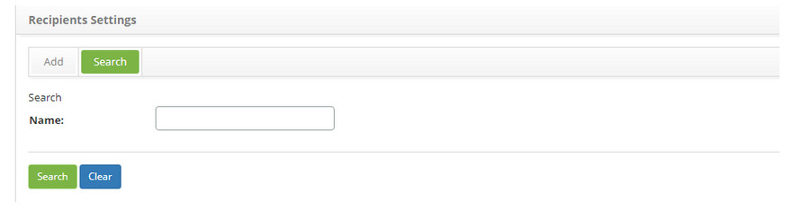
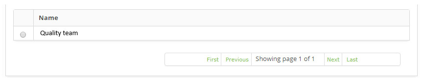
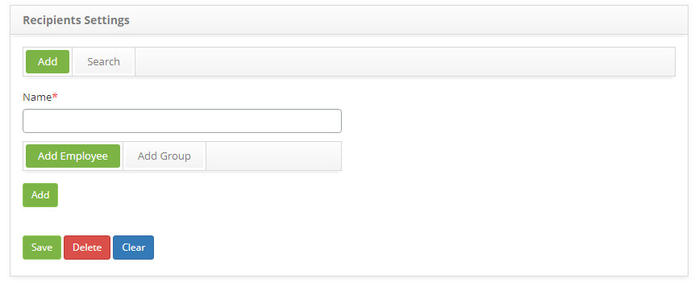
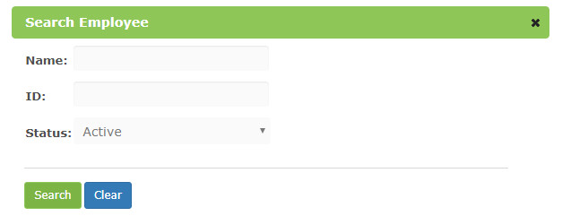
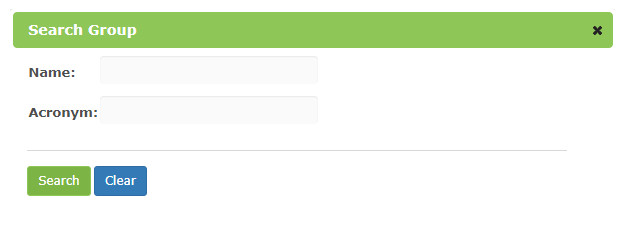

title: Notification recipients setup
Description: This functionality aims to configure the recipients which will receive notifications. 
# Notification recipients setup

This functionality aims to configure the recipients which will receive notifications. The recipient can be one or more staff 
members and/or groups.

How to access 
-----------------

1. Access the **Recipient Settings** feature navigating through the main menu 
**Process Management > Event Management > Recipient Settings**.

Preconditions
----------------

1. Register staff members (see knowledge [Staff registration and search](/en-us/citsmart-platform-7/initial-settings/access-settings/user/employee.html));

2. Register groups (see knowledge [Group registration and search](/en-us/citsmart-platform-7/initial-settings/access-settings/user/group.html)).

Filters
-----------

1. The following filter enable the user to restrict the participation of items in the standard feature listing, making it easier to 
locate the desired items as shown in the figure below:

    - Name.
    
2. On the **Recipient Settings** screen, click on the **Search** tab. The search screen will be displayed as illustrated on the 
image below:

    
    
    **Figure 1 - Recipient settings search screen**
    
3. Perform a recipient settings search:

    - Insert the name of the intended settings and click on the *Search* button. Afterwards, the settings entry will be displayed 
    according to the description provided;
    
    - To list all settings, just click directly on the *Search* button, if needed.
    
Items list
--------------------

1. The following cadastral field is available to the user to facilitate the identification of the desired items in the standard 
listing of the functionality: **Name**.

    
    
    **Figure 2 - Recipient settings items list screen**
    
2. After searching, select the intended entry. Afterwards, they will be redirected to the registry screen displaying the content 
belonging to the selected entry;

3. To edit a recipient settings entry, just modify the information on the intended fields and click on the *Save* button to confirm 
the changes to the database, at which date, time and user will be stored automatically for a future audit.

Filling in the registration fields
-------------------------------------

1. Access the feature, afterwards, the **Recipient Settings Entry** screen will be displayed, as illustrated on the image below:

    
    
    **Figure 3 - Recipient settings entry screen**
    
2. Insert the recipient settings information to be registered:

    - **Name**: insert the recipient settings intended name.
    
Linking recipients - add employee
------------------------------------------

1. To add a staff member select the tab **Recipients - Add Employee**, click on the *Add* button and the screen to search and 
select the staff member will be displayed:

**Figure 4 - Staff member search screen**

Linking recipients - add group
----------------------------------

1. To add a group click on the tab **Recipients - Add Group**, click on the *Add* button and the screen to search and select the 
group will be displayed:

    
    
    **Figure 5 - Group search screen**
    
2. To remove the added staff members and groups, just click on the  icon;

3. Click on the *Save* the button to confirm the entry, at which date, time and user will automatically be stored for a future 
audit.

!!! tip "About"

    <b>Product/Version:</b> CITSmart | 7.00 &nbsp;&nbsp;
    <b>Updated:</b>08/29/2019 – Larissa Lourenço
