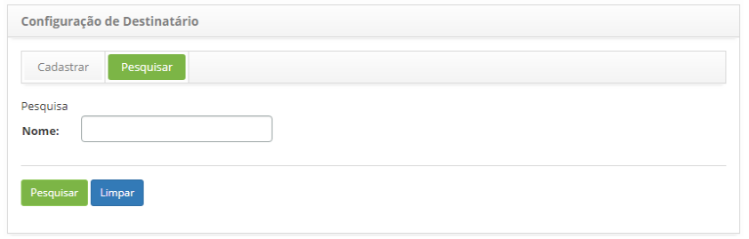
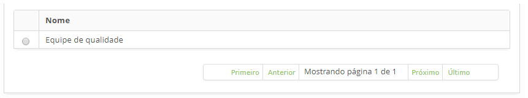
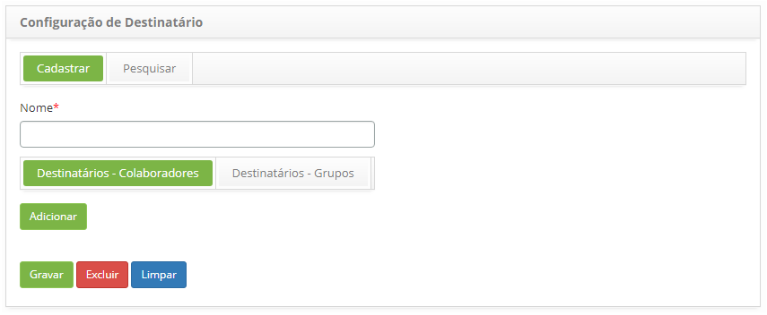
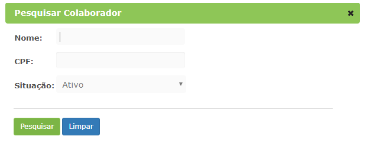
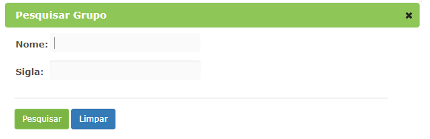

title: Notification recipients setup
Description: This functionality aims to configure the recipients which will receive notifications. 
# Notification recipients setup

This functionality aims to configure the recipients which will receive notifications. The recipient can be one or more staff 
members and/or groups.

How to access 
-----------------

1. Access the **Recipient Settings** feature navigating through the main menu 
**Process Management > Event Management > Recipient Settings**.

Preconditions
----------------

1. Register staff members (see knowledge [Staff registration and search](/en-us/citsmart-platform-7/initial-settings/access-settings/user/group.html));

2. Register groups (see knowledge [Group registration and search](/en-us/citsmart-platform-7/initial-settings/access-settings/user/group.html)).

Filters
-----------

1. The following filter enable the user to restrict the participation of items in the standard feature listing, making it easier to 
locate the desired items as shown in the figure below:

    - Name.
    
2. On the Recipient Settings screen, click on the Search tab. The search screen will be displayed as illustrated on the image below:

    
    
    **Figura 1 - Tela de pesquisa de configuração de destinatário**
    
3. Realize a pesquisa de configuração de destinatário;

    - Informe o nome da configuração de destinatário que deseja pesquisar e clique no botão "Pesquisar". Após isso, será exibido o 
    registro conforme o nome informado;
    
    - Caso deseje listar todos os registros de configuração de destinatário, basta clicar diretamente no botão "Pesquisar".
    
Listagem de itens
--------------------

1. O seguinte campo cadastral está disponível ao usuário para facilitar a identificação dos itens desejados na listagem 
padrão da funcionalidade: **Nome**.

    
    
    **Figura 2 - Tela de listagem de configuração de destinatário**
    
2. Após a pesquisa, selecione o registro desejado. Feito isso, será direcionado para a tela de cadastro exibindo o conteúdo
referente ao registro selecionado;

3. Para alterar os dados do registro de configuração de destinatário, basta modificar as informações dos campos desejados e 
clicar no botão "Gravar" para que seja gravada a alteração realizada no registro, onde a data, hora e usuário serão gravados 
automaticamente para uma futura auditoria.

Preenchimento dos campos cadastrais
-------------------------------------

1. Acesse a funcionalidade, após isso, será apresentada a tela de Cadastro de **Configuração de Destinatário**, conforme 
ilustrada na figura abaixo:

    
    
    **Figura 3 - Tela de cadastro de configuração de destinatário**
    
2. Informe os dados para cadastro de configuração de destinatário:

    - **Nome**: informe o nome que desejar para a configuração de destinatário.
    
Vinculando destinatários - colaboradores
------------------------------------------

1. Para adicionar colaborador selecione a aba **Destinatários - Colaboradores**, clique no botão "Adicionar" e será apresentada a 
tela para pesquisar e selecionar colaborador:

**Figura 4 - Tela de pesquisa de colaborador**

Vinculando destinatários - grupos
----------------------------------

1. Para adicionar grupo selecione a aba **Destinatários - Grupos**, clique no botão "Adicionar" e será apresentada a tela para
pesquisar e selecionar grupo:

    
    
    **Figura 5- Tela de pesquisa de grupo**
    
2. Para excluir os colaboradores e grupos adicionados, basta clicar no ícone .

3. Clique no botão "Gravar" para efetuar o registro, onde a data, hora e usuário serão gravados automaticamente para 
uma futura auditoria.

!!! tip "About"

    <b>Product/Version:</b> CITSmart | 7.00 &nbsp;&nbsp;
    <b>Updated:</b>07/18/2019 – Larissa Lourenço
