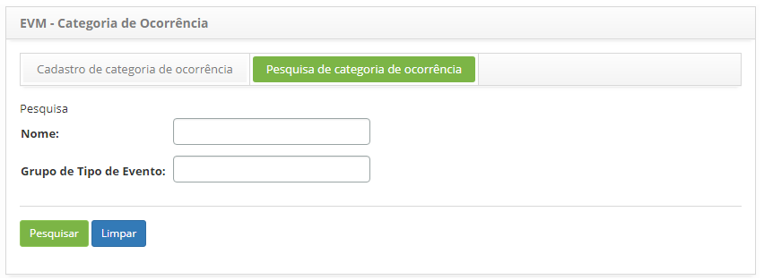
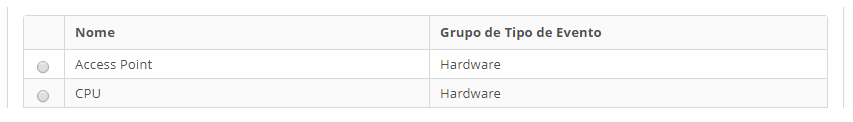
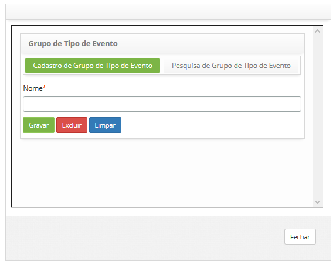

title: Cadastro e pesquisa de categoria de ocorrência
Description: Esta funcionalidade tem como objetivo realizar o cadastro de categoria de ocorrência.
# Cadastro e pesquisa de categoria de ocorrência

Esta funcionalidade tem como objetivo realizar o cadastro de categoria de ocorrência, ou seja, através dele é permitido agrupar 
ocorrências de eventos de um mesmo tipo. Este cadastro será associado a cada item do cadastro de gerente de eventos do CITSmart 
Inventory, Nagios ou Zabbix.

Como acessar
--------------

1. Acesse a funcionalidade de categoria de ocorrência através da navegação no menu principal 
**Processos ITIL > Gerência de Evento > Categoria de ocorrência**.

Pré-condições
---------------

1. Não se aplica.

Filtros
---------

1. Os seguintes filtros possibilitam ao usuário restringir a participação de itens na listagem padrão da funcionalidade, 
facilitando a localização dos itens desejados, conforme ilustrado na figura abaixo:

    - Nome;
    - Grupo de Tipo de Evento.
    
2. Na tela de **EVM - Categoria de Ocorrência**, clique na aba **Pesquisa de categoria de ocorrência**. Será apresentada a tela de 
pesquisa conforme ilustrada na figura abaixo:

    
    
    **Figura 1 - Tela de pesquisa de categoria de ocorrência**
    
3. Realize a pesquisa de categoria de ocorrência;

    - Informe o nome da categoria de ocorrência e/ou o grupo de tipo de evento e clique no botão "Pesquisar". Após isso, será 
    exibido o registro da categoria de ocorrência conforme os dados informados.
    
    - Caso deseje listar todos os registros de categoria de ocorrência, basta clicar diretamente no botão "Pesquisar".
    
Listagem de itens
-------------------

1. Os seguintes campos cadastrais estão disponíveis ao usuário para facilitar a identificação dos itens desejados na listagem 
padrão da funcionalidade: **Nome** e **Grupo de Tipo de Evento**, conforme ilustrado na figura abaixo:

    
    
    **Figura 2 - Tela de lista de itens**
    
2. Após a pesquisa, selecione o registro desejado. Feito isso, será direcionado para a tela de cadastro exibindo o conteúdo 
referente ao registro selecionado;

3. Para alterar os dados do registro de categoria de ocorrência, basta modificar as informações dos campos desejados e clicar no
botão "Gravar" para que seja gravada a alteração realizada no registro, onde a data, hora e usuário serão gravados automaticamente
para uma futura auditoria.

Preenchimento de campos cadastrais
------------------------------------

1. Acesse a funcionalidade, após isso, será apresentada a tela de cadastro de categoria de ocorrência, conforme ilustrada na
figura abaixo:

    
    
    **Figura 3 - Tela de cadastro de categoria de ocorrência**
    
2. Preencha os campos conforme orientações abaixo:

    - **Nome**: informe o nome que desejar para a categoria de ocorrência;
    - **Grupo de Tipo de Evento**: selecione o grupo que desejar para a categoria de ocorrência. Caso haja necessidade de 
    cadastrar um grupo, proceda conforme explicação abaixo:
        - Clicando no botão "Criar/Editar Grupo" é possível cadastrar, consultar, editar e excluir registros de grupos de eventos;
        - Na aba **Cadastro de Grupo de Tipo de Evento**, conforme ilustração abaixo. Informe o nome do grupo e clique no botão 
        "Gravar" para efetuar o registro;
        
    
    
    **Figura 4 - Tela de cadastro de grupo de tipo de evento**
    
    - Na aba **Pesquisa de Grupo de Tipo de Evento**, as consultas podem ser realizadas informando o nome do grupo, busca por 
    aproximação da palavra digitada, ou através do botão "Pesquisar", onde todos os registros cadastrados serão listados. A figura
    abaixo ilustra essa tela:
    
    
    
    **Figura 5 - Tela de pesquisa de grupo de tipo de evento**
    
    - Selecione o registro que desejar e o mesmo será direcionado para a aba de cadastro com os campos preenchidos;
    - Para editar o grupo de tipo de evento, basta realizar a modificação desejada e clicar no botão "Gravar".
    
3. Clique no botão "Gravar" para efetuar o registro, onde a data, hora e usuário serão gravados automaticamente para uma 
futura auditoria.

!!! tip "About"

    <b>Product/Version:</b> CITSmart | 7.00 &nbsp;&nbsp;
    <b>Updated:</b>07/17/2019 – Larissa Lourenço
