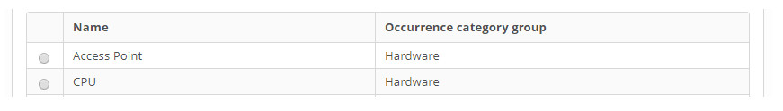

title: Occurrence category registration and search
Description: Esta funcionalidade tem como objetivo realizar o cadastro de categoria de ocorrência.
# Occurrence category registration and search

This functionality has the purpose of registering the occurrence category, that is, through it it is possible to group occurrences 
of events of the same type. This registration will be associated with each item in the CITSmart Inventory, Nagios or Zabbix event 
manager registry.

How to access
-----------------

1. Access the event category functionality by navigating in the main menu 
**Process Management > Event Management > Occurrence category**.

Preconditions
------------------

1. Not applicable.

Filters
-----------

1. The following filters enable the user to restrict the participation of items in the standard feature listing, making it easier 
to locate the desired items as shown in the figure below:

    - Name;
    - Ocurrence category group.
    
2. On the **EVM - Occurrence Category** screen, click the **Occurrence category search** tab. The search screen will be displayed 
as shown in the figure below:

    
    
    **Figure 1 - Occurrence category search screen**
    
3. Perform the occurrence category search:

    - Enter the name of the event category and/or event type group and click the *Search* button. After that, the occurrence 
    category record will be displayed according to the reported data;
    
    - If you want to list all occurrence category records, simply click the *Search* button directly.
    
Items list
-------------------

1. The following cadastral fields are available to the user to make it easier to identify the desired items in the default listing 
of the functionality: **Name** and **Occurrence category group**:

    
    
    **Figure 2 - Items screen**
    
2. After searching, select the desired record. Once this is done, it will be directed to the registration screen displaying the 
contents of the selected registry;

3. To change the occurrence category record data, simply change the information of the desired fields and click on the *Save* 
button to save the change made to the record, where the date, time and user will be saved automatically for a future audit.

Filling in the registration fields
------------------------------------

1. Access the functionality, after that, the event category registration screen will be displayed, as shown in the figure below:

    
    
    **Figure 3 - Occurrence category record screen**
    
2. Fill in the fields as directed below:

    - **Name**: enter the name you want for the category of occurrence;
    - **Occurrence category group**: select the group you want for the event category. If you need to register a group, process as 
    explained below:
        - By clicking the *Create/Edit Group* button you can register, query, edit and delete event group records;
        - On the **Occurrence category group** registration tab, as shown below. Enter the group name and click the Save button to 
        register;
        
    
    
    **Figure 4 - Event type group master screen**
    
    - In the **Occurrence category group search** tab, queries can be made by entering the name of the group, search by 
    approximation of the word entered, or by the Search button, where all the registered records will be listed. The figure below 
    illustrates this screen:
    
    
    
    **Figure 5 - Event type group search screen**
    
    - Select the record you want and it will be directed to the registration tab with the fields filled;
    - To edit the event type group, simply make the desired modification and click the *Save* button.
    
3. Click the *Save* button to register, where the date, time and user will be saved automatically for a future audit.

!!! tip "About"

    <b>Product/Version:</b> CITSmart | 7.00 &nbsp;&nbsp;
    <b>Updated:</b>08/30/2019 – Larissa Lourenço
