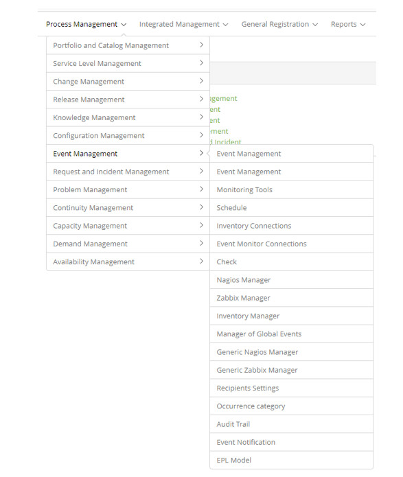

title: Event Management module
Description: Event Management receives and filters the various events generated by IT services.
# Event Management module

Module objective
--------------------

Event Management receives and filters the various events generated by IT services, CIs and monitoring tools. Filtering these events 
will determine when action is needed. Various actions can be taken, such as opening an incident, problem or change log, or 
performing some manual or automated procedure.

Event Management supports the Incident Management process because it is possible to detect in advance faults in the services and 
act quickly to avoid downtime of the service to the end user.

Monitoring and Event Management are closely linked. Event Management focuses on generating and detecting significant notifications 
about IT infrastructure and service status, and monitoring is required to detect and track these notifications. Monitoring observes 
various environmental conditions and helps detect events, and Event Management handles events that have significance.

Where are the features
----------------------------------

To access the functionality click on the main menu **Process Management > Event Management**.

**Figure 1 - Event Management module menu**

Main feature (in highlight)
---------------------------------------

In the *See also* section you can access the main functionality(ies) of this module, in order to obtain a more detailed knowledge.

See also
------------

- [Event Management module](/en-us/citsmart-platform-7/processes/event/event-management.html)

!!! tip "About"

    <b>Product/Version:</b> CITSmart | 7.00 &nbsp;&nbsp;
    <b>Updated:</b>08/30/2019 – Larissa Lourenço
