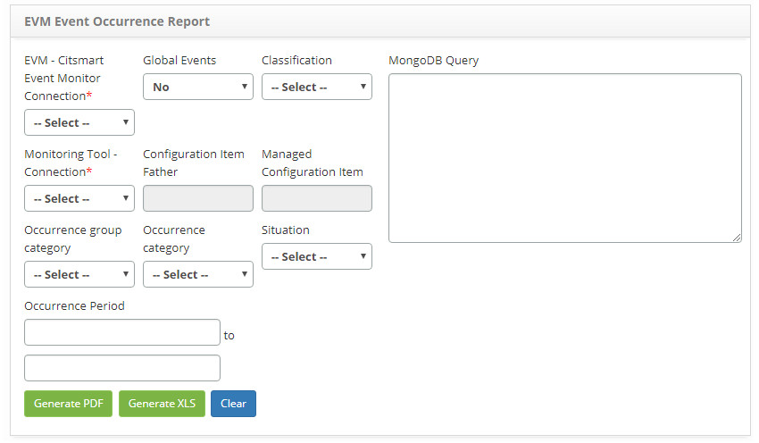

title:  Report generation - Event Management
Description: This report is intended to present occurrences of events. 
# Report generation - Event Management

This report is intended to present occurrences of events that have been stored in the **Event Database (MongoDB)**.

How to access
-----------------

1. Access the Event Occurrence Reporting feature by navigating in the main menu **Reports > Event Management > Event Occurrence**.

Preconditions
----------------

1. No applicable.

Filters
----------

1. The following filters enables the user to restrict the participation of items in the standard feature listing, making it easier 
to find the desired items:

    - EVM - Citsmart Event Monitor Connection;
    - Global Events;
    - Classification;
    - MongoDB Query;
    - Monitoring Tool - Connection;
    - Configuration Item Father;
    - Managed Configuration Item;
    - Occurrence group category;
    - Occurrence category;
    - Situation;
    - Occurrence Period.
    
2. The **Event Occurrence Report Generation** screen will be displayed, as shown in the following figure:

    
    
    **Figure 1 - Event occurrence report generation screen**
    
3. Enter the filters according to your need to generate the report of occurrence of events;

4. Click the *Generate PDF* button to generate the event occurrence report in PDF format.

5. Click the *Generate XLS* button to generate the event report in Excel format.

Items list
-------------------

1. No applicable.

Filling in the registration fields
---------------------------------------

1. No applicable.

!!! tip "About"

    <b>Product/Version:</b> CITSmart | 7.00 &nbsp;&nbsp;
    <b>Updated:</b>08/30/2019 - Larissa Lourenço
