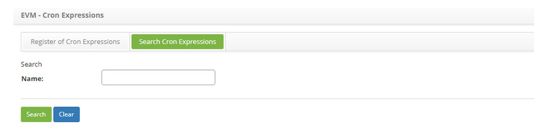
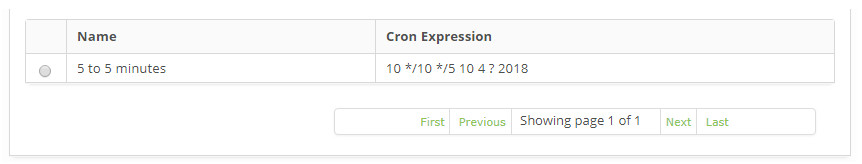
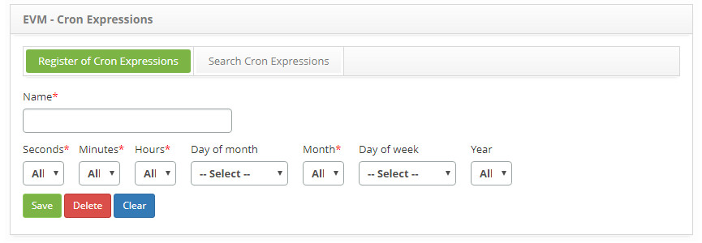

title: Schedule registration and search
Description: The goal of this feature is to schedule tasks.
# Schedule registration and search

The goal of this feature is to schedule tasks. Time and date filters are chosen and a cronological expression is generated with the 
goal of creating trigger schedules to be executed regularly on the established times and dates. For example, to perform a network 
inventory, a previously scheduled entry must be selected so the system can perform the inventory on the chosen time.

How to access
-----------------

1. Access the **Schedule** feature navigating through the main menu **Event Management > Event Management > Schedule**.

Preconditions
---------------

1. Not applicable.

Filters
-----------

1. The following filters enable the user to restrict the participation of items in the standard feature listing, making it easier 
to locate the desired items as shown in the figure below:

    - Name.
    
    
    
    **Figure 1 - Schedule search screen**
    
2. Perform a schedule search:

    - Insert the name of the intended schedule and click on the *Search* button. Afterwards, the schedule entry will be displayed 
    according to the description provided;
    
    - To list all schedule, just click directly on the *Search* button, if needed.
    
Items list
-------------------

1. The following cadastral fields are available to the user to make it easier to identify the desired items in the default listing 
of the functionality: **Name** and **Cron Expression**.

    
    
    **Figure 2 - Schedule items list screen**
    
2. After searching, select the intended entry. Afterwards, they will be redirected to the registry screen displaying the content 
belonging to the selected entry;

3. To edit a schedule entry, just modify the information on the intended fields and click on the Save button to confirm the changes 
to the database, at which date, time and user will be stored automatically for a future audit.

Filling in the registration fields
-------------------------------------

1. Access the feature, afterwards, the **Schedule Entry** screen will be displayed, as illustrated on the image below:

    
    
    **Figure 3 - Schedule entry screen**
    
2. Fill out the fields as instructed below:

    - **Name**: name the schedule entry;
    - Insert the intended schedule time selecting the **Seconds, Minutes** and **Hours**;
    - Insert the intended schedule date, selecting the **Day of Month** or **Day of Week, Month** and **Year**.
    
    !!! note "NOTE"
    
        Insert only one of the options, Day of month or Day of week.
        
3. Click on the *Save* the button to confirm the entry, at which date, time and user will automatically be stored for a future 
audit.

!!! tip "About"

    <b>Product/Version:</b> CITSmart | 7.00 &nbsp;&nbsp;
    <b>Updated:</b>08/30/2019 – Larissa Lourenço
