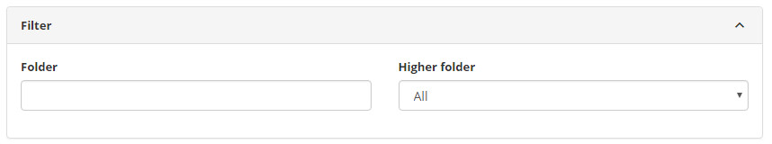
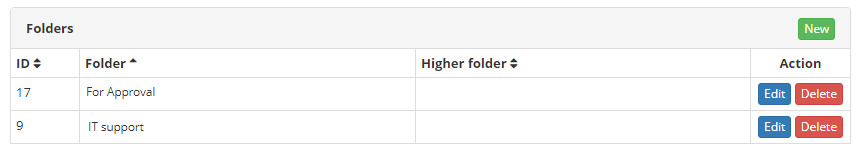
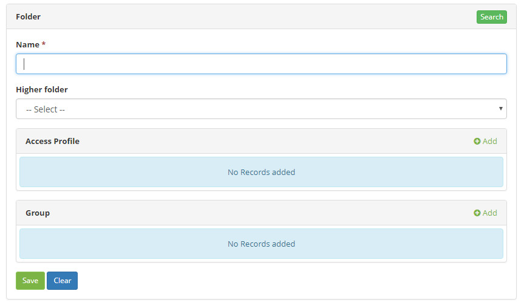

title: Folder registration and search
Description: This functionality aims to create and maintain folders that will be used for storing and organizing the knowledge 
# Folder registration and search

This functionality aims to create and maintain folders that will be used for storing and organizing the knowledge recorded in the 
database.

How to access
---------------

1.  Access the folder functionality through navigation in the main menu **ITIL Processes > Knowledge Management > Folder**.

Preconditions
-------------

1.  Have at least one registered profile, a registered group or both scenarios (see knowledge 
[Access profile registration and search][1], [Group registration and search][2].

Filters
------------

1.  The following filter enables the user to restrict the participation of items in the standard feature listing, making it easier 
to find the desired items:

    -   Folder;

    -   Higher folder.

**Figure 1 - Folder search screen**

Items list
----------------

1.  The following cadastral fields are available to the user to facilitate the identification of the desired items in the standard 
feature listing: **ID, Folder** and **Higher folder**.

2.  There are action buttons available to the user for each item in the listing, they are: *Edit* and *Delete*.

**Figure 2 - Folder listing screen**

Filling in the registration fields
--------------------------------------

1.  To open a new folder click on button *New*, as the figure bellow:

    

    **Figure 3 - New folder registration screen**

1.  Fill in the fields:

    -  **Name**: enter the folder name;
    -  **Higher Folder**: enter the upper folder, if the folder being registered is part of another folder;
    -  **Access Profile**: select the profiles that will have access to the folder;
       -  **Permission**: set the permissions for each selected profile;
       -  **Can publish**: define for each selected profile whether they can publish knowledge related to the folder.
    -  **Group**: select the groups that will have the folder by clicking the Add button. Allows the meeting of more than one 
    profile/group in one:
       -  **Permission**: sets whether the profile can read or read/write;
       -  **Can publish**: define whether or not the user can publish.

!!! info "IMPORTANT"

     When defining the access profile of the folders by group and access profile, the one with the highest permissions will prevail 
     (fields: Permission and Can Publish).

!!! tip "About"

    <b>Product/Version:</b> CITSmart | 8.00 &nbsp;&nbsp;
    <b>Updated:</b>08/30/2019 – Larissa Lourenço
    
[1]:/en-us/citsmart-platform-7/initial-settings/access-settings/profile/user-profile.html
[2]:/en-us/citsmart-platform-7/initial-settings/access-settings/user/group.html
