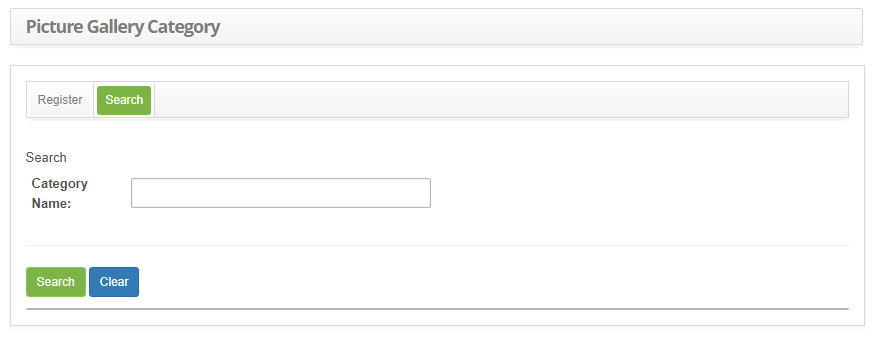
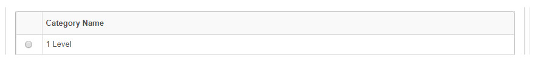
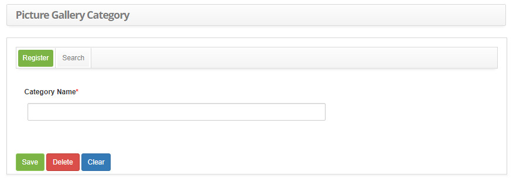

title: Image category registration and search
Description: The goal of this feature is to register the picture gallery categories to organize the arrange images into galeries.
# Image category registration and search

The goal of this feature is to register the picture gallery categories to organize the arrange images into galeries used and 
managed by the system.

How to access
-----------------

1.  Access the image category feature navigating through the main menu 
**Process Management > Knowledge Management > Picture Gallery Category**.

Preconditions
-----------------

1.  Not applicable.

Filters
-----------

1.  The following filter enable the user to restrict the participation of items in the standard feature listing, making it easier 
to locate the desired items as shown in the figure below:

    - Category Name.

2.  On the **Register** screen, click on the **Search** tab. The search screen will be displayed as illustrated on the image below:

    
   
    **Figure 1 - Picture gallery category search screen**

3.  Perform a picture gallery category search;

    -   Insert the name of the intended category and click on the *Search* button. Afterwards, the category entry will be displayed 
    according to the description provided;

    -   To list all categories, just click directly on the *Search* button, if needed.

Items list
----------------

1.  The following cadastral field is available to the user to make it easier to identify the desired items in the standard feature 
listing: **Category Name**.

    

    **Figure 2 - Items screen**

2.  After searching, select the intended entry. Afterwards, they will be redirected to the registry screen displaying the content 
belonging to the selected entry;

3.  To edit a category entry, just modify the information on the intended fields and click on the *Save* button to confirm the 
changes to the database, at which date, time and user will be stored automatically for a future audit.

Filling in the registration fields
--------------------------------------

1.  Access image category functionality by navigating the main menu. Afterwards, the picture gallery category entry screen will be 
displayed, as illustrated on the image below:

    

    **Figure 3 - Picture gallery category entry screen**

2.  Fill out the fields as instructed below:

    - **Category Name**: name the picture gallery category.

!!! tip "About"

    <b>Product/Version:</b> CITSmart | 8.00 &nbsp;&nbsp;
    <b>Updated:</b>08/30/2019 – Larissa Lourenço
