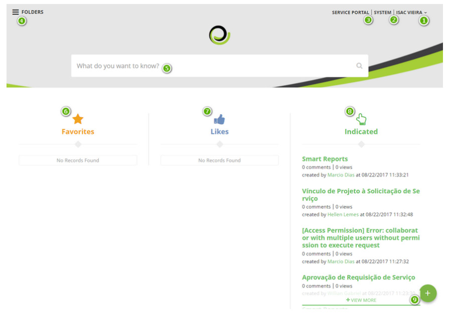
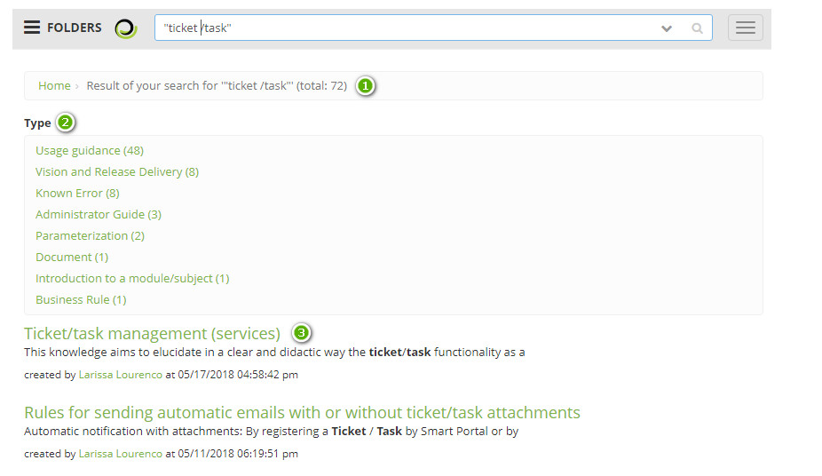
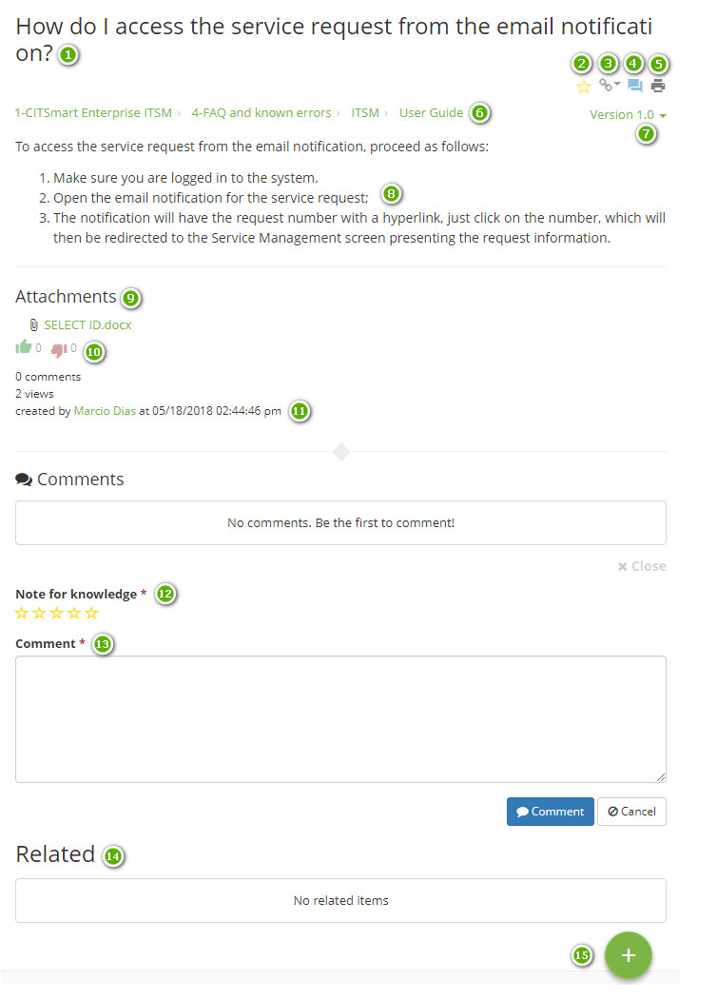

title:  Knowledge Portal
Description: The Knowledge Portal is one of the main screens of the solution, which aims to provide relevant information. 
# Knowledge Portal

The Knowledge Portal is one of the main screens of the solution, which aims to provide relevant information that allows the 
operator (user or administrator) the understanding and application of a certain knowledge. It also enables it to register a new 
knowledge in order to make the portal dynamic and up-to-date.

**Figure 1 - Knowledge Portal**

 **Identification of the user logged in**: when clicking the option, the functions to change the access 
password and exit the portal are displayed;

 **System**: clicking on the option allows to enter the system;

 **Services Portal**: clicking on the option will display one of the main screens of the product, the 
Service Portal (Smart Portal);

 **Folders**: displays the folders that the logged-in user has access to view the knowledge of the same;

 **Field of search**: allows the search for knowledge;

 **Favorites**: knowledge that has been marked as favorite by user the logged in;

 **Liked**: knowledge that was created by the logged in user;

 **Indicated**: knowledge indicated to the user, referring to the most accessed system features. Example: 
the user logged-in always accesses the "Service Request" functionality, when it enters the Knowledge Portal, the system will 
indicate the knowledge regarding the functionality;

 **Add Knowledge**: allows the user logged-in to post new knowledge in the Knowledge Base.

Viewing the content of a knowledge
---------------------------------------------

1. After performing the search in the Search field, a list will appear:

    
    
    **Figure 2 - Search result**
    
     Shows the amount of knowledge found;
    
     **Type**: shows the types of knowledge found, and it is possible to further refine the initial search 
    by selecting one of the options;
    
     Relation of knowledge found.
    
    !!! note "NOTE"
    
        The resulting list is mounted according to certain (configurable) comparisons priorities. By default, any resulting list 
        will be assembled by comparing the searched text with (in this order): (a) content of knowledge, (b) title, (c) attachments 
        and (d) keywords (Tags).
        
2. After finding the desired knowledge, click on the title to view the content:

    
    
    **Figure 3 - Viewing knowledge**
    
     Knowledge title
    
     Icon for favoring the knowledge to be related in the main page of the Knowledge Portal
    
     Icon to view which ITIL modules knowledge is linked to
    
     Icon to leave a comment about the knowledge
    
     Icon to print a knowledge
    
     Path of folders and sub-folders to get to this knowledge (bread crumb)
    
     List for access to versions of knowledge
    
     List of files attached to knowledge
    
     Content of knowledge
    
     Icons to register a "like" or "unlike" about knowledge
    
     Number of comments, views, name of who created the knowledge, date and time of your last modification
    
     Quantitative knowledge assessment strategy (one note), which will range from 1 to 5, depending on the 
    star marked
    
     Place where user can register your comments
    
     Place where all the knowledge that has been related to the visualized knowledge will be listed
    
     Icon to contribute to the knowledge management of the organization, that is, the way the user has to create (propose) a new knowledge (see knowledge [Knowledge management][1])
    
See also
-------------

- [Knowledge management](/en-us/citsmart-platform-7/processes/knowledge/management.html)

- [Tips on how to conduct searches on Knowledge Portal and User Guide](/en-us/citsmart-platform-7/processes/knowledge/tips-search-knowledge.html)

- [Parameterization rules - Knowledge](/en-us/citsmart-platform-7/plataform-administration/parameters-list/parametrization-knowledge.html)

!!! tip "About"

    <b>Product/Version:</b> CITSmart | 7.00 &nbsp;&nbsp;
    <b>Updated:</b>09/02/2019 - Larissa Lourenço
    
[1]:/en-us/citsmart-platform-7/processes/knowledge/management.html
    
