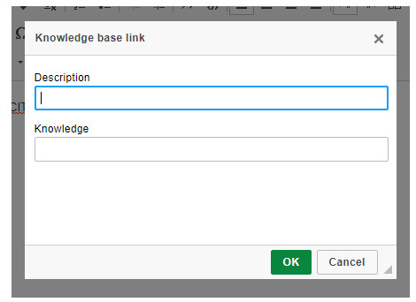

title: Knowledge management
Description: Knowledge Management aims to provide and manage the information and knowledge.
# Knowledge management

Knowledge Management aims to provide and manage the information and knowledge, in a reliable and complete way, that support the 
execution of the service.

How to access
------------------

1.  Access the main menu **ITIL Processes > Knowledge Management > Knowledge Management**.

Preconditions
-----------------

1.  Have registered folders for insertion and organization of knowledge (see the knowledge [Folder registration and search][1]).

Filters
---------

1.  The following filter enables the user to restrict the participation of items in the standard feature listing, making it easier 
to find the desired items:

    -   Title;

    -   Document type;

    -   Content;

    -   Published;

    -   Status;

    -   Folder.

**Figure 1 - Knowledge search screen**

Items list
----------------

1.  The following cadastral field is available to the user to facilitate the identification of the desired items in the standard 
listing of the functionality: **ID, Title, Document type, Version, Published, Retired** and **Folder**.

2.  There are action buttons available to the user in relation to each listing item, it is: *Edit* and *Delete*.

**Figure 2 - Knowledge listing screen**

Filling in the registration fields
--------------------------------------

1.  The **Knowledge Management** screen will be displayed;

2.  Click the radio button  and then click the register button
. Once this is done, the **Knowledge Registry** screen will be displayed, as shown in the 
following figure:

    

    **Figure 3 - Knowledge registry screen**

3.  Fill in the fields as directed below:

    -   **Title**: report the title of knowledge;

    -   **Version**: this field is for simple conference. The knowledge version number will be displayed after recording it;

    -   **Document type**: state the type of knowledge to be registered;

    -   **Source/Reference**: inform the source/knowledge reference;

    -   **Folder**: select the folder in which the knowledge will be stored;

    -   **Origin**: inform the origin of the knowledge;

    -   **Status**: inform the knowledge situation;

    -   **Expiration Date**: enter the expiration date of the knowledge;

    -   **Observation**: inform observations regarding knowledge, if necessary;

    -   **Author**: in this field will be presented the name of the user who is registering the knowledge;

    -   **Publisher**: in this field will be presented the name of the user, responsible for approving and publishing the knowledge 
    in the knowledge portal;

    -   **Privacy**: define the privacy of knowledge;

        -   **Confidential**: only the knowledge author and the administrator of the folder will have access to the knowledge;

        -   **Public**: all people will have access to knowledge, even to those who do not have permission in the folder;

        -   **Internal**: only people who have permission in the folder will have access to the knowledge.

    !!! warning "WARNING"

        If you do not select an option, the privacy of knowledge will be set by the system as "Public".

    -   **Creation Date**: this field is for simple conference, as the current date of the knowledge record will be displayed;

    -   **Publication Date**: the date of publication of knowledge in the knowledge portal will be presented in this field;

    -   **Publish**: if the informed folder, allows the publication of the knowledge, this field will be displayed to define if the 
    knowledge will be published in the knowledge portal for search;

    -   **Tags**:  report the tags to knowledge. Tags are keywords that serve just like a tag and help when organizing information, 
    grouping those that have received the same tag, making it easier to find related tags;

    -   **Content**: describe the text of knowledge;

        -   To add a hyperlink to the knowledge content, in order to access an external link, do the following:

            -  Select a word or phrase and click the icon  to add the hyperlink. Once this is done, 
            the screen will be displayed to inform the data of the same, as shown in the figure below:

    

    **Figure 4 - Hyperlink information registration**

    - Enter the hyperlink type, protocol, and hyperlink URL. Once this is done, click *Ok* to perform the operation. After that, 
    the hyperlink will be added to the knowledge, as shown in the figure below:

    

    **Figure 5 - Hyperlink inserted into knowledge**

    -  To add a hyperlink to the content of knowledge, in order to relate one knowledge to another knowledge, proceed as follows:

    -  Click the icon  to add the hyperlink. Once this is done, the screen will be displayed to 
    inform the data of the same, as shown in the figure below:

    
    
    **Figure 6 - Hyperlink information registration**

    - Enter the description for the hyperlink, search, and select the knowledge you want to relate. Once this is done, click *Ok* 
    to perform the operation. After this, the hyperlink will be added to the knowledge, as shown in the figure below:

    
    
    **Figure 7 - Hyperlink inserted into knowledge**

    - To add an image to the knowledge content, simply click and drag the image from your computer to the description area of the 
    knowledge text;

    - To add a video to the knowledge content, proceed as follows:

        - Click the . Once this is done, the video upload screen will be displayed, as shown in the 
        figure below:

    
    
    **Figure 8 - Server video upload**

    - In the Server Video tab, you can insert a video that is located on the video server or on your computer;

        - Click the Browse Server button, and then the videos screen will appear;

        - Select desired video. But if you do not have the video on the server, add a new video;

        - After the selected video, set the video settings;

        - **Responsive width**: means that the video will be rendered according to the size of the screen;

        - **Show controls**: means that the video will have the execute buttons, for etc;

        - **Autoplay?**: means the video will start running as soon as the knowledge screen opens;

        - **Size**: set the size that the video will appear on the screen;

        - **Alignment**: select the alignment of the video to be presented in the knowledge.

    - On the Embedded tab, you can embed YouTube videos;

        - Go to YouTube, search for the video you want to add to the feed;

        -   Right-click on the video and then click *Copy embed code*, as shown in the picture below:

     
     
     **Figure 9 - You Tube video**

    - In the **Code** field, paste the YouTube video code, as shown in the figure below:

     
     
     **Figure 10 -YouTube video upload**

     - After inserting the video, click the *Ok* button to perform the operation;

     - To attach a file to the knowledge record, just click on it and drag to the attachment area.

4. After the data is entered, click the radio button   and then click the record button
 to register, where the date, time and user will be recorded automatically for a future audit.

Relating knowledge
------------------------

1. On the **Knowledge Master** screen, click the **Related Document** tab. Once this is done, the knowledge relationship screen 
will be displayed;

2. Look for the knowledge you want to relate to the knowledge that is being registered. After the search, just click on it to make 
the relationship.

Relating category occurrence
-----------------------------------------------

1. On the Knowledge Master screen, click the **Event Category Occurrence** Category  tab. Once this is done, the **Category of 
Occurrence Category** screen will be displayed;

2. Find the category of occurrence of events that you want to relate to the knowledge you are registering. After the search, just 
click on it to make the relationship.

!!! info "IMPORTANT"

    The purpose of using this tab is to have Event Management screens display knowledge related to a category whenever it is 
    selected, similar to what happens with services in the Portfolio Management module. Therefore it is this tab that allows to 
    configure this type of connection between the two modules..

Adding stakeholders
---------------------------------

1. On the **Knowledge Master** screen, click the **Interesed Parts** tab. Once this is done, the screen for addition of 
stakeholders will be displayed;

    

    **Figure 11 – Stakeholder addition screen**

2. Fill in the fields as desired and click the *Add* button.

Configuring notifications
---------------------------

3. On the **Knowledge Master** screen, click the **Notification** tab. Once this is done, the notifications configuration screen 
will be displayed;

    

    **Figure 12 – Notification configuration screen**

4. Fill in the fields with the correct information for the knowledge notification setting.

Linking configuration item to knowledge
-----------------------------------------------

1. On the **Knowledge Management** screen, perform the search for the desired knowledge and then click the Edit button. The 
registration of the particular knowledge will be presented;

2. Click on the **Configuration Item** tab and after that, the Knowledge Configuration link screen will be displayed;

    

    **Figure 13 – Configuration item link screen**

3. Look for the Configuration Item that you want to link to knowledge. After the search, just click on it to make the link.

Advanced options
--------------------

1. In the upper right corner of the knowledge there is the button  which will display the 
following flags:

    

    **Figure 14 - Advanced features**

    - **Availability Management: means if registered knowledge refers to Availability Management;

    - **Copyright**: means if registered knowledge refers to a copyright;

    - **Legislation**: means if registered knowledge refers to legislation.

[1]:/en-us/citsmart-platform-7/processes/knowledge/folder.html

!!! tip "About"

    <b>Product/Version:</b> CITSmart | 8.00 &nbsp;&nbsp;
    <b>Updated:</b>08/30/2019 – Larissa Lourenço
