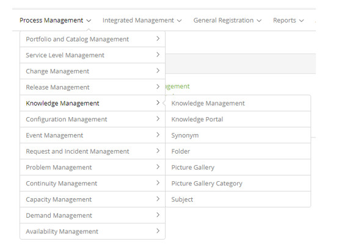

title: Knowledge Management module
Description: Module objective
# Knowledge Management module

Module objective
--------------------

Knowledge Management improves the quality of decision making, ensuring the availability of information and knowledge, reliably and 
comprehensively, throughout the service life cycle. The purpose is to provide and maintain the relevant knowledge that support the 
execution of the service.

This feature lists the knowledge that is stored in the Knowledge Base.

Where are the features
---------------------------------

To access the functionality click on the main menu **Process Management > Knowledge Management**.

**Figure 1 -Knowledge Management module menu**

Main feature (in highlight)
---------------------------------------

In the *See also* section you can access the main functionality(ies) of this module, in order to obtain a more detailed knowledge.

See also
-------------

- [Knowledge management](/en-us/citsmart-platform-7/processes/knowledge/management.html)

!!! tip "About"

    <b>Product/Version:</b> CITSmart | 7.00 &nbsp;&nbsp;
    <b>Updated:</b>09/02/2019 – Larissa Lourenço
