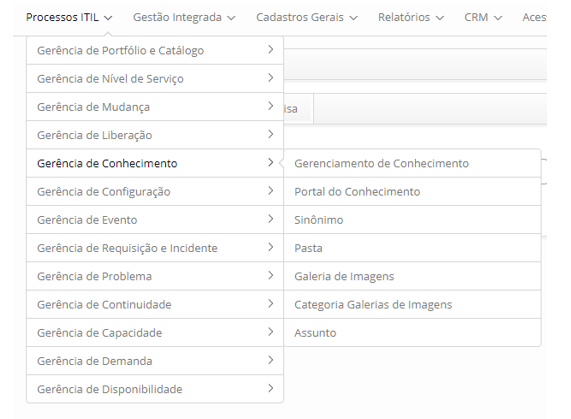

title: Módulo Gerenciamento de Conhecimento
Description: Objetivo do módulo. 
# Módulo Gerenciamento de Conhecimento

Objetivo do módulo
--------------------

O Gerenciamento do Conhecimento melhora a qualidade da tomada de decisão, garantindo a
disponibilidade das informações e conhecimento, de forma confiável e íntegra, durante 
todo o ciclo de vida do serviço. O mesmo tem por objetivo disponibilizar e manter os 
conhecimentos relevantes que apoiam a execução do serviço.

Nessa funcionalidade apresenta a listagem dos conhecimentos que estão gravados na Base de
Conhecimento.

Onde estão suas funcionalidades
---------------------------------

Acesse o menu principal **Processos ITIL > Gerência de Conhecimento**.

**Figura 1 - Menu do módulo Gerência de Conhecimento**

Principal funcionalidade (em destaque)
---------------------------------------

Na seção "Veja também" é possível acessar a(s) funcionalidade(s) principal(is) deste
módulo, desta forma se pode obter um conhecimento mais detalhado.

Veja também
-------------

- [Gerenciamento de Conhecimento](/pt-br/citsmart-platform-7/processes/knowledge/management.html)

!!! tip "About"

    <b>Product/Version:</b> CITSmart | 7.00 &nbsp;&nbsp;
    <b>Updated:</b>07/26/2019 – Larissa Lourenço
