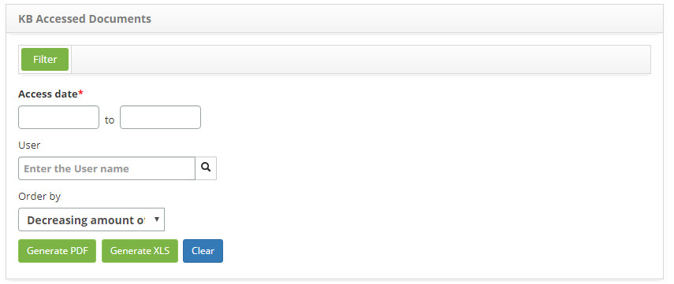
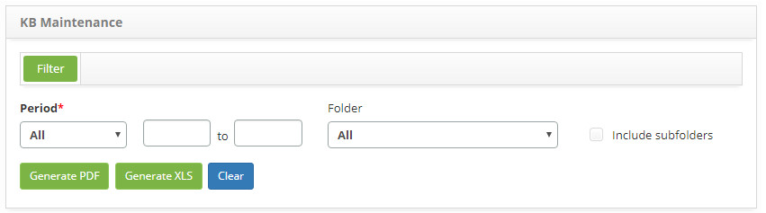

title: Report generation - Knowledge Management
Description: The purpose of this report is to present information on the knowledge contained in the knowledge base
# Report generation - Knowledge Management

Generating knowledge base report
--------------------------------------------

The purpose of this report is to present information on the knowledge contained in the knowledge base.

*How to access*

1. Access the Knowledge Base Reporting feature by navigating the main menu **Reports > Knowledge Management > Knowledge Base**.

*Filters*

1. The following filters enables the user to restrict the participation of items in the standard feature listing, making it easier 
to find the desired items:

    - **Period**: Select the period type you want, and then enter the period;
    - **Folder**: select the folder in which the knowledge is stored;
    - **Knowledge Base**: select knowledge;
    - **Status**: select the knowledge situation;
    - **Average Rating**: select the average rating of the knowledge;
    - **Order by**: select the sorting that will be displayed in the report;
    - **View last access**: inform if you want to display the last accesses in the report;
    - **Show only latest versions**: please advise if you want to display only the latest versions in the report;
    - **Hide Field Content**: check this field if you want to hide the contents of the knowledge to not be displayed in the report.
    
2. The **Knowledge BaseReport Generation** screen will be displayed, as shown in the following figure:

    
    
    **Figure 1 - Knowledge base report generation screen**
    
3. Set the filters as needed.

!!! note "NOTE"

    The number of accesses to knowledge is displayed in the report, this amount is counted per user, counting only 1 click per 
    hour.
    
Generating quantitative knowledge base report
---------------------------------------------------------

This report has the objective of presenting the amount of knowledge, by situation, origin, evaluation, author and approver, 
contained in the knowledge base.

*How to access*

1. Access the Quantitative Knowledge Base feature by navigating through the main menu 
**Reports > Knowledge Management > Knowledge Base (Quantitative Report)**.

*Filters*

1. The following filter enables the user to restrict the participation of items in the standard feature listing, making it easier 
to find the desired items:

    - **Opening Period**: Enter the desired period.
    
2. The Quantitative Knowledge Base Report Generation screen will be displayed, as shown in the following figure:

    
    
    **Figure 2 - Knowledge base report generation screen**
    
3. Set the filters as needed.

Generating report of accessed documents in the knowledge base
-------------------------------------------------------------------

This report aims to present the number of hits in the knowledge base documents.

*How to access*

1. Access the Reporting feature of Accessed Documents in the Knowledge Base by navigating the main menu 
**Reports > Knowledge Management > Accessed Documents**.

*Filters*

1. The following filter enables the user to restrict the participation of items in the standard feature listing, making it easier 
to find the desired items:

    - **Access Date**: enter the desired period;
    - **User**: select the user;
    - **Sorting**: Select the sorting that will be displayed in the report.
    
2. The **Knowledge Base Accessed Document Report Generation** screen will be displayed, as shown in the following figure:

    
    
    **Figure 3 - Report generation screen of accessed documents**
    
3. Set the filters as needed.

Generating knowledge base maintenance report
----------------------------------------------------------

The purpose of this report is to present the information concerning the registration and / or changes of knowledge in the knowledge 
base.

*How to access*

1. Access the Knowledge Base Maintenance Report feature by navigating the main menu 
**Reports > Knowledge Management > Knowledge Bases Maintenance**.

*Filters*

1. The following filter enables the user to restrict the participation of items in the standard feature listing, making it easier 
to find the desired items:

    - **Period**: Select the period type you want, and then enter the period;
    - **Folder**: select the knowledge folder;
    - **Include subfolders**: If you have selected a folder, check this field to display the information at the hierarchical level 
    so that you can view the selected folder and all its daughters.

2. The **Knowledge Base Maintenance Generation Report** screen will be displayed, as shown in the following figure:

    
    
    **Figure 4 - Report generation screen**
    
3. Set the filters as needed.

!!! tip "About"

    <b>Product/Version:</b> CITSmart | 7.00 &nbsp;&nbsp;
    <b>Updated:</b>09/02/2019 - Larissa Lourenço  

