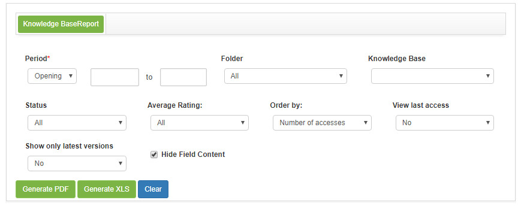
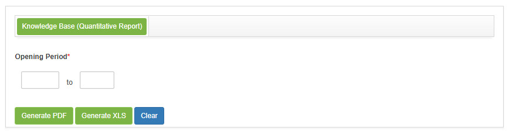
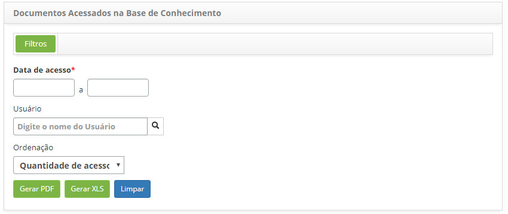
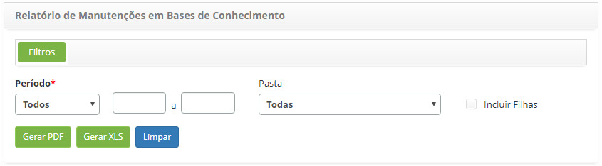

title: Report generation - Knowledge Management
Description: The purpose of this report is to present information on the knowledge contained in the knowledge base
# Report generation - Knowledge Management

Generating knowledge base report
--------------------------------------------

The purpose of this report is to present information on the knowledge contained in the knowledge base.

*How to access*

1. Access the Knowledge Base Reporting feature by navigating the main menu **Reports > Knowledge Management > Knowledge Base**.

*Filters*

1. The following filters enables the user to restrict the participation of items in the standard feature listing, making it easier 
to find the desired items:

    - **Period**: Select the period type you want, and then enter the period;
    - **Folder**: select the folder in which the knowledge is stored;
    - **Knowledge Base**: select knowledge;
    - **Status**: select the knowledge situation;
    - **Average Rating**: select the average rating of the knowledge;
    - **Order by**: select the sorting that will be displayed in the report;
    - **View last access**: inform if you want to display the last accesses in the report;
    - **Show only latest versions**: please advise if you want to display only the latest versions in the report;
    - **Hide Field Content**: check this field if you want to hide the contents of the knowledge to not be displayed in the report.
    
2. The **Knowledge BaseReport Generation** screen will be displayed, as shown in the following figure:

    
    
    **Figure 1 - Knowledge base report generation screen**
    
3. Set the filters as needed.

!!! note "NOTE"

    The number of accesses to knowledge is displayed in the report, this amount is counted per user, counting only 1 click per 
    hour.
    
Generating quantitative knowledge base report
---------------------------------------------------------

This report has the objective of presenting the amount of knowledge, by situation, origin, evaluation, author and approver, 
contained in the knowledge base.

*How to access*

1. Access the Quantitative Knowledge Base feature by navigating through the main menu 
**Reports > Knowledge Management > Knowledge Base (Quantitative Report)**.

*Filters*

1. The following filter enables the user to restrict the participation of items in the standard feature listing, making it easier 
to find the desired items:

    - **Opening Period**: Enter the desired period.
    
2. The Quantitative Knowledge Base Report Generation screen will be displayed, as shown in the following figure:

    
    
    **Figure 2 - Knowledge base report generation screen**
    
3. Set the filters as needed.

Generating report of accessed documents in the knowledge base
-------------------------------------------------------------------

This report aims to present the number of hits in the knowledge base documents.

*How to access*

1. Access the Reporting feature of Accessed Documents in the Knowledge Base by navigating the main menu Reports → Knowledge 
Management → Accessed Documents.

*Filtros*

1. Os seguintes filtros possibilitam ao usuário restringir a participação de itens na listagem padrão da funcionalidade,
facilitando a localização dos itens desejados:

    - **Data de Acesso**: informe o período desejado;
    - **Usuário**: selecione o usuário;
    - **Ordenação**: selecione a ordenação que será apresentada no relatório.
    
2. Será apresentada a tela de Geração de Relatório de Documentos Acessados na Base de Conhecimento, conforme ilustrada na
figura a seguir:

    
    
    **Figura 3 - Tela de geração de relatório de documentos acessados**
    
3. Defina os filtros conforme sua necessidade.

Gerando relatório de manutenções em base de conhecimento
----------------------------------------------------------

Esse relatório tem por objetivo de apresentar as informações referente ao cadastro e/ou alterações de conhecimentos na base de 
conhecimentos.

*Como acessar*

1. Acesse a funcionalidade de Relatório de Manutenção em Base de Conhecimento através da navegação no menu principal
**Relatórios > Gerência de Conhecimentos > Manutenções em Bases de Conhecimento**.

*Filtros*

1. O seguinte filtro possibilita ao usuário restringir a participação de itens na listagem padrão da funcionalidade, facilitando
a localização dos itens desejados:

    - **Período**: selecione o tipo de período desejado e após isso, informe o período;
    - **Pasta**: selecione a pasta de conhecimento;
    - **Incluir Filhas**: caso tenha selecionado uma pasta, marque esse campo para apresentar as informações em nível 
    hierárquico, para que seja possível visualizar a pasta selecionada e todas as suas filhas.
    
2. Será apresentada a tela de **Geração de Relatório de Manutenções em Base de Conhecimento**, conforme ilustrada na figura a 
seguir:

    
    
    **Figura 4 - Tela de geração de relatório**
    
3. Defina os filtros conforme sua necessidade.

!!! tip "About"

    <b>Product/Version:</b> CITSmart | 7.00 &nbsp;&nbsp;
    <b>Updated:</b>02/08/2019 - Larissa Lourenço  

