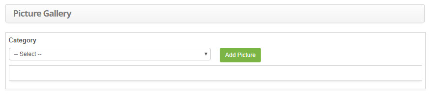
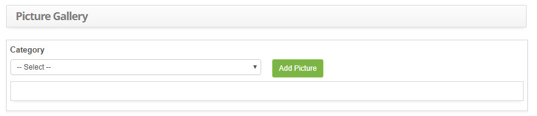
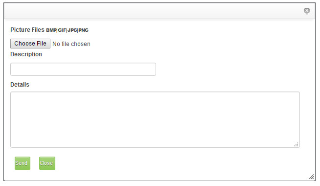

title: Images upload in Gallery
Description: This functionality has the purpose of uploading images for later use in the system.
# Images upload in Gallery

This functionality has the purpose of uploading images for later use in the system.

How to access
----------------

1.  Access the Image Gallery feature by navigating the main menu **ITIL Processes > Knowledge Management > Image Gallery**.

Preconditions
------------------

1. To add images to the gallery you must have done the image category registration (see the knowledge 
[Image category registration and search][1]).

Filters
-----------

1. The following filters enable the user to restrict the participation of items in the standard feature listing, making it easier 
to locate the desired items as shown in the figure below:

    - Category.

    

    **Figure 1 - Image gallery screen**

Items list
---------------------

1. Not applicable.

Filling in the registration fields
-------------------------------------

1. Not applicable.

Adding images to gallery
----------------------------

1. . After that, the **Image Gallery** screen will be displayed, as shown in the figure below:

    

    **Figure 2 - Image gallery screen**

1.  Select the category in which the image will be added;

2. Click the *Add Picture* button. Once this is done, the window for selecting and adding the image will be displayed, as shown in 
the figure below:

    

    **Figure 3 - Image addition**

    - Click the *Choose File* button. Select the image you want to add, enter the image description and details if necessary;

    - Click the *Send* button. After that, the image will be added to the image gallery.

[1]:/en-us/citsmart-platform-7/processes/knowledge/image-category.html
!!! tip "About"

    <b>Product/Version:</b> CITSmart | 8.00 &nbsp;&nbsp;
    <b>Updated:</b>08/30/2019 – Larissa Lourenço
