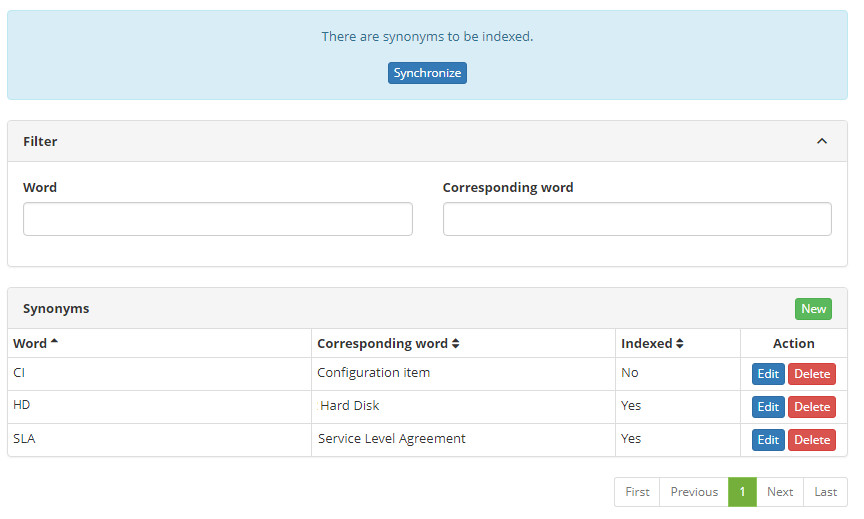
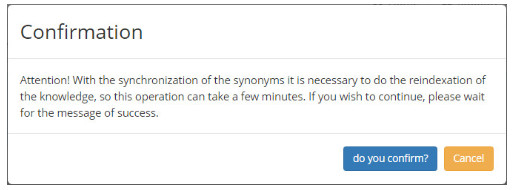
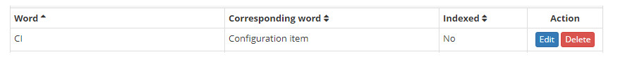
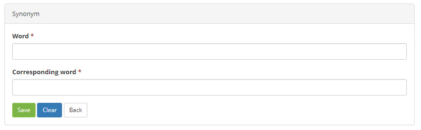

title: Synonym registration and search
Description: This functionality aims to keep the record of synonymous words for search purposes in the Knowledge base.
# Synonym registration and search

This functionality aims to keep the record of synonymous words for search purposes in the Knowledge base.

How to access
----------------

1. Access the synonym functionality by navigating the main menu 
**Process Management > Knowledge Management > Synonym**.

Preconditions
------------------

1. No applicable.

Filters
-----------

1. The following filters enables the user to restrict the participation of items in the standard feature listing, making it easier 
to find the desired items:

    - Word;

    - Corresponding word.

2. On the **Synonym** screen, the search screen appears as illustrated in the following figure. On this screen, the words 
synonymous already registered and the filter fields are displayed the search for certain records are displayed:

    

    **Figure 1 - Synonym search screen**

3. To search for synonyms, enter the corresponding word and/or word. After this, the record will be displayed according to the data 
entered;

4. To change the data in the synonym registry, click the *Edit* button. Done this, you will be directed to the registration screen 
displaying the content pertaining to the selected registry;

5. To index a synonym, click the *Synchronize* button and a confirmation alert will be displayed:

    

    **Figure 2 - Indexing Confirmation**

    - Click on the *do you confirm?* button.

Items list
----------------

1. The following cadastral fields are available to the user to facilitate the identification of the desired items in the standard 
feature listing: **Word, Corresponding word** and **Indexed**.

2. There are action buttons available to the user for each item in the listing, they are: *Edit* and *Delete*.

    

    **Figure 3 - Items screen**

Filling in the registration fields
-------------------------------------

1. The **Synonym** screen will be displayed;

2. Click the *New* button. Done this, the synonymous words register screen will be displayed, as illustrated in the following 
figure:

    

    **Figure 4 - Synonym entry screen**

3. Fill in the fields as guidelines below:

    - **Word**: inform the description of the word;

    - **Corresponding word**: inform the description of the corresponding word.

4. Click the *Save* button to register, where the date, time and user will be saved automatically for a future audit;

5. The *Back* button returns to the synonym search page.

!!! tip "About"

    <b>Product/Version:</b> CITSmart | 8.00 &nbsp;&nbsp;
    <b>Updated:</b>08/30/2019 – Larissa Lourenço
