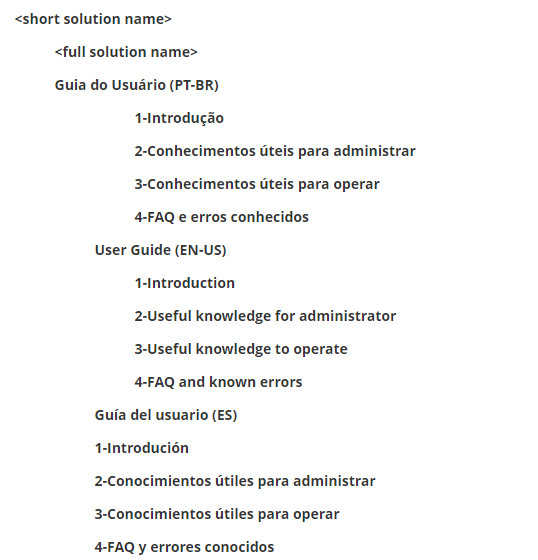
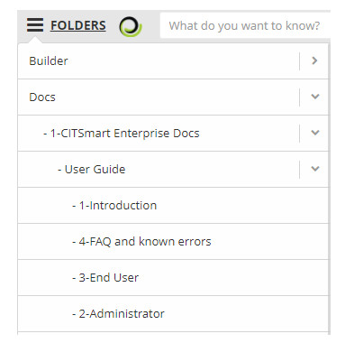
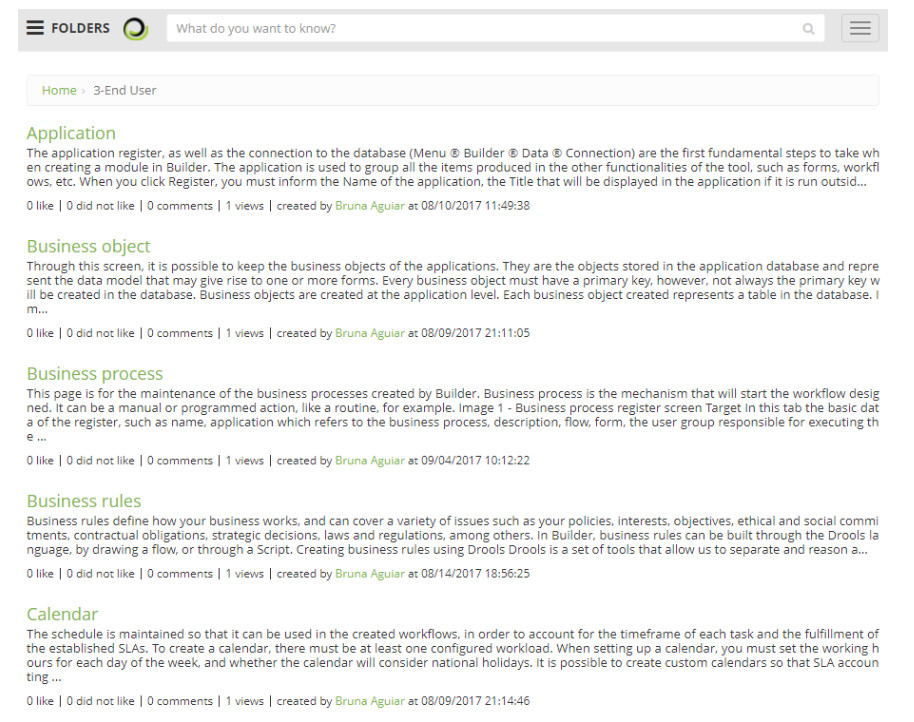
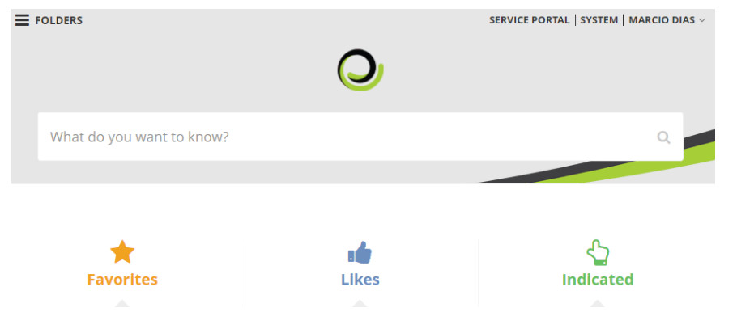

title:  Understanding how this solution is documented in the knowledge base
Description: There was a need to create an enlightening document on how this knowledge was structured
# Understanding how this solution is documented in the knowledge base

Since there was a strategic decision to migrate all documentation of CITSmart Corporation solutions to the CITSmart Enterprise ITSM 
knowledge base, there was a need to create an enlightening document on how this knowledge was structured. With this introductory 
explanation we understand that the navigation and the searches within this documentation become more efficient and effective on the 
part of the employees of the company, authorized agents and end users of the solution.

We have now identified four feasible alternatives to access and assimilate basic knowledge about the use and administration of 
solutions in the knowledge base. They are explained in this document.

The overview document strategy
----------------------------------------

It is recommended that every beginner first read the document called "Overview" in the "1-Introduction" folder. It is a very useful 
document for the beginners because it allow a top-down assimilation of the solution, starting from its objectives and benefits, 
through the main links that lead to other relevant documents and reaching the manuals so the use of the solution can effectively 
begin.

From this first document read, it is possible to follow the reading of others by using hyperlinks inside (eg. links to documents 
that explain each module of the solution).

All CITSmart Corporation solutions have their own "Overview" document in the knowledge base, only distinguished by the solution 
acronym between parentheses, eg "Overview (ITSM)", "Overview (Docs)", "Overview (Builder)," etc.

To access and read the desired Overview, simply use the form described in the alternative "THE SEARCHER STRATEGY" (quoted below).

The folders structure strategy
----------------------------------

All CITSMart Corporation solutions have a minimum standardized structure of structured folders to organize documentation on their 
use and administration.

The names of these folders are self-explanatory to facilitate access and management of this knowledge.

The minimum standard structure is:

**Figure 1 - Folder Structure**

There are more folders besides these, but they serve other purposes than the basic use and administration. They are visible only 
for internal use by CITSmart Corporation and its Authorized Agents.

A real example of this structure:

**Figure 2 - Example of a folder structure**

Not all solutions are internationalized, so they do not have folders for translated documents, only the national version.

When you click on a folder the list of all the knowledge of this folder is mounted, then for each sub-folder in that folder, the 
subfolder documents are added to the resulting list repeatedly and recursively.

**Figure 2 - List of the documents of a folder**

!!! info "IMPORTANT"

    Only CITSmart Corporation employees view the folders and documentation of the solutions in all available languages, the other 
    profiles (Authorized Agents, Clients and Prospectuses) are directed to only one specific language.

The smart button strategy
-----------------------------

Most CITSmart Enterprise ITSM screens have the Smart Button feature. It is a mobile flap that shows a list of link to selected 
knowledges to explain the current functionality.

**Figure 4 - Smart Button Tab**

In order for this resource to work effectively, there is a prerequisite for the team managing your organization's knowledge base, 
which is:

1. Each document that contributes to the explanation of a screen/feature should have the "Tags" field populated with a keyword in 
the option **ITIL Processes > Knowledge Management > Knowledge Management**;
2. This same keyword should be used to fill in the field Tags of the register of each screen/functionality (option 
**General Register > Menu**) that should be linked to the knowledge that explains it.
    
The final effect of this configuration of Tags is quite didactic and productive, because it greatly reduces the wear and tear of 
the end user who without this has to move to the Knowledge Portal to perform navigations and additional searches (overhead) to only 
thus be able to understand the screen context.

The searcher strategy
--------------------------

CITSmart Enterprise ITSM, as well as the best Knowledge Management tools on the market, provides a knowledge base search engine for 
the end user, in our case using [SolR][1] technology.

In the central part of the Knowledge Portal screen is a text-type field filled with the phrase "What do you want to know?". When 
entering a word in this field and typing ENTER, the solution starts a search process on all records in the knowledge base, 
including within the files attached to each of those records.

**Figure 5 - Knowledge Portal Search Field**

This search for the desired word takes into account some access security issues previously configured by the administrators, 
basically linked to the crossing of the user access profile logged with the set of folders released to this profile for read and/or 
write access permission. This general strategy of access levels for publications in the database (for all solutions) is arranged as 
follows:

- **Unrestricted (public)**: wide level of access in which folders and documents/knowledge about basic use and administration can 
be accessed without restrictions (it's necessary only a simple registration);
- **Some restrictions (authorized Agents)**: access level at which folders and documents/knowledge can be accessed only by CITSmart 
Corporation and its official resellers;
- **Maximum restriction (internal/restricted/private/confidential)**: access level at which folders and documents/knowledge can 
only be accessed by CITSmart Corporation.

Also, the current state of each knowledge present within these folders is considered as selection criteria in these searches, since 
knowledge that is classified as confidential, unpublished, drafts, retired and expired (by the due date) should not be included in 
the list resulting.

In *See also* section you can find tips and search guidelines.

The "type of document" strategy
------------------------------------

The knowledge is classified by its content and arranged in its proper folder in order to optimize the search of the same by the 
user. They are:

| **Applied in**                                        | **"Document Type" Title**          | **Meaning/Relevance**                                                                                                                                                                                                                                                                  |
|----------------------------------------------------|--------------------------------|--------------------------------------------------------------------------------------------------------------------------------------------------------------------------------------------------------------------------------------------------------------------------------------|
| **General**                                         | Document                       | It is a knowledge created with generic type, registered without any concern or interest in its categorization, it is recommended not to use this when there is the corresponding type.                                                                                               |
|                                                    | FAQ                            | It is the knowledge of the question-answer type, most common in a technical / operational support environment.                                                                                                                                                                       |
| **User Guide(all the products)**                       | A product presentation         | Type of document that explains in general the purpose, benefits and characteristics of a software product. Should be the first reading for anyone who wants to know the product. All CITSmart products must have at least one with the default name: "Overview (<product acronym>)". |
|                                                    | Data dictionary                | Document generated by the Enterprise Architect containing the list of all tables and columns of the product.                                                                                                                                                                         |
|                                                    | Known Error                    | Problem report in the solution with corresponding support orientation to treat or circumvent it.                                                                                                                                                                                     |
|                                                    | Glossary                       | List in alphabetical order of terms and expressions most used in the product with the proper explanation.                                                                                                                                                                            |
|                                                    | A Module Introduction          | Any type of document used to introduce concepts, characteristics and modules of a product. It should be the reading to be made right after the Overview for anyone who wants to know the product. All CITSmart products must have at least one document for each module.             |
|                                                    | Administration Manual          | More technical procedures for managing the solution (installation, upgrade, configuration of infrastructure, database, application server and operating system).                                                                                                                     |
|                                                    | UML model                      | Diagrams used to document the specification of a software.                                                                                                                                                                                                                           |
|                                                    | Usage guidance                 | Explanation about filling in a registration feature.                                                                                                                                                                                                                                 |
|                                                    | Standard Operational Procedure | SOP: process document that explains the minimum steps required to execute with quality each flow activity.                                                                                                                                                                           |
|                                                    | Programming                    | Any kind of knowledge that the developer teams understand relevant for sharing (programming and architecture).                                                                                                                                                                       |
|                                                    | Business rule                  | Assertiveness that determines the functionalities behavior of a product. They are conditions that have nothing to do with technology, but with the operation of the business.                                                                                                        |
|                                                    | Smart Report                   | Specifying dynamic and reprogrammable reports that exist in the product without any additional customization.                                                                                                                                                                        |
|                                                    | Native Product Report          | Specifying reports that exist in the product without any customization.                                                                                                                                                                                                              |
|                                                    | Vision and Release Delivery    | Deliverables list intended or present in a release, as well as specific guidelines and links to deploy files and scripts.                                                                                                                                                            |
|                                                    | Web Services                   | Application Programming Interface: Service interfaces published or consumed by software products.                                                                                                                                                                                    |
| **User Guide(ITSM)**                                   | Key fields                     | Explanations about the special fields used to configure e-mails and requests in ITSM.                                                                                                                                                                                                |
| **Team Management**                                    | Official Correspondence        | Registration of mailing and receiving of letters and parcels.                                                                                                                                                                                                                        |
|                                                    | Document                       | Generic type for a knowledge that does not have the proper classification.                                                                                                                                                                                                           |
|                                                    | Test Evidence                  | Test work registration carried out by the Quality team.                                                                                                                                                                                                                              |
|                                                    | GCS                            | Job record of software configuration management performed by the Quality team.                                                                                                                                                                                                       |
|                                                    | White papers                   | CITSmart Company publications to divulge characteristics of its services and products.                                                                                                                                                                                               |
|                                                    | Knowledge Passing Material     | Any kind of knowledge (Video, Slides, Text, etc.) used to pass knowledge between CITSmart teams and Authorized Agents.                                                                                                                                                               |
|                                                    | Pre-sale Material              | Any kind of knowledge (Video, Slides, Text, etc.) used to support presentations of commercial interest of CITSmart products.                                                                                                                                                         |
|                                                    | Draft Contract                 | Document template to be used as contracts of legal effect.                                                                                                                                                                                                                           |
|                                                    | OKR                            | Documents related to initiatives created and executed with the OKR technique.                                                                                                                                                                                                        |
| **Methodologies, Consultancies and related services.** | HOW-TO                         | Directory with links to view processes generated by BizAgi in html format.                                                                                                                                                                                                           |
|                                                    | Certification Material         | Any kind of knowledge (Video, Slides, Text, etc.) used for certifications in CITSmart products.                                                                                                                                                                                      |
|                                                    | Material for Deployment        | Any type of knowledge (Video, Slides, Text, etc.) used to implement the processes present in each product.                                                                                                                                                                           |
|                                                    | Training Materials             | Any kind of knowledge (Video, Slides, Text, etc.) used for official training of CITSmart products.                                                                                                                                                                                   |
|                                                    | Material on Methodology        | Any kind of knowledge (Video, Slides, Text, etc.) used to explain the methodologies applicable to CITSmart products.                                                                                                                                                                 |
| **ITIL Processes Functioning**                        | Known Error                    | They are knowledge with type assigned automatically by the Problem Management module.                                                                                                                                                                                                |
|                                                    | Test Evidence                  | They are knowledge of type assigned automatically by the module of Continuity Management.                                                                                                                                                                                            |
|                                                    | Recovery measure               | Knowledge used in Continuity Management within which there should be all recovery guidelines necessary for a disaster.                                                                                                                                                               |
|                                                    | Emergency Response Plan        | Knowledge used in Continuity Management within which there should be all the necessary guidelines for a moment of emergency.                                                                                                                                                         |
|                                                    | Damage Evaluation Plan         | Knowledge used in Continuity Management that should contain information on possible damages caused at the time of disaster.                                                                                                                                                          |
|                                                    | Vital Records Plan             | Knowledge used in Continuity Management that should contain information about functions vital to business continuity.                                                                                                                                                                |
|                                                    | Communication Plan             | It is the knowledge that informs the ways, means and criteria of communication, as well as the people that must be communicated (Matrix RACI).                                                                                                                                       |
|                                                    | Availability Plan              | Knowledge used in Availability Management that should contain the criteria of what is or is not understood as "available". E.g.: what is the percentage of availability of a server.                                                                                                 |

**Table 1 - Documents Type**

See also
---------------

- [Tips on how to conduct searches on Knowledge Portal and User Guide](/en-us/citsmart-platform-7/processes/knowledge/tips-search-knowledge.html)

!!! tip "About"

    <b>Product/Version:</b> CITSmart | 7.00 &nbsp;&nbsp;
    <b>Updated:</b>09/02/2019 - Larissa Lourenço
    
[1]:http://lucene.apache.org/solr/
