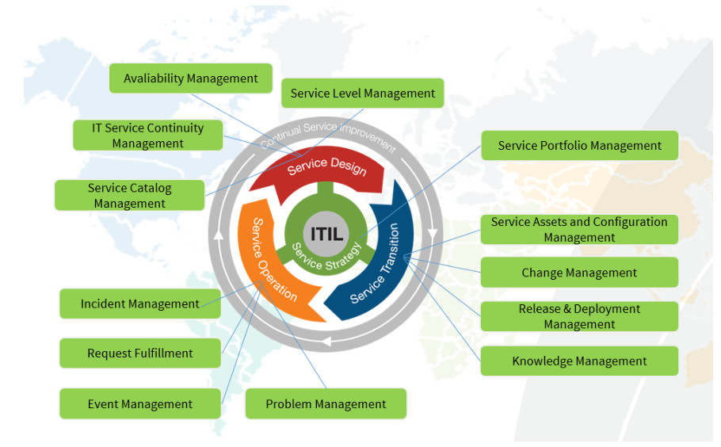

title:  Overview (ITSM)
Description: Explains how the knowledge base about the CITSmart Corporation solutions was structured and how to use it. 
# Overview (ITSM)

Read me first
---------

This [link][1] explains how the knowledge base about the **CITSmart Corporation** solutions was structured and how to use it.

 CITSmart Enterprise ITSM
------------------------------------------------------------

It is an intelligent corporate governance platform in line with an Information Technology Service Management (ITSM), whose overall 
objective is to support organizations in Information Technology (IT) and Business Service Management by adopting the best practices 
ITIL (Information Technology Infrastructure Library).

**Why Adopt It**? It is known that working with real-time information in decision making makes companies more competitive and 
qualified to meet their demands and their activities in order to reduce losses or business damages since they are in constant 
monitoring. Therefore, if well applied, information technology makes managers better understand their business activities and 
employ the energetic flows of investments in the most appropriate direction. This provides companies with an organizational 
structure and a service implementation that applies the best practices to the organizational environment, translating objectives 
and goals into measurable reality.

The image below shows the significant coverage of this solution in relation to the processes foreseen in the ITIL library:IL:

| **Stages of the ITIL Lifecycle for services** | **ITIL processes**                                                                                                                                               |
|----------------------------------------------|--------------------------------------------------------------------------------------------------------------------------------------------------------------|
| Service Strategy                             | [Service Portifolio Management][2]                                                                                                                      |
| Service Design                               | [Service Level Management][3]; [Service Catalog Management][4]; [IT Service Continuity Management][5]; [Avaliability Management][6] |
| Service Transition                           | [Change Management][7]; [Service Assets and Configuration Management][8]; [Release & Deployment Management][9]; [Knowledge Management][10]              |
| Service Operation                            | [Ticket Management module][11]; [Event Management][12]; [Problem Management][13]                                                               |

 Target audience of the solution and main benefits
---------------------------------------------------

| Target audience                                     | Benefits                                                                                                                                                                                                                                                                                                                       |
|--------------------------------------------------|-----------------------------------------------------------------------------------------------------------------------------------------------------------------------------------------------------------------------------------------------------------------------------------------------------------------------------------|
| High direction                                    | 1. To promote improvements in the efficiency of IT and business service delivery processes; 2. To view reports and dashboards that support changes and improvements; 3. To visualize the health of your business services; 4. To view strategic risk monitoring; 5. To recognize the value of the service to the business.            |
| Customer service                          | 1. To expedite the solution of your customers' problems; 2. To improve your image; 3. To connect teams; 4. To fix problems in real time; 5. To track requests; 6. To use knowledge base; 7. To route calls for field service; 8. To reduce costs with cognitive intelligence; 9. To monitor Events; 10. To identify trends. |
| Management of Suppliers and Contracts third | 1. To manage service delivery contracts by applying SIAM (Service Integration and Management); 2. To evaluate service delivery performance; 3. To set goals for achieving KPIs; 4. To manage the financial flow of contracts; 5. To apply fines / glosses                                                                 |
| IT Infrastructure management                  | 1. To control the assets, customers, vendors and configuration items needed to provide the services; 2. To manage Service Level Agreements (SLAs); 3. To structure service catalogs and portfolios; 4. To design the service designing in the BPMN standard; 5. To make service measurements with quality and assurance.               |

 Preparing for the first steps before you start
------------------------------------------------------------------------------------------

1. The most relevant terms and expressions: [Glossary][14]

2. Before the properly instalation of **CITSmart Enterprise ITSM**, it is necessary to observe these main assumptions:

    - This solution offers two versions in the market, a **Community** and **Enterprise**: [Comparation][15]    
    - Understand how to navigate the solution screens: [Navegability][16]
    - Get to know the three operating environments in the solution, each with its purpose and characteristics:
        - [System][17] 
        - Smart Portal (Service Portal) - [introduction ][18] and [documentation][68]
        - [Knowledge Portal][19]
    - It is up to the Solution Administrator to configure the access permission setting for each system main menu option for 
    certain users.
    
3. Installation manuals (by component):

  - [CITSmart Enterprise ITSM][20]
  - [Inventory][21]
  - [EVM][22]
  - Mobile ([Android][23] and [iOS][24])
  
4. Frequently Asked Questions: [FAQ][47]
  
 Understanding the structure of subsystems and solution functionalities
----------------------------------------------------------------------------------------------------------------

- **Menu: ITIL process**
    - Objetivo geral: reúne as principais funcionalidades de todos os [Processos da ITIL][25] served by the solution.
    - Sub-systems/Functionalities (in this case, the 13 ITIL processes, which have the [PinkVERIFY][26] seal certificated by
    [Pink Elephant][27]):
1. **Portfolio and Catalog** - [introduction][28] and [documentation][48]
2. **Service Level** - [introduction][29] and [documentation][49]
3. **Change** - [introduction][30] and [documentation][50]
4. **Release** - [introduction][31] and [documentation][51]
5. **Knowledge** - [introduction][32] and [documentation][52]
6. **Configuration and Service Asset** - [introduction ][33] and [documentation][53]
7. **Events** - [introduction][34] and [documentation][54]
8. **Requests and Incidents** - [introduction][35] and [documentation][55]
9. **Problems** - [introduction][36] and [documentation][56]
10. **Continuity** - [introduction][37] and [documentation][57]
11. **Capacity** - [introduction][38] and [documentation][58]
12. **Demand** - [introduction][39] and [documentation][59]
13. **Availability** - [introduction][40] and [documentation][60]
- **Menu: Integrated Management**
    - General objective: it gathers several management modules to support ITIL processes and minimize risks.
    - Documentation: [link][61]
    - Sub-systems / Functionalities:
        - **IT Operations Automation** - Refers to the scheduling verification features of activities related to Request, incident, 
        change, problem, and release processes.
        - **Contracts** - This module aims to manage the life cycle of the contracts present in the organization from the moment of 
        the internal request of a service until its distort or closure. In order to do so, it is necessary to keep the signature 
        fields register to be associated with a signature group, in order to customize the signatures present in the Work Orders 
        report. These Work Order reports are used to record, prove and charge for services rendered to the customer.
        - **Service Force** - This module aims to manage, follow and monitor service requests by field technicians.
        - **Projects** - This module aims to provide management and monitoring of the organization's projects.
        - **Provisioning and Logistics** - This module aims to manage the requests for purchases of products and services.
- **Menu: Reports**
    - General objective: it provides the main resources and emission options for the operational / managerial reporting of the 
    solution.
    - Documentation: [link][62]
    - Sub-systems / Functionalities:
        - Settings
        - Knowledge
        - Contracts
        - Events
        - Incidents/Request
        - News
        - Service Levels
        - Personal
        - Problems
        - Smart Reports
- **Menu: Access and Permission**
    - General objective: it encompasses all the functionality that concerns the definition of the access permission to the system, 
    guaranteeing secrecy, focus and permission control.
    - Documentation: [link][63]
    - Sub-systems / Functionalities:
        - Acess profile
        - Group
        - Continuity
        - Portfolio
        - Requests/Incidents
        - SmartDecisions
- **Menu: Parametrization**
    - General objective: it encompasses the main parameters of the product so that the behavior and the business rules are adapted 
    to the diverse needs of the client. It allows to customize certain functionality according to the established parameters, for 
    example: changing calculations, formulas, methodology, etc.
    - Documentation: [link][64]
    - Sub-systems / Functionalities:
        - Chat
        - LDAP Configuration
        - E-mail
        - Configuration Management
        - Knowledge Management
        - Release Management
        - Change management
        - Problem Management
        - Request and Incident Management
        - Mobile
        - Order of Service (OS)
        - Parameters Citsmart
        - Provisioning and Logistics
        - System
        - Smart Portal
        - Telephony
- **Menu: System**
    - General Objective: it encompasses the main configurable technological resources of the product, allowing to obtain the 
    maximum of control and security in the product.
    - Documentation: [link][65]
    - Sub-systems / Functionalities:
        - Remote access
        - Database
        - Compatibility
        - External Links
        - Settings
        - Contract Control
        - Control of income of Personnel
        - Import Management
        - Degree of service satisfaction
        - Importing and Loading Data
        - Flow Maintenance
        - Notifications
        - Batch Processing
        - Service Request Template
        - Audit trail
        - Visions and Meta data
        - Web Service
- *TOP* **Featured Resources**:
    - **Smart Reports** - [introduction][41] and [documentation][66]
    - **Smart Decision** - [introduction][42] and [documentation][67]
    - **Chat** - [introduction][43]
    - **Smart Button** - [introduction][44]
    - **Neuro** - constructor and executor workflow solution embedded inside the ITSM solution to leverage the workflow management
    
 Identifying the main technologies incorporated
--------------------------------------------------------------------------------------------

Several technological advances are being continuously introduced in CITSmart Enterprise ITSM to improve its performance, usability, 
security, portability, maintenance and to achieve the maximum satisfaction of its clients, the main ones are:

- **DBMS**: compatibility with databases: PostGreSQL, MS SQL Server and ORACLE - see minimum version requirements in the 
installation guide
- **INTEGRATIONS**: monitoring Tools (Nagios and Zabbix), LDAP, E-Mail Services and Asterisk
- **INVENTORY**: own Inventory Agent
- **JBOSS**: compatibility with JBoss 7.1.2
- **MOBILE**: allows mobility (Android and iOS)
- **SGBD**: compatibility with databases: PostGreSQL, MS SQL Server and ORACLE - see minimum version requirements in the 
installation guide
- **SOLR**: adopts bigdata technology for storage / retrieval (indexed searches) in knowledge base and event correlations
- **UX**: adoption of User eXperience techniques in the main screens
- **WEB**: adopts Java for the entire Web platform, making it compatible with browsers: IE, Firefox and Chrome - see minimum 
version requirements in the installation guide
- **PROTOCOLOS**: fully compatible with HTTPS/SSL, DNS and IPv4 protocols (without requiring special ports configured in Firewall)
- **PROTECTIONS**: applies defense strategy against SQL Injection, failures in exception management and Local File Including

!!! note "NOTE

    Any suggestion or problem related to the contents of this User Guide, please kindly activate the CITSmart Corporation team that 
    manages it.
    
See also
--------------

- [Tips on how to conduct searches on Knowledge Portal and User Guide](/en-us/citsmart-platform-7/processes/knowledge/tips-search-knowledge.html)

!!! tip "About"

    <b>Product/Version:</b> CITSmart | 7.00 &nbsp;&nbsp;
    <b>Updated:</b>09/02/2019 - Larissa Lourenço
   
[1]:/en-us/citsmart-platform-7/processes/knowledge/understanding-knowledge-base.html
[2]:/en-us/citsmart-platform-7/processes/portfolio-and-catalog/overview.html
[3]:/en-us/citsmart-platform-7/processes/service-level/overview.html
[4]:/en-us/citsmart-platform-7/processes/portfolio-and-catalog/overview.html
[5]:/en-us/citsmart-platform-7/processes/continuity/overview.html
[6]:/en-us/citsmart-platform-7/processes/availability/overview.html
[7]:/en-us/citsmart-platform-7/processes/change/overview.html
[8]:/en-us/citsmart-platform-7/processes/configuration/overview.html
[9]:/en-us/citsmart-platform-7/processes/release/overview.html
[10]:/en-us/citsmart-platform-7/processes/knowledge/overview.html
[11]:/en-us/citsmart-platform-7/processes/tickets/overview.html
[12]:/en-us/citsmart-platform-7/processes/event/overview.html
[13]:/en-us/citsmart-platform-7/processes/problem/overview.html
[14]:/en-us/glossary.html
[15]:/en-us/citsmart-platform-7/initial-settings/version-comparison.html
[16]:/en-us/citsmart-platform-7/get-started/navigate.html
[17]:/en-us/citsmart-platform-7/get-started/system.html
[18]:/en-us/citsmart-platform-7/get-started/smart-portal.html
[19]:/en-us/citsmart-platform-7/processes/knowledge/knowledge-portal.html
[20]:/en-us/citsmart-platform-7/get-started/installation.html
[21]:/en-us/citsmart-platform-7/get-started/inventory-installation.html
[22]:/en-us/citsmart-platform-7/additional-features/add-ons/evm-installation.html
[23]:/en-us/citsmart-platform-7/additional-features/mobile-and-field-service/apps/android.html
[24]:/en-us/citsmart-platform-7/additional-features/mobile-and-field-service/apps/ios.html
[25]:https://pt.wikipedia.org/wiki/ITILv3
[26]:https://www.pinkelephant.com/en-ca/PinkVERIFY/PinkVERIFYToolsets
[27]:https://www.pinkelephant.com/
[28]:/en-us/citsmart-platform-7/processes/portfolio-and-catalog/overview.html
[29]:/en-us/citsmart-platform-7/processes/service-level/overview.html
[30]:/en-us/citsmart-platform-7/processes/change/overview.html
[31]:/en-us/citsmart-platform-7/processes/release/overview.html
[32]:/en-us/citsmart-platform-7/processes/knowledge/overview.html
[33]:/en-us/citsmart-platform-7/processes/configuration/overview.html
[34]:/en-us/citsmart-platform-7/processes/event/overview.html
[35]:/en-us/citsmart-platform-7/processes/tickets/overview.html
[36]:/en-us/citsmart-platform-7/processes/problem/overview.html
[37]:/en-us/citsmart-platform-7/processes/continuity/overview.html
[38]:/en-us/citsmart-platform-7/processes/capacity/overview.html
[39]:/en-us/citsmart-platform-7/processes/demand/overview.html
[40]:/en-us/citsmart-platform-7/processes/availability/overview.html
[41]:/en-us/citsmart-platform-7/additional-features/reports/create/smart-reports/configuration/emit-report.html
[42]:/en-us/citsmart-platform-7/additional-features/reports/create/dashboard/use/template-smart-decision.html
[43]:/en-us/citsmart-platform-7/processes/portfolio-and-catalog/chat.html
[44]:/pt-br/citsmart-platform-7/plataform-administration/customizable-fields/smart.button.html
[45]:
[46]:
[47]:/en-us/faq.html
[48]:/en-us/citsmart-platform-7/processes/portfolio-and-catalog/all-documentation.html
[49]:/en-us/citsmart-platform-7/processes/service-level/all-documentation.html
[50]:/en-us/citsmart-platform-7/processes/change/all-documentation.html
[51]:/en-us/citsmart-platform-7/processes/release/all-documentation.html
[52]:/en-us/citsmart-platform-7/processes/knowledge/all-documentation.html
[53]:/en-us/citsmart-platform-7/processes/configuration/all-documentation.html
[54]:/en-us/citsmart-platform-7/processes/event/all-documentation.html
[55]:/en-us/citsmart-platform-7/processes/tickets/all-documentation.html
[56]:/en-us/citsmart-platform-7/processes/problem/all-documentation.html
[57]:/en-us/citsmart-platform-7/processes/continuity/all-documentation.html
[58]:/en-us/citsmart-platform-7/processes/capacity/all-documentation.html
[59]:/en-us/citsmart-platform-7/processes/demand/all-documentation.html
[60]:/en-us/citsmart-platform-7/processes/availability/all-documentation.html
[61]:/en-us/citsmart-platform-7/additional-features/all-documentation.html
[62]:/en-us/citsmart-platform-7/additional-features/reports/all-documentation.html
[63]:/en-us/citsmart-platform-7/initial-settings/access-settings/all-documentation.html
[64]:/en-us/citsmart-platform-7/plataform-administration/parameters-list/all-documentation.html
[65]:/en-us/citsmart-platform-7/get-started/system-documentation.html
[66]:/en-us/citsmart-platform-7/additional-features/reports/create/smart-reports/configuration/all-documentation.html
[67]:/en-us/citsmart-platform-7/additional-features/reports/create/dashboard/use/smart-decision-documentation.html
[68]:/en-us/citsmart-platform-7/processes/portfolio-and-catalog/smart-portal/all-documentation.html
