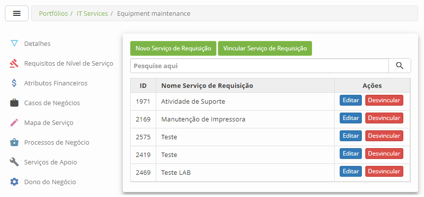
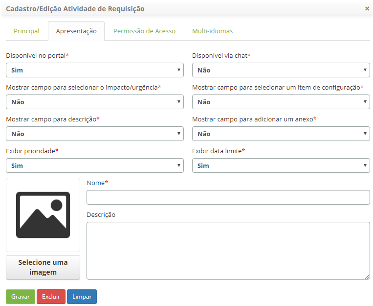
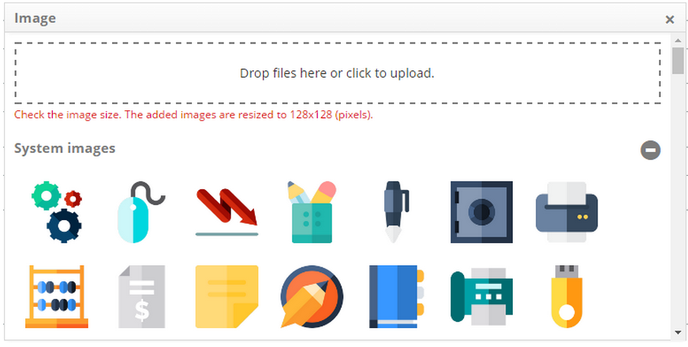
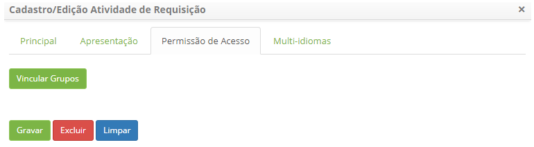
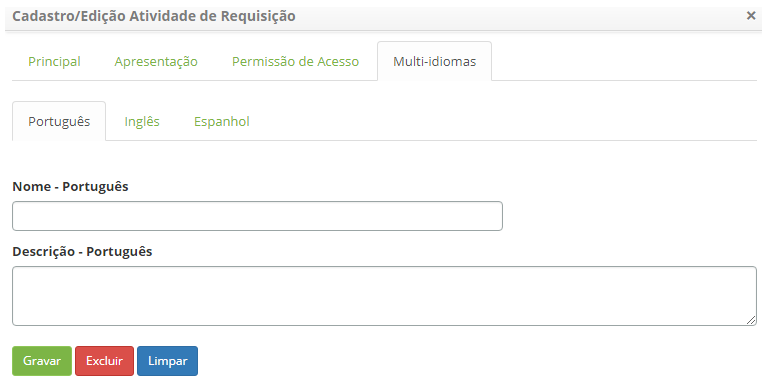
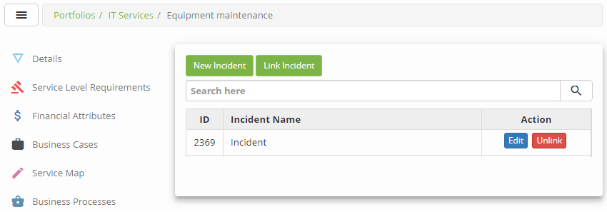
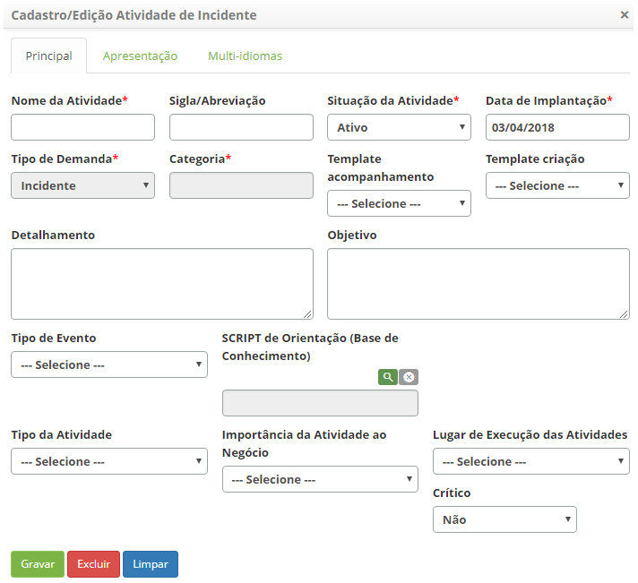
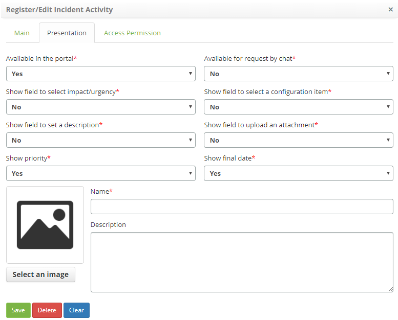
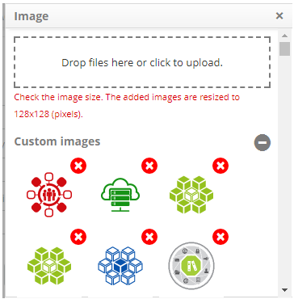
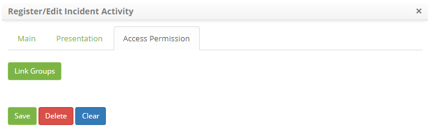

title: Service activity registration
Description: This functionality is intended to record the activities of a service (request and/or incident).

# Service activity registration

This functionality is intended to record the activities of a service (request
and/or incident).

Preconditions
-------------

1.  Have the portfolio with the services registered (see knowledge [Service
    portfolio registration][1], [Service registration][2]);

2.  Have the group registered (see knowledge [Group registration and
    search][3]);

3.  Have the configuration items registered (see knowledge [Configuration item
    management][4]);

4.  Have the calendar set (see knowledge [Calendar registration and
    search][5]);

5.  Have the contract registered (see knowledge [Contract registration and
    search][6]);

Registering service request activities
--------------------------------------

### How to access

1.  Access the main menu **Processes Management > Portfolio and Catalog
    Management > Portfolio Management**. After that, the Services Portfolio
    Management screen will be displayed;

2.  Access the Services Portfolio you want by clicking the *Advance* button of
    the same;

3.  On the "Service Catalog" tab, choose the desired service and
    click *Advance*;

4.  Then click on the **Requests** tab.

### Filters

1.  The following filter enables the user to restrict the participation of items
    in the standard feature listing, making it easier to find the desired items:

-   Service Request Name.

### Items list

1.  The following cadastral fields are available to the user to make it easier
    to identify the desired items in the standard feature listing: **ID**
    and **Service Request Name**.

2.  There are action buttons available to the user for each item in the listing,
    they are: *Edit* and *Unlink*.

**Figure 1 - Service request activity screen**

### Filling in the registration fields

1.  Click the *New Service Request* button. Once this is done, the Service
    Request Activity Master screen will be displayed, as shown in the figure
    below:

   
   
   **Figure 2 - Request activity registration screen**

2.  Fill in the fields as shown below:

-   **Activity Name**: define the name of the request activity;

-   **Acronym/Abbreviation**: enter the acronym or abbreviation that will
    represent the request activity;

-   **Activity Status**: select the status of the request activity;

-   **Type**: it is not necessary to fill this field, since it is already filled
    automatically with the type "request";

-   **Category**: enter the category of the request activity;

-   **Deployment**: inform the date of the implementation of the request
    activity;

-   **Visualization Template**: linking the activity to a personalized
    satisfaction survey through a Neuro form.

-   **Follow-up Template**: select, if there is one, the template for monitoring
    the request activity;

-   **Creation Template **: select, if one exists, the request activity
    template;

-   **Details**: describe the details of how the request activity should be
    performed;

-   **Objective**: describe the objectives of the request activity;

-   **Event Type**: select when the request activity will occur;

-   **Orientation Script (KB -Knowledge Base)**: report, if available, the
    support script stored in the Knowledge Base for guidance in the execution of
    the request activity;

-   **Activity Type**: select the type of the request activity;

-   **Importance of Activity to Business**: select the importance of the request
    activity to the business;

-   **Place of Execution of Activities**: select the place of execution of the
    request activity.

3.  If you want to make the request activity available in Smart Portal and/or
    Chat for request, click the **Presentation** tab;

   
   
   **Figure 3 - Availability of request activity in the portal and/or chat**

-   **Available in the portal**: select the "Yes" option to make the service
    request activity available on the portal;

-   **Available for request by chat**: select the "Yes" option to make the
    service request activity available in the chat;

-   **Show field to select impact/urgency**: define whether the "impact" and
    "urgency" fields are displayed in the portal on the activity request log
    screen;

-   **Show field to select a configuration item**: define whether the
    configuration item functionality in the portal is displayed in the activity
    request log screen, which allows the selection of the configuration item;

-   **Show field to set a description**: define whether the "description" field
    in the portal will be displayed in the activity request log screen, which
    allows you to describe the request in more detail;

-   **Show field to upload an attachment**: define whether the add attachment
    field will appear in the portal on the activity request log screen, which
    allows you to add files in the request;

-   **Show priority**: define whether the service request open by the Service
    Portal will be provided with the Priority information;

-   **Show final date**: define whether the service request open by the Service
    Portal will be provided the date and time limit information;

   !!! note "NOTE"

     In order for the deadline to be displayed, an SLA must be registered for
     the activity (see knowledge **[Service contract attributes configuration][1])**,
     in the section Linking request activities to contract). The parameters "Show
     priority" and "Show final date" have their default value equal to "Yes".

-   **Name**: enter the name of the request activity for display on the portal
    and/or chat;

-   **Description**: provide a brief description of the request activity, which
    will be displayed on the portal.

-   Click the *Select an Image* button and a screen will appear to select an
    image that will represent the request activity:

   
   
   **Figure 4 - Image selection screen**

4.  Link the executor group, which will have access to the request activity in
    the portal and/or chat:

   !!! note "NOTE"

      Configuring the group access permission to view the request activity in
      the portal will only be applied if the parameter "Enable access permission
     for user groups in the portal" is enabled.

-   Click on the **Access Permission** tab, the link screen of the groups will
    be displayed, as shown in the figure below:

   
   
   **Figure 5 - Access by group permission**

-   Click the *Link Groups* button. The Group Search screen appears. Perform the
    search, select the groups and click on the *Add*button to perform the
    operation;

-   !!! info "Colocar Título"

   !!! info "IMPORTANT"

      If one of the 3 languages on this tab is left blank, the information will
      be filled out with the information contained in the "Presentation" tab.

-   To unlink the group, simply click the *Unlink*.

5.  After entering the required data for the request activity, click
    the *Save* button to register. Once this is done, the request activity will
    be recorded and linked to the service;

6.  To change the request activity data, click the *Edit* button of the request
    activity, modify the data you want and click *Save* to make the change,
    where the date, time and user will be saved automatically for a future
    audit;

7.  To delete the request activity, click the *Edit* button on it, and then
    click the *Delete* button;

8.  To unlink the service request activity, simply click on the *Unlink* button
    of the service;

9.  To re-link a request activity to the service, click the *Link Service
    Request* button. Once this is done, the screen for searching the request
    activities that have been disconnected from the service will be displayed.
    Perform the search and select the request activity to successfully complete
    the link;

10.  If you want to make the request activity available in the 3 available
    languages (Portuguese/English/Spanish), click on the Multi-languages tab as
    shown below:

   !!! info "IMPORTANT"

      The Multi-languages field will only appear in the order activity
      edit/registration if it has a YES option in the Main tab of the chosen
      portfolio.

   
   
   **Figure 6 - Request activity internationalization screen**

!!! note "NOTE"

    If one of the 3 languages on this tab is left blank, the information will
    be filled out with the information contained in the "Presentation" tab.

Registering service incident activities
---------------------------------------

### How to access

1.  Access the main menu **Processes Management > Portfolio and Catalog
    Management > Portfolio Management**. After that, the Services Portfolio
    Management screen will be displayed;

2.  Access the Services Portfolio you want by clicking the *Advance* button of
    the same;

3.  On the "Service Catalog" tab, choose the desired service and
    click *Advance*;

4.  Then click on the **Incidents** tab.

### Filters

1.  The following filter enables the user to restrict the participation of items
    in the standard feature listing, making it easier to find the desired items:

-   Incident Name.

### Items list

1.  The following cadastral fields are available to the user to make it easier
    to identify the desired items in the default listing of the
    functionality: **ID** and **Incident Name**.

2.  There are action buttons available to the user for each item in the listing,
    they are: *Edit *and *Unlink*.

**Figure 7 - Service incident activity screen**

### Filling in the registration fields

1.  Click the *New Incident* button. Once this is done, the **Incident Activity
    Master** screen will be displayed, as shown in the figure below:

   
   
   **Figure 8 - Incident activity master record screen**

2.  Fill in the fields as shown below:

-   **Activity Name**: define the name of the incident activity;

-   **Acronym/Abbreviation**: enter the acronym or abbreviation that will
    represent the incident activity;

-   **Activity Status**: select the status of the incident activity;

-   **Deployment**: enter the date of deployment of the incident activity;

-   **Type**: it is not necessary to fill in this field, since it is already
    filled automatically with the type "Incident";

-   **Category**: report the category of incident activity;

-   **Follow-up Template**: select, if applicable, the Incident Activity
    Tracking Template;

-   **Creation Template **: select, if any, the template of the incident
    activity;

-   **Details**: describe the details of how the incident activity should be
    performed;

-   **Objective**: describe the purpose of the incident activity;

-   **Event Type**: select when the incident activity will occur;

-   **Orientation Script (Knowledge Base)**: report, if any, the support script
    stored in the Knowledge Base for guidance on the execution of the incident
    activity;

-   **Critical**: report whether the incident activity is for "critical
    incident" resolution;

-   **Activity Type**: select the type of incident activity;

-   **Importance of Activity to Business**: select the importance of incident
    activity to the business;

-   **Place of Execution of Activities**: select the location where the incident
    activity is to be run.

3.  If you want to make available the incident activity in the Smart Portal
    and/or Chat for request, click the **Presentation** tab;

   
   
   **Figure 9 - Availability of incident activity in portal and / or chat**

-   **Available in the portal**: select the "Yes" option to make the incident
    activity available in the portal;

-   **Available for request by chat**: select the "Yes" option to make the
    incident activity available in the chat;

-   **Show field to select impact/urgency**: Define whether the "impact" and
    "urgency" fields will be displayed in the portal on the request log of the
    incident activity;

-   **Show field to select a configuration item**: define whether the
    configuration item functionality in the portal is displayed on the Incident
    Activity Request Log screen, which allows the selection of the configuration
    item;

-   **Show field to set a description**: define whether the "description" field
    in the portal will be displayed on the request activity log screen, which
    allows you to describe the request in more detail;

-   **Show field to upload an attachment**: define whether the Add Attachment
    field will appear in the portal on the Incident Activity Request Log screen,
    which allows you to add files in the request;

-   **Show priority**: define whether the service request open by the Service
    Portal will be provided with the Priority information;

-   **Show final date**: define whether the service request open by the Service
    Portal will be provided the date and time limit information ;

   !!! note "NOTE"

       In order for the deadline to be displayed, an SLA must be registered for
       the activity (see knowledge **[Service contract attributes configuration][1])**,
       in the section Linking request activities to contract). The parameters "Show
   priority" and "Show final date" have their default value equal to "Yes".**

-   **Name**: enter the name of the incident activity for viewing on the portal
    and/or chat;

-   **Description**: please provide a brief description of the incident
    activity, which will be displayed on the portal;

-   Click the *Select an image* button and a screen will appear to select an
    image that will represent the incident activity:

   
   
   **Figure 10 - Image selection screen**

4.  Link the executor group, which will have access to incident activity in the
    portal and/or chat:

   !!! note "NOTE"

       Setting the group access permission to view the service activity in the
       portal will only be applied if the parameter "Enable access permission for
      user groups in the portal" is enabled.

-   Click on the **Access Permission** tab, the link screen of the groups will
    be displayed, as shown in the figure below:

   
   
   **Figure 11 - Access by group permission**

-   Click the *Link Groups* button. The Group Search screen appears. Perform the
    search, select the groups and click on the *Add*button to perform the
    operation;

   !!! info "IMPORTANT"

     In the group search screen, only the groups that have been linked in the
     service portfolio record will be listed.

5.  After entering the required data for the incident activity, click
    the *Save* button to register. Once this is done, the incident activity will
    be recorded and linked to the service;

6.  To change the incident activity data, click the *Edit* button of the
    incident, modify the data you want and click *Save* to make the change,
    where the date, time and user will be saved automatically for a future
    audit;

7.  To delete the incident activity, click the *Edit* button of the incident and
    then click the *Delete* button;

8.  To unlink the incident activity, simply click the *Unlink* from it button;

9.  To re-link an incident activity to the service, click the *Link
    Incident* button. Once this is done, the Incident Activity Search screen
    that has been unlinked from the service will be displayed. Perform the
    survey and select the incident activity to successfully complete the link.

[1]:/en-us/citsmart-platform-7/processes/portfolio-and-catalog/register.html
[2]:/en-us/citsmart-platform-7/processes/portfolio-and-catalog/services.html
[3]:/en-us/citsmart-platform-7/initial-settings/access-settings/user/group.html
[4]:/en-us/citsmart-platform-7/processes/configuration/IC-management.html
[5]:/en-us/citsmart-platform-7/plataform-administration/time/create-calendar.html
[6]:/en-us/citsmart-platform-7/additional-features/contract-management/use/register-contract.html

!!! tip "About"

    <b>Product/Version:</b> CITSmart | 8.00 &nbsp;&nbsp;
    <b>Updated:</b>08/30/2019 – Anna Martins
