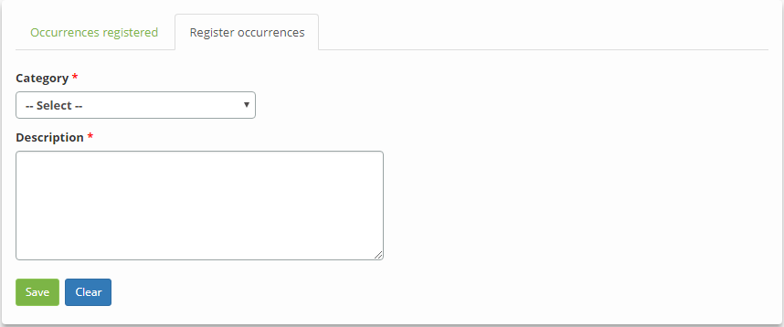

title: Service audit
Description: This feature allows you to check the service history for auditing the service.

# Service audit

This feature allows you to check the service history for auditing the service.
The guidelines described in this "Knowledge" may be followed to check the
history of the Business/IT Service and the Support/Technical Service.

How to access
-------------

1.  Access the functionality by navigating the main menu **Process
    Management > Portfolio and Catalog Management > Portfolio
    Management**;

2.  Access the Services Portfolio you want by clicking the *Advance* button of
    the same;

3.  Click the *Advance* button of the service to access it. After that,
    the **Service Information** will be displayed;

4.  Click **Audit Service**. The Service Audit screen will be displayed, where
    you can check the history of changes to the service to audit it and register
    the necessary information for the audit performed.

Preconditions
-------------

1.  Have the service portfolio defined (see knowledge [Service portfolio
    registration][1]).

Filters
-------

1.  The following filters enables the user to restrict the participation of
    items in the standard feature listing, making it easier to find the desired
    items:

    - Opening Period;

    - Category.

    

    **Figure 1 - Audit service search screen**

Items list
----------

1.  The following cadastral fields are available to the user to facilitate the
    identification of the desired items in the standard feature listing: ID,
    Date/Time of creation, Created by, Type and Category.

2.  There is one action button available to the user for each item in the
    listing, they is: *Expand*.

    
   
    **Figure 2 - Audit service screen**

    - If you need to record the details of the audit performed, click on the **Register occurences** tab. The registration
    screen will be displayed, as illustrated in the figure below:

    
   
   **Figure 3 - Audit registration screen**

    - **Category**: select the category of service in which the audit was performed;

    - **Description**: inform the details of the audit performed.

3.  After the data is informed, click the *Save* button to register.

Filling in the registration fields
----------------------------------

1.  Not applicable.

[1]:/en-us/citsmart-platform-7/processes/portfolio-and-catalog/register.html

!!! tip "About"

    <b>Product/Version:</b> CITSmart | 8.00 &nbsp;&nbsp;
    <b>Updated:</b>09/01/2019 – Anna Martins
