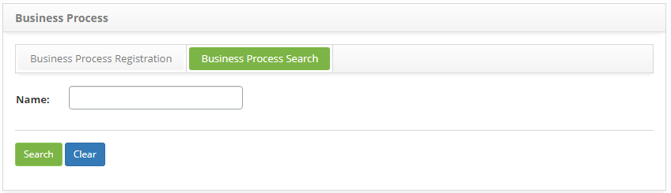
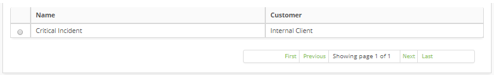
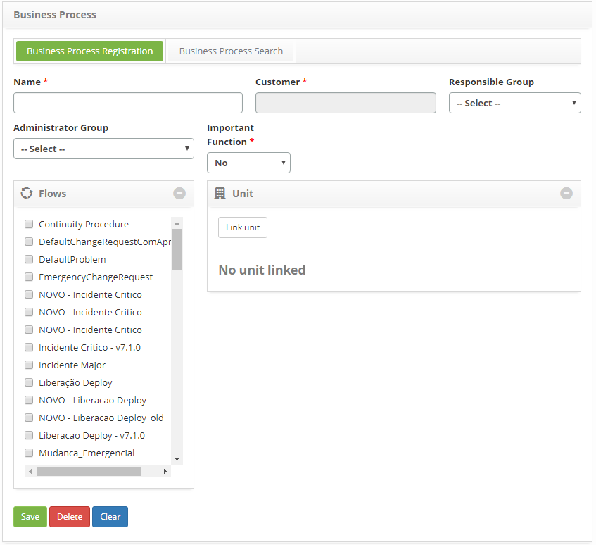

title: Business process registration and search
Description: Contribute to the delivery of a product or service to customers.

# Business process registration and search

The Business Process will contribute to the delivery of a product or service to
customers.For example, a merchant may have a purchase process that will help him
deliver services to his customers. Many business processes depend on IT
services.

How to access
-------------

1.  Access the business process functionality through navigation in the main
    menu **Processes Management > Portfolio and Catalog Management > Business Process Register**.

Preconditions
-------------

1.  Customer registration (see knowledge [Customer registration and search ][1]);

2.  Group registration (see knowledge [Group registration and search][2]);

3.  Register unit (see knowledge [Unit registration and search][3]);

4.  Have defined workflows (see knowledge [Workflow maintenance][4]).

Filters
-------

1.  The following filter enable the user to restrict the participation of items
    in the standard feature listing, making it easier to locate the desired
    items as shown in the figure below:

-   Name.

2.  On the Business Process screen, click the **Business Process Lookup** tab.
    The respective search screen will be displayed, as shown in the figure
    below:

   

   **Figure 1 - Business Process lookup screen**

3.  Perform business process search:

    -   Enter the name of the business process you want to search for and click
        the *Search* button. After that, the business process register will be
        displayed according to the name entered;

    -   If you want to list all business process records, simply click
        the *Search* button directly.

Items list
----------

1.  The following registration fields are available to the user to facilitate
    the identification of the desired items in the standard listing of the
    functionality: **Name** and **Customer**.

   
   
   **Figure 2 - Items screen**

2.  After searching, select the desired record. Once this is done, it will be
    directed to the registration screen displaying the contents of the selected
    registry;

3.  To change the business process record data, simply change the information of
    the desired fields and click the *Save* button to save the change made to
    the record, where the date, time and user will be saved automatically for a
    future audit.

Filling in the registration fields
----------------------------------

1.  The **Business Process Registration** screen will be displayed, as shown in
    the figure below:

   
   
   **Figure 3 - Business Process Master Screen**

2.  Fill in the fields as directed below:

    -  **Name**: enter the name of the business process;

    -  **Customer**: inform the client of the business process;

    -  **Responsible group**: inform the group responsible for the business
        process;

    -  **Administrator group**: inform the business process administrator
        group;

    -  **Flows**: select the workflow (s) of the business process. Remembering
        that these flows are defined in the flow designing screen;

    -  **Important function**: inform if the business process is referring to a
        vital function. Vital function is a part of a business process that is
        critical to business success, ie it is the part of running the business
        that can not stop. Imagine, for example, software that takes care of the
        process of an automatic teller machine for cash withdrawals: the
        function of issuing banknotes for the customer will probably have a
        greater criticality than the function of issuing extracts. Therefore,
        the former is more likely to be considered a vital function. Vital role
        is an important consideration in managing service continuity;

    -  If the business process relates to a vital function, inform the business
        impact and urgency.

    -  **Unit**: link the unit (s) to the business process;

-   Click the *Link Unit* button. Once this is done, a screen will be displayed
    to search for the desired unit;

-   Perform the search, select the unit (s) and click *Add* to link the drive
    (s) to the business process;

-   To delete the link from the drive to the business process, simply click
    the  .

3.  After entering the data, click the *Save* button to register, where the
    date, time and user will be saved automatically for a future audit.

[1]:/en-us/citsmart-platform-7/processes/portfolio-and-catalog/client.html
[2]:/en-us/citsmart-platform-7/initial-settings/access-settings/user/group.html
[3]:/en-us/citsmart-platform-7/plataform-administration/region-and-language/register-unit.html
[4]:/en-us/citsmart-platform-7/workflow/workflow-management.html

!!! tip "About"

    <b>Product/Version:</b> CITSmart | 8.00 &nbsp;&nbsp;
    <b>Updated:</b>08/30/2019 – Anna Martins

