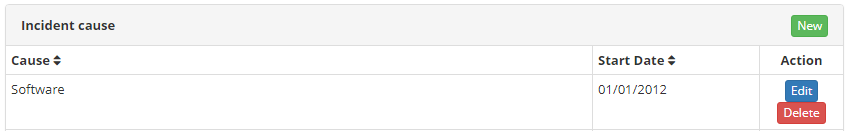

title: Incident cause registration and search
Description: This feature allows you to save and search the causes of incidents.

# Incident cause registration and search

This feature allows you to save and search the causes of incidents.

How to access
-------------

1.  Access Incident Causes feature navigating through the main menu **Process
    Management > Portfolio and Catalog Management > Incident Causes**.

Preconditions
-------------

1.  No applicable.

Filters
-------

1.  The following filters enables the user to restrict the participation of
    items in the standard feature listing, making it easier to find the desired
    items:

    - Cause;

    - Start Date.

    

    **Figure 1 - Incident cause search screen**

Items list
----------

1.  The following cadastral fields are available to the user to facilitate the
    identification of the desired items in the standard feature
    listing: **Cause** and **Start Date**.

    

    **Figure 2 - Incident cause screen**

2.  To search for an incident cause, enter the description and/or start date of
    the incident. After this, the record will be displayed according to the data
    entered.

3.  There are action buttons available to the user for each item in the listing,
    they are: *Edit* and *Delete*.

Filling in the registration fields
----------------------------------

1.  The incident causes screen will be displayed.

2.  Click the *New* button. Then, the **Incident Causes Registration** screen
    will be displayed as illustrated in the following image:

    
   
    **Figure 3 - Incident Cause Entry Screen**

3.  Fill out the fields as instructed:

    - **Cause**: insert the description of the incident;

    - **Start**: insert the initial date of the incident cause registration;

    - **Parent incident cause**: select a higher incident cause if the incident being registered is part of another incident cause.

4.  After inserting the data, click the *Save* button to confirm the entry, at
    which the date, time and user are automatically stored for future audit.

!!! tip "About"

    <b>Product/Version:</b> CITSmart | 8.00 &nbsp;&nbsp;
    <b>Updated:</b>08/30/2019 – Anna Martins
