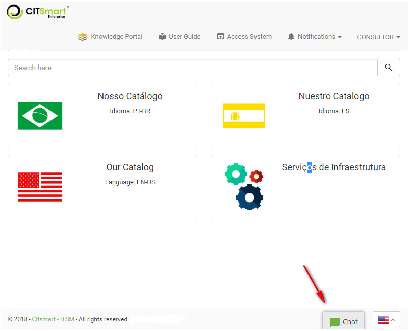
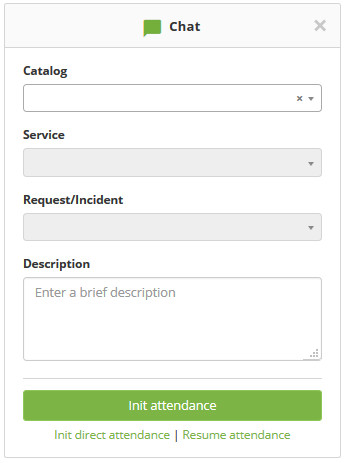
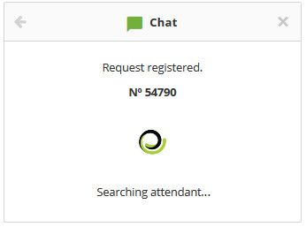
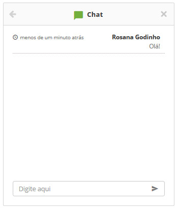

title: Service request via chat
Description: Service request via chat

# Service request via chat

How to access
-------------

1.  In **Smart Portal**, click **Chat**, as shown in the figure below:

**Figure 1 - Smart portal - Chat**

Preconditions
-------------

1.  Have the "Enable Chat" parameter enabled (see knowledge [Parameterization
    rules -  Chat][1]);

2.  Have the parameters "Id of the origin of the requests created by the chat"
    and "Id of the activity of the requests created by the chat" configured;

3.  Have the portfolio with request/incident services and activities registered
    and made available in the Chat (see knowledge [Service portfolio
    registration][2]).

Requesting service via chat
---------------------------

1.  The **Chat Home** screen will appear as shown in the figure below:

   
   
   **Figure 2 - Chat home screen**

-   **Catalog**: select the desired service catalog;

-   **Service**: select the desired service;

-   **Request/Incident**: select the desired activity to start the attendance
    related to the same;

-   After the data is entered, click the *Init attendance* button. Once this has
    been done, the request will be registered and the attendant will be able to
    wait for interaction with it;

-   If you want to start the service immediately, just click *Init direct
    attendance*. Once this is done, a request will be recorded and the attendant
    can wait;

   
   
   **Figure 3 - Waiting attendant**

-   When the attendant initiates service, the chat screen will be displayed for
    interaction with the same, as shown in the figure below:

   
   
   **Figure 4 - Interaction with attendant**

-   To end the conversation, click the icon  .

    
!!! tip "About"

    <b>Product/Version:</b> CITSmart | 7.00 &nbsp;&nbsp;
    <b>Updated:</b>02/02/2019 - Anna Martins

[1]:/en-us/citsmart-platform-7/plataform-administration/parameters-list/parametrization-chat.html
[2]:/en-us/citsmart-platform-7/processes/portfolio-and-catalog/register.html
