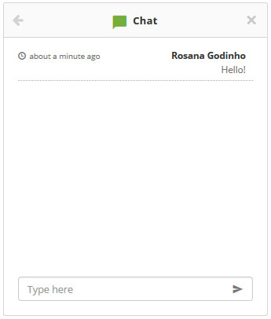

title:  Solicitação de serviço via chat
Description: Solicitação de serviço via chat. 
# Solicitação de serviço via chat

Como acessar
---------------

1. No **Smart Portal**, clique em **Chat**, conforme indicado na figura abaixo:

**Figura 1 - Smart portal - chat**

Pré-condições
---------------

1. Ter o parâmetro “Ativar Chat” habilitado (ver conhecimento [Regras de parametrização - Chat][1]);

2. Ter os parâmetros “Id da origem das solicitações criadas pelo chat” e “Id da atividade das solicitações criadas pelo chat” 
configurados;

3. Ter o portfólio com os serviços e atividades de requisição/incidente cadastradas e disponibilizados no Chat (ver conhecimento 
[Cadastro de portfólio de serviços][2]).

Solicitando serviço via chat
--------------------------------

1. Será apresentada a tela inicial do Chat, conforme ilustrada na figura abaixo:

    
    
    **Figura 2 - Tela Inicial do chat**
    
    - **Catálogo**: selecione o catálogo de serviço desejado;
    - **Serviço**: selecione o serviço desejado;
    - **Requisição/Incidente**: selecione a atividade desejada para iniciar o atendimento referente a mesma;
    - Após os dados informados, clique no botão "Iniciar atendimento". Feito isso, a solicitação será registrada e poderá aguardar
    o atendente para interação com o mesmo;
    - Caso queira iniciar de imediato o atendimento, basta clicar em "Iniciar atendimento direto". Feito isso, uma solicitação será 
    registrada e poderá aguardar o atendente;
    
    
    
    **Figura 3 - Aguardando atendente**
    
    - Quando o atendente iniciar o atendimento, será exibida a tela de bate-papo para interação com o mesmo, conforme exemplo 
    ilustrado na figura abaixo:
    
    
    
    **Figura 4 - Interação com atendente**
    
    - Para encerrar a conversar, clique no ícone .
    
!!! tip "About"

    <b>Product/Version:</b> CITSmart | 7.00 &nbsp;&nbsp;
    <b>Updated:</b>07/30/2019 - Larissa Lourenço

[1]:/pt-br/citsmart-platform-7/plataform-administration/parameters-list/parametrization-chat.html
[2]:/pt-br/citsmart-platform-7/processes/portfolio-and-catalog/register.html
