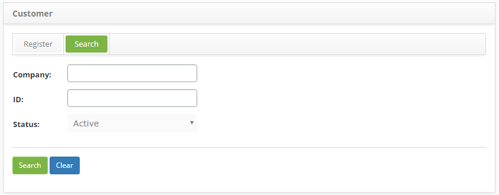
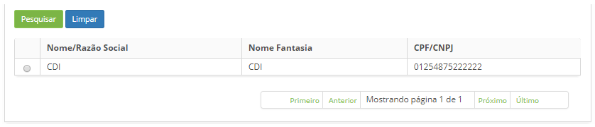
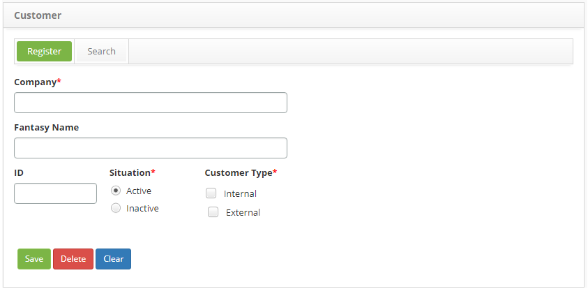

title: Costumer registration and search
Description: This functionality is intended to register and perform search by customers.

# Costumer registration and search

The customer is a company or person requesting products and/or services. It can
be internal and/or external to the organization.

This functionality is intended to register and perform search by customers.

How to access
-------------

1.  Access group feature navigating through the main menu **Processes
    Management > Portfolio and Catalog Management > Customer**.

Preconditions
-------------

1.  No applicable.

Filters
-------

1.  The following filters enables the user to restrict the participation of
    items in the standard feature listing, making it easier to find the desired
    items:

-   Company;

-   ID;

-   Status.

2.  In the **Customer** screen, click on the **Search** tab, the **Customer
    Search** screen will be displayed as illustrated in the image below:

   
   
   **Figure 1 - Customer search screen**

3.  Perform a customer search. Set the filters as needed:

    -   **Company Name**: insert the customer name/company name;

    -   **ID**: insert the customer’s tax registration or social security
        number;

    -   **Status**: select the customer’s current situation;

    -   After the setting the filters, click the *Search* button. Then, the
        entries will be displayed according to the data provided;

    -   To list all customer entries, just click directly on
        the *Search* button.

Items list
----------

1.  The following cadastral fields are available to the user to facilitate the
    identification of the desired items in the standard feature
    listing: **Company** and **ID**:

   
   
   **Figure 2 - Customers Listing**

2.  After searching, select the intended entry. Once this is done, you will be
    directed to the registry screen displaying the content of the selected
    entry;

3.  To change a customer entry, just modify the information in the desired
    fields and click the *Save* button to save the changes made to the registry,
    at which the date, time and user are automatically stored for a future
    audit.

Filling in the registration fields
----------------------------------

1.  In the **Customer** screen, click on the **Register** tab, the **Customer
    Registration** screen will be displayed, as illustrated in the image below:

   
   
   **Figure 3 - Customer Entry Screen**

2.  Fill out the fields as instructed:

    -   **Company Name**: if the customer is an individual, insert their full
        name, if it is a corporation, insert the company’s registered name;

    -   **Fantasy Name**: insert the company’s fantasy name, if necessary;

    -   **ID**: if the customer is an individual, insert its social security
        number, if it is a company, insert the federal tax registry.

    -   **Situation**: select the customer's current status withiin the
        organization (active or inactive);

    -   **Customer type**: select customer type:

        -   **Internal**: one that is part of the same organization, as a
            director, consultant, manager and others.

        -   **External**: one that financially maintains the organization,
            buying products or services.

3.  After inserting the data, click the *Save* button to confirm the entry, at
    which date, time and user are automatically stored for future a audit.

!!! tip "About"

    <b>Product/Version:</b> CITSmart | 8.00 &nbsp;&nbsp;
    <b>Updated:</b>08/30/2019 – Anna Martins
