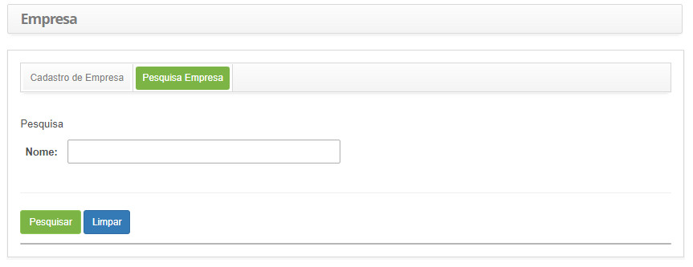
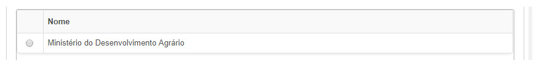
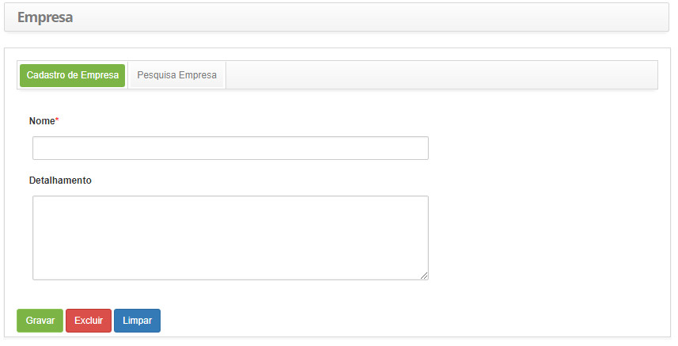

title:  Cadastro e pesquisa de empresa
Description: Esta funcionalidade tem por objetivo registrar informações da empresa. 
# Cadastro e pesquisa de empresa

Esta funcionalidade tem por objetivo registrar informações da empresa.

Como acessar
--------------

1. Acesse a funcionalidade de empresa através da navegação no menu principal **Cadastros Gerais > Empresa**.

Pré-condições
--------------

1. Não se aplica.

Filtros
----------

1. O seguinte filtro possibilita ao usuário restringir a participação de itens na listagem padrão da funcionalidade, facilitando a
localização dos itens desejados:

    - Nome.
    
    
    
    **Figura 1 - Tela de pesquisa de empresas**
    
2. Realize a pesquisa de empresa:

    - Informe o nome da empresa que deseja pesquisar e clique no botão "Pesquisar". Após isso, será exibido o registro de empresa 
    conforme a descrição informada;
    - Caso deseje listar todos os registros de empresa, basta clicar diretamente no botão "Pesquisar".
    
Listagem de itens
-------------------

1. O seguinte campo cadastral está disponível ao usuário para facilitar a identificação dos itens desejados na listagem padrão da
funcionalidade: **Nome**.

    
    
    **Figura 2 - Tela de listagem de empresas**
    
2. Após a pesquisa, selecione o registro desejado. Feito isso, será direcionado para a tela de cadastro exibindo o conteúdo 
referente ao registro selecionado;

3. Para alterar os dados do registro de empresa, basta modificar as informações dos campos desejados e clicar no botão "Gravar"
para que seja gravada a alteração realizada no registro, onde a data, hora e usuário serão gravados automaticamente para uma 
futura auditoria.

Preenchimento dos campos cadastrais
-------------------------------------

1. Será apresentada a tela de cadastro de empresa, conforme ilustrada na figura abaixo:

    
    
    **Figura 3 - Tela de cadastro de empresa**
    
2. Preencha os campos conforme orientações abaixo:

    - **Nome**: informe o nome da empresa;
    - **Detalhamento**: descreva os detalhes sobre a empresa.
    
3. Clique no botão "Gravar" para efetuar o registro, onde a data, hora e usuário serão gravados automaticamente para uma futura
auditoria.

!!! tip "About"

    <b>Product/Version:</b> CITSmart | 7.00 &nbsp;&nbsp;
    <b>Updated:</b>08/08/2019 - Larissa Lourenço
        
